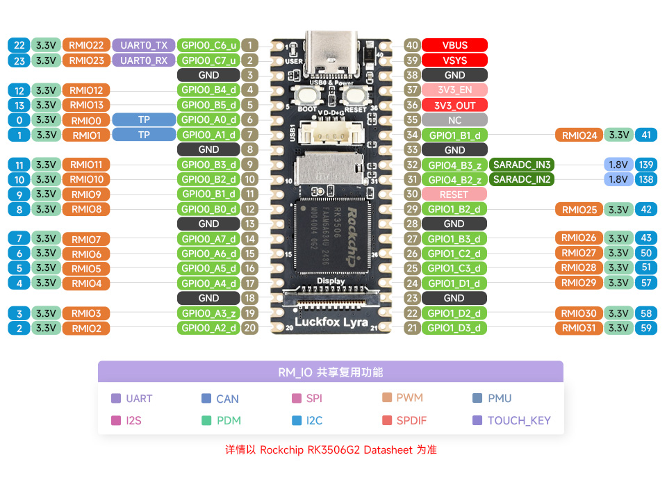

[datasheet](https://files.luckfox.com/wiki/Luckfox/RK3506/PDF/Rockchip%20RK3506G2%20Datasheet%20V1.0-20240816.pdf) 
[原理图](https://files.luckfox.com/wiki/Luckfox/RK3506/PDF/Luckfox%20Lyra%26Luckfox%20Lyra%20Plus%20SCH.pdf)



rk3506G2

SRAM 48KB
ROM 32KB

集成 128MB DDR3L 0x03e00000

0x03e00000 -- DDR3L

0xfff84000 -- SRAM

0xfff90000

默认调试串口波特率: 1500000

## 编译

## SPI 屏幕

|  uart0_tx | GPIO0_C6 |       | VBUS     |         |
|  uart0_rx | GPIO0_C7 |       | VSYS     |         |
|           |      GND |       | GND      |         |
|           | GPIO0_B4 |       | 3V3_EN   |         |
|           | GPIO0_B5 |       | 3V3_OUT  |         |
|           | GPIO0_A0 |       | NC       |         |
|           | GPIO0_A1 |       | GPIO1_B1 |         |
|           |      GND |       | GND      |         |
|           | GPIO0_B3 |       | GPIO4_B3 |         |
| spi1_miso | GPIO0_B2 |       | GPIO4_B2 |         |
| spi1_mosi | GPIO0_B1 |       | RESET    |         |
| spi1_clk  | GPIO0_B0 |       | GPIO1_B2 |         |
|           |      GND |       | GND      |         |
| spi1_csn1 | GPIO0_A7 |       | GPIO1_B3 |         |
| lcd_reset | GPIO0_A6 |       | GPIO1_C2 |         |
|  lcd_dc   | GPIO0_A5 |       | GPIO1_C3 |         |
|  lcd_led  | GPIO0_A4 |       | GPIO1_D1 |         |
|           |      GND |       | GND      |         |
|           | GPIO0_A3 |       | GPIO1_D2 |         |
|           | GPIO0_A2 |       | GPIO1_D3 |         |


找到 rk3506-pinctl.dtsi, 搜索 spi0 可以看到 spi1 引脚默认配置

```c
&spi1 {
    status = "okay";
	pinctrl-names = "default";
	pinctrl-0 = <&spi1_csn1_pins>;
    pinctrl-names = "default";
	#address-cells = <1>;
	#size-cells = <0>;

    st7789v@0{
        compatible = "sitronix,st7789v";
        reg = <0>;
        spi-max-frequency = <50000000>;
        buswidth = <8>;
        debug = <0>;
        height = <240>;
        width = <240>;
        fps = <30>;
        reset-gpios = <&gpio0 RK_PA6 GPIO_ACTIVE_LOW>;
        dc-gpios = <&gpio0 RK_PA5 GPIO_ACTIVE_HIGH>;
        led-gpios = <&gpio0 RK_PA4 GPIO_ACTIVE_HIGH>;
        rotate = <0>;
        spi-cpol;
        spi-cpha;
    };
};
```


## Ubuntu

```sh
apt install exfat-fuse
```
