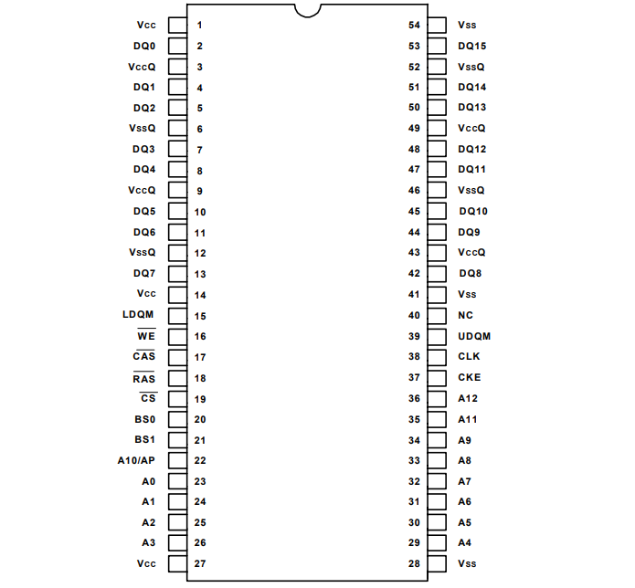
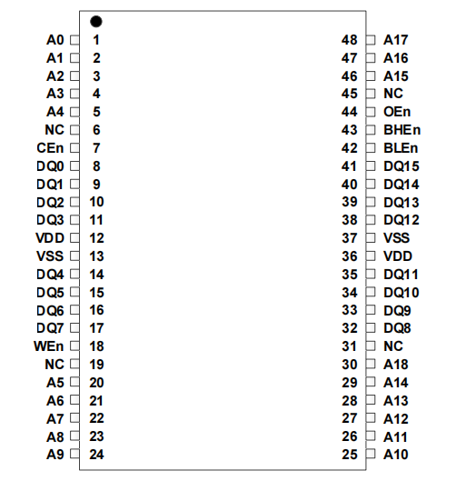
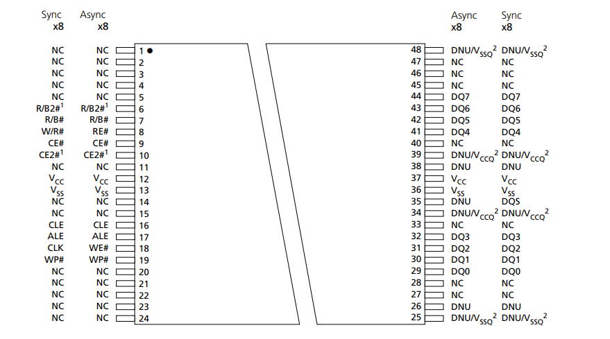
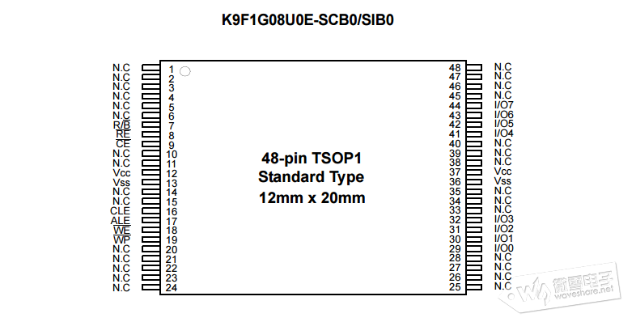

# [2023-03-15 09:12:56]

虽然买了很久了，但一直没有深入研究。而且每次串口那些的都要重来，查找引脚资料之类的，很烦人。

首先给出 [官方网站](https://art-pi.gitee.io/website/) 和 [IO 引脚信息](https://art-pi.gitee.io/website/docs/#/tutorial/pin-description)

源码和资料仓库：
[github 仓库地址](https://github.com/RT-Thread-Studio/sdk-bsp-stm32h750-realthread-artpi)

[gitee 仓库地址](https://gitee.com/mirrors/ART-Pi)

原理图等相关资料在仓库资料中有，但为了方便，这里直接给出 [原理图链接](https://gitee.com/mirrors/ART-Pi/raw/master/documents/board/ART-Pi_HW_V1.5/ART-Pi_SCH_V1.5_Release.pdf)

其中比较重要的是调试串口的引脚信息， 这里直接给出：

```
PI9     ------> UART4_RX
PA0     ------> UART4_TX
```

## DRAM 探究

ART-Pi 板子上的 DRAM 使用的是 [华邦 W9825G6DH ](http://pdf-html.ic37.com/pdf_file_A/20200531/pdf_pdf/pdf5/WINBOND/W9825G6DH_datasheet_518061/844528/W9825G6DH_datasheet.pdf)，4M words × 4 banks = 32MB, 数据线宽度 16bits

根据官方资料各个引脚功能如下：

54Pin TSOP II 封装



一般来说，这是典型封装，其他厂商的封装也是一样的，例如[IS42S16160J-6BLI](https://file.elecfans.com/web2/M00/21/F6/pYYBAGGl1_qAWiEdAAxiT2ZQ9vo373.pdf) 引脚定义一模一样，可直接替换使用。

| 引脚            | 名称      | 功能                    | 描述                                                                              |
| --------------- | --------- | ----------------------- | --------------------------------------------------------------------------------- |
| 23−26, 22,29−36 | A0−A12    | 地址线                  | 行地址和列地址的复用引脚，行地址：A0−A12，列地址：A0−A8                           |
| 20, 21          | BS0, BS1  | Bank 选择               | 在行地址锁存期间选择要激活的存储体，或在地址锁存时间选择要读/写的存储体           |
| 2, 4, 5, 7, 8,  | DQ0−DQ15  | 数据线（输入/输出）     | 用于数据输出和输入的多路传输引脚                                                  |
| 10, 11, 13, 42, |           |                         |                                                                                   |
| 44, 45, 47, 48, |           |                         |                                                                                   |
| 50,51, 53       |           |                         |                                                                                   |
| 19              | CS (L)    | 片选信号                | 禁用或启用芯片命令解码器，当禁用命令解码器时，新命令将被忽略，先前的操作将继续    |
| 18              | RAS (L)   | 行地址选通脉冲          | 命令输入。在时钟上升沿采样时，RAS、CAS 和 WE 定义要执行的操作。                   |
| 17              | CAS (L)   | 列地址选通脉冲          | 参考 RAS (L)                                                                      |
| 16              | WE (L)    | 写入使能                | 参考 RAS (L)                                                                      |
| 15, 39          | LDQM,UDQM | Input/Output Mask       | 当 DQM 在读取周期中被采样为高电平时，输出缓冲器被置于 Hi-Z（延迟为 2)。           |
|                 |           |                         | 在写入周期中，采样 DQM 高电平将以零延迟阻止写入操作                               |
| 38              | CLK       | 时钟输入                | 用于在时钟上升沿对输入进行采样的系统时钟。                                        |
| 37              | CKE       | 时钟使能                | CKE 控制时钟的激活和去激活。当 CKE 为低电平时，进入断电模式、挂起模式或自刷新模式 |
| 1, 14, 27       | VCC       | 电源 (+3.3V)            | DRAM 内部输入缓冲器和逻辑电路的电源                                               |
| 28, 41, 54      | VSS       | 地                      | DRAM 内部输入缓冲区和逻辑电路的接地。                                             |
| 3, 9, 43, 49    | VCCQ      | I/O Buffer 电源 (+3.3V) | 将电源与 VCC 分开，以提高 DQ 抗噪性                                               |
| 6, 12, 46, 52   | VSSQ      | I/O Buffer 地           | 将接地与 VSS 分开，以提高 DQ 的抗噪性。                                           |
| 40              | NC        | 不连接                  | 没有连接 (NC 引脚应连接到 GND 或悬空）                                            |

DRAM 原理：

可以看到，除了数据线，地址线和电源，剩下就是关键的控制线。包括:

CS、RAS、CAS、WE、LDQM,UDQM、CLK、CKE


有一款国产 XRAM (自刷新 DRAM)[XM8A51216V33A](https://bbs.16rd.com/misc.php?mod=citiao&id=22945&mobile=no), 也就说能自己刷新时钟，这样就可以简化设计。封装也小了:



其控制原理为:


相比之前用过的 TSOP Type 1 封装的 [Nand Flash](https://file.elecfans.com/web2/M00/67/73/poYBAGMYRHuAPulQACvETxIsMxY627.pdf) 有什么区别呢？







# [2023-03-29 11:19:29]

使用 RTThread Art-Pi BSP 自带的 SDIO 驱动 sd 卡有问题

```
r12: 0x0000000c
 lr: 0x90001a8b
 pc: 0x90001760
hard fault on thread: mmcsd_de�

thread   pri  status      sp     stack size max used left tick  error
-------- ---  ------- ---------- ----------  ------  ---------- ---
tshell    20  suspend 0x000000c4 0x00001000    06%   0x00000009 OK
sd_mount  30  suspend 0x000000e0 0x00000800    11%   0x00000014 OK
mmcsd_de  15  running 0x0000026c 0x00000800    30%   0x00000007 OK
tidle0    31  ready   0x00000060 0x00000100    56%   0x00000014 OK
main      10  suspend 0x000000b0 0x00000800    17%   0x0000000e OK
bus fault:

SCB_CFSR_BFSR:0x04 IMPRECISERR
```

跟踪错误发现是执行 rthw_sdio_send_command 时出现问题, 该函数出错部分如下:

主要是 SCB_CleanInvalidateDCache 出错了.

```c
addr2line -e rt-thread.elf  -a -f 0x90001760

/* data pre configuration */
if (data != RT_NULL)
{
    SCB_CleanInvalidateDCache();

    reg_cmd |= SDMMC_CMD_CMDTRANS;
    hw_sdio->mask &= ~(SDMMC_MASK_CMDRENDIE | SDMMC_MASK_CMDSENTIE);
    hw_sdio->dtimer = HW_SDIO_DATATIMEOUT;
    hw_sdio->dlen = data->blks * data->blksize;
    hw_sdio->dctrl = (get_order(data->blksize) << 4) | (data->flags & DATA_DIR_READ ? SDMMC_DCTRL_DTDIR : 0);
    hw_sdio->idmabase0r = (rt_uint32_t)cache_buf;
    hw_sdio->idmatrlr = SDMMC_IDMA_IDMAEN;
}
```

据我所知，SCB_CleanInvalidateDCache 是全局 clean 是不能随便用的, 我暂时把它注释掉就能运行了，不知会不会影响其他地方


# [2023-03-29 11:36:15]


