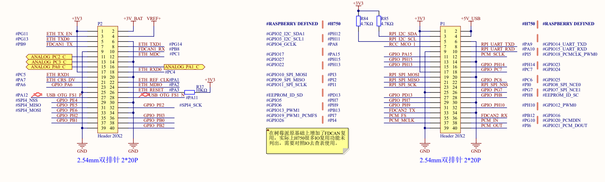

[官方网站](https://art-pi.gitee.io/website/)

[IO引脚信息](https://art-pi.gitee.io/website/docs/#/tutorial/pin-description)

用于 Debug 的串口 

    PI9     ------> UART4_RX
    PA0     ------> UART4_TX

LED

    PI8     ------> LED_BLUE
    PC15    ------> LED_RED
