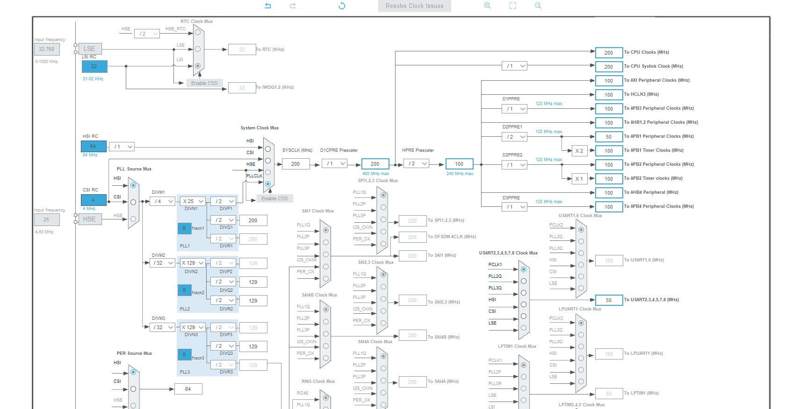

一般来说 STM32 有两段时钟配置

* 第一段是 start.s 文件中调用的 SystemInit 来进行时钟系统复位。
  这似乎是 CMSIS 规范要求的。ARM 规定每个 MCU 厂商在给用户的 SDK 中都需要包含这个函数用来对系统进行初始化。在 STM32 的官方的 start.s 中，SystemInit 函数是复位后第一个执的，之后才对行程序用到的内存（主要是对全局变量进行初始化） 和 libc 的初始化。最后才加载用户的 main 函数。

* 第二段是在用户据代码 main 中执行。
  这部分是用户可自定义的，若使用 HAL 库来配置时钟，需在配置之前执行 HAL 初始化 HAL_Init

# SystemInit

第一段的 SystemInit 实际上只是将时钟复位到默认值，即使可能寄存器上电后直接就是默认值，但是有可能用户只是通过软复位，这时要保证旧的寄存器配置被重置为默认值。

SystemInit 的代码如下：

```c
/**
  * @brief  Setup the microcontroller system
  *         Initialize the FPU setting and  vector table location
  *         configuration.
  * @param  None
  * @retval None
  */
void SystemInit (void)
{
#if defined (DATA_IN_D2_SRAM)
 __IO uint32_t tmpreg;
#endif /* DATA_IN_D2_SRAM */

  /* 设置 FPU 功能，这是 ARM 核心自带的 */
  #if (__FPU_PRESENT == 1) && (__FPU_USED == 1)
    SCB->CPACR |= ((3UL << (10*2))|(3UL << (11*2)));  /* set CP10 and CP11 Full Access */
  #endif
  
  /* 下面是将 RCC 时钟复位到默认状态 */

   /* 提高 CPU 频率 */
  if(FLASH_LATENCY_DEFAULT  > (READ_BIT((FLASH->ACR), FLASH_ACR_LATENCY)))
  {
    /* 将新的等待状态数编程到 FLASH_ACR 寄存器中的等待时间位 */
    MODIFY_REG(FLASH->ACR, FLASH_ACR_LATENCY, (uint32_t)(FLASH_LATENCY_DEFAULT));
  }

  /* 设置 HSION 位 */
  RCC->CR |= RCC_CR_HSION;

  /* 重置 CFGR 寄存器 */
  RCC->CFGR = 0x00000000;

  /* 重置 HESON、HSECSSON、CSION、HSI48ON、CSIKERON、PLL1ON、PLL2ON 和 PLL3ON 位 */
  RCC->CR &= 0xEAF6ED7FU;

   /* 由于 CPU 频率较低，减少了等待状态的数量 */
  if(FLASH_LATENCY_DEFAULT  < (READ_BIT((FLASH->ACR), FLASH_ACR_LATENCY)))
  {
    /* 将新的等待状态数编程到 FLASH_ACR 寄存器中的等待时间位 */
    MODIFY_REG(FLASH->ACR, FLASH_ACR_LATENCY, (uint32_t)(FLASH_LATENCY_DEFAULT));
  }

#if defined(D3_SRAM_BASE)
  /* 重置 D1CFGR 寄存器 */
  RCC->D1CFGR = 0x00000000;

  /* 重置 D2CFGR 寄存器 */
  RCC->D2CFGR = 0x00000000;

  /* 重置 D3CFGR 寄存器 */
  RCC->D3CFGR = 0x00000000;
#else
  /* 重置 CDCFGR1 寄存器 */
  RCC->CDCFGR1 = 0x00000000;

  /* 重置 CDCFGR2 寄存器 */
  RCC->CDCFGR2 = 0x00000000;

  /* 重置 SRDCFGR 寄存器 */
  RCC->SRDCFGR = 0x00000000;
#endif
  /* 重置 PLLCKSELR 寄存器 */
  RCC->PLLCKSELR = 0x02020200;

  /* 重置 PLLCFGR 寄存器 */
  RCC->PLLCFGR = 0x01FF0000;
  /* 重置 PLL1DIVR 寄存器 */
  RCC->PLL1DIVR = 0x01010280;
  /* 重置 PLL1FRACR 寄存器 */
  RCC->PLL1FRACR = 0x00000000;

  /* 重置 PLL2DIVR 寄存器 */
  RCC->PLL2DIVR = 0x01010280;

  /* 重置 PLL2FRACR 寄存器 */
  RCC->PLL2FRACR = 0x00000000;

  /* 重置 PLL3DIVR 寄存器 */
  RCC->PLL3DIVR = 0x01010280;

  /* 重置 PLL3FRACR 寄存器 */
  RCC->PLL3FRACR = 0x00000000;

  /* 重置 HSEBYP bit */
  RCC->CR &= 0xFFFBFFFFU;

  /* 禁用所有中断 */
  RCC->CIER = 0x00000000;

#if (STM32H7_DEV_ID == 0x450UL)
  /* dual core CM7 or single core line */
  if((DBGMCU->IDCODE & 0xFFFF0000U) < 0x20000000U)
  {
    /* if stm32h7 revY */
    /* 将 AXI SRAM 目标（目标 7) 的开关矩阵读取发出能力更改为 1 */
    *((__IO uint32_t*)0x51008108) = 0x000000001U;
  }
#endif /* STM32H7_DEV_ID */

/* 处理当在 D2 SRAM(AHB SRAM) 中初始化数据的情况下，启用 D2 SRAM 时钟 (AHB SRAM 时钟）*/
#if defined(DATA_IN_D2_SRAM)
#if defined(RCC_AHB2ENR_D2SRAM3EN)
  RCC->AHB2ENR |= (RCC_AHB2ENR_D2SRAM1EN | RCC_AHB2ENR_D2SRAM2EN | RCC_AHB2ENR_D2SRAM3EN);
#elif defined(RCC_AHB2ENR_D2SRAM2EN)
  RCC->AHB2ENR |= (RCC_AHB2ENR_D2SRAM1EN | RCC_AHB2ENR_D2SRAM2EN);
#else
  RCC->AHB2ENR |= (RCC_AHB2ENR_AHBSRAM1EN | RCC_AHB2ENR_AHBSRAM2EN);
#endif /* RCC_AHB2ENR_D2SRAM3EN */

  tmpreg = RCC->AHB2ENR;
  (void) tmpreg;
#endif /* DATA_IN_D2_SRAM */

/* 双核 (M4 和 M7 混合） 且该核是 M4 */
#if defined(DUAL_CORE) && defined(CORE_CM4)
  /* 为 Corest-M4 配置向量表位置添加偏移量地址 */
#if defined(USER_VECT_TAB_ADDRESS)
  SCB->VTOR = VECT_TAB_BASE_ADDRESS | VECT_TAB_OFFSET; /* 内部 D2 AXI-RAM 或内部闪存中的向量表重新定位 */
#endif /* USER_VECT_TAB_ADDRESS */

#else
  /*
   * 禁用 FMC BANK1（重置后启用）。
   * 这可以防止在 24us 期间阻止使用 FMC 的对该存储体的 CPU 推测访问。
   * 在此期间，其他 FMC 主机（如 LTDC) 不能使用它！
   */
  FMC_Bank1_R->BTCR[0] = 0x000030D2;

  /* 配置 M7 核的中断向量表 */
#if defined(USER_VECT_TAB_ADDRESS)
  SCB->VTOR = VECT_TAB_BASE_ADDRESS | VECT_TAB_OFFSET; /* 内部 D1 AXI-RAM 或内部闪存中的向量表重新定位 */
#endif /* USER_VECT_TAB_ADDRESS */

#endif /*DUAL_CORE && CORE_CM4*/
}
```

# 时钟配置

时钟配置相关寄存器为 RCC (Reset and Clock Control)

## 概览

```
  ==============================================================================
                      ##### RCC specific features #####
  ==============================================================================
    [..]  
      After reset the device is running from Internal High Speed oscillator
      (HSI 8MHz) with Flash 0 wait state, Flash prefetch buffer is disabled, 
      and all peripherals are off except internal SRAM, Flash and JTAG.
      (+) There is no prescaler on High speed (AHB) and Low speed (APB) buses;
          all peripherals mapped on these buses are running at HSI speed.
      (+) The clock for all peripherals is switched off, except the SRAM and FLASH.
      (+) All GPIOs are in input floating state, except the JTAG pins which
          are assigned to be used for debug purpose.
    [..] Once the device started from reset, the user application has to:
      (+) Configure the clock source to be used to drive the System clock
          (if the application needs higher frequency/performance)
      (+) Configure the System clock frequency and Flash settings  
      (+) Configure the AHB and APB buses prescalers
      (+) Enable the clock for the peripheral(s) to be used
      (+) Configure the clock source(s) for peripherals whose clocks are not
          derived from the System clock (RTC, ADC, I2C, USART, TIM, USB FS, etc..)

                      ##### RCC Limitations #####
  ==============================================================================
    [..]  
      A delay between an RCC peripheral clock enable and the effective peripheral 
      enabling should be taken into account in order to manage the peripheral read/write 
      from/to registers.
      (+) This delay depends on the peripheral mapping.
        (++) AHB & APB peripherals, 1 dummy read is necessary

    [..]  
      Workarounds:
      (#) For AHB & APB peripherals, a dummy read to the peripheral register has been
          inserted in each __HAL_RCC_PPP_CLK_ENABLE() macro.

```

根据 `stm32h7xx_hal_rcc.c` 文件中的 RCC specific features 描述可知，在复位后，设备时钟主要由内部的高速晶振 HSI (8MHz) 提供，并运行在 Flash 0 上，这时 flash 预取缓冲区被禁止，并且除了 内部 SRAM, flash 和 JTAG, 其他所有外设都处于关闭状态。即：这时

* 给到高速总线 (AHB) 和 低速总线 (APB) 的时钟没有分频，因此所有挂在这两条总线上的外设都将以 HSI 的速度运行。
* 除了 Flash 和 SRAM，所有给到外设的时钟都被关闭。
* 除了用于调试的 JTAG 引脚以外，所有的 GPIO 引脚都处于浮空输入状态。

一旦设备从复位中启动，用户代码应当执行如下操作：
* 若应用需要更高的时钟源频率和性能的话，需重新配置时钟源用于驱动整个系统的时钟树。
* 配置系统时钟频率和 Flash 设置。
* 配置 AHB 和 APB 总线的时钟分频。
* 使能外设的时钟以激活外设准备使用。
* 配置那些非系统时钟直接输入的外设的时钟源 （如 RTC, ADC, I2C, TIM, USB FS 等）

> 注：
> 
> 应考虑 RCC 外设时钟启用和有效外设启用之间的延迟，以便管理对寄存器的外设读/写。
> 
> 此延迟取决于外围设备映射。例如：AHB 和 APB 外设，需要 1 个 dummy 读取周期
>
> 对于 HAL 库中，对于 AHB 和 APB 外设，在每个 __HAL_RCC_PPP_CLK_ENABLE() 宏中都已经插入了对外设寄存器的虚拟读取。

## 时钟初始化

```
===============================================================================
           ##### Initialization and de-initialization functions #####
 ===============================================================================
    [..]
      This section provides functions allowing to configure the internal/external oscillators
      (HSE, HSI, LSE,CSI, LSI,HSI48, PLL, CSS and MCO) and the System buses clocks (SYSCLK, AHB3, AHB1
       AHB2,AHB4,APB3, APB1L, APB1H, APB2, and APB4).

    [..] Internal/external clock and PLL configuration
         (#) HSI (high-speed internal), 64 MHz factory-trimmed RC used directly or through
             the PLL as System clock source.
         (#) CSI is a low-power RC oscillator which can be used directly as system clock, peripheral
             clock, or PLL input.But even with frequency calibration, is less accurate than an
             external crystal oscillator or ceramic resonator.
         (#) LSI (low-speed internal), 32 KHz low consumption RC used as IWDG and/or RTC
             clock source.

         (#) HSE (high-speed external), 4 to 48 MHz crystal oscillator used directly or
             through the PLL as System clock source. Can be used also as RTC clock source.

         (#) LSE (low-speed external), 32 KHz oscillator used as RTC clock source.

         (#) PLL , The RCC features three independent PLLs (clocked by HSI , HSE or CSI),
             featuring three different output clocks and able  to work either in integer or Fractional mode.
           (++) A main PLL, PLL1, which is generally used to provide clocks to the CPU
                and to some peripherals.
           (++) Two dedicated PLLs, PLL2 and PLL3, which are used to generate the kernel clock for peripherals.

         (#) CSS (Clock security system), once enabled and if a HSE clock failure occurs
            (HSE used directly or through PLL as System clock source), the System clock
             is automatically switched to HSI and an interrupt is generated if enabled.
             The interrupt is linked to the Cortex-M NMI (Non-Mask-able Interrupt)
             exception vector.

         (#) MCO1 (micro controller clock output), used to output HSI, LSE, HSE, PLL1(PLL1_Q)
             or HSI48 clock (through a configurable pre-scaler) on PA8 pin.

         (#) MCO2 (micro controller clock output), used to output HSE, PLL2(PLL2_P), SYSCLK,
             LSI, CSI, or PLL1(PLL1_P) clock (through a configurable pre-scaler) on PC9 pin.

    [..] System, AHB and APB buses clocks configuration
         (#) Several clock sources can be used to drive the System clock (SYSCLK): CSI,HSI,
             HSE and PLL.
             The AHB clock (HCLK) is derived from System core clock through configurable
             pre-scaler and used to clock the CPU, memory and peripherals mapped
             on AHB and APB bus of the 3 Domains (D1, D2, D3)* through configurable pre-scalers
             and used to clock the peripherals mapped on these buses. You can use
             "HAL_RCC_GetSysClockFreq()" function to retrieve system clock frequency.

         -@- All the peripheral clocks are derived from the System clock (SYSCLK) except those
             with dual clock domain where kernel source clock could be selected through
             RCC_D1CCIPR,RCC_D2CCIP1R,RCC_D2CCIP2R and RCC_D3CCIPR registers.

     (*) : 2 Domains (CD and SRD) for stm32h7a3xx and stm32h7b3xx family lines.
@endverbatim
  * @{
  */
```

Initialization 和 de-initialization 函数部分提供了用于配置内部或外部晶振 (HSE, HSI, LSE,CSI, LSI,HSI48, PLL, CSS and MCO) 以及系统总线时钟的配置 (SYSCLK, AHB3, AHB1, AHB2,AHB4,APB3, APB1L, APB1H, APB2, and APB4).

### 内部或外部时钟以及 PLL 的配置

* HSI (high-speed internal) RC 是一个出厂修正 (factory-trimmed) 过的 64 MHz 的时钟源，可直接或通过 PLL 后用作系统时钟源。
* CSI 是一个低功耗的 RC 源可直接用于系统时钟，外设时钟或作为 PLL 输入。
* LSI (low-speed internal), 32 KHz 低功耗 RC， 用于 IWDG 和 RTC 外设的时钟源。
* HSE (high-speed external), 外部 4 ~ 48 MHz 无源晶振， 可直接或通过 PLL 后用作系统时钟源。
* LSE (low-speed external), 外部 32 KHz 晶振用于 RTC 时钟源。
* PLL, RCC 具有三个独立的 PLL，每个 PLL 都可输入自 HSI、HSE 或 CSI，且每个 PLL 具有三种不同的输出时钟，能够在整数或分数模式下工作。
  * 1 个主 PLL (PLL1) 通常用于提供 CPU 和一些外设时钟；
  * 2 个专用 PLL (PLL2 和 PLL3) 用于提供外设的核心时钟。
* CSS (Clock security system), 使能后如果 HSE 时钟源发生错误，则系统时钟将会自动切换到 HSI 并产生一个中断 （如果使能中断了的话），该中断被链接到 Cortex-M NMI （Non-Mask-able Interrupt) 中断异常向量。
* MCO1 (micro controller clock output), 用于在 PA8 引脚输出 HSI, LSI, HSE, PLL1(PLL1_Q)  或 HSI48 时钟 （通过可配置的预分频器） 
* MCO2 (micro controller clock output)，用于在 PC9 引脚输出 HSE, PLL2(PLL1_Q), SYSCLK, LSI, CSI, 或 PLL1 (PLL1_P) 时钟 （通过可配置的预分频器）。

### System, AHB 以及 APB 总线时钟的配置

* 一些时钟源可直接用于系统时钟 (SYSCLK)，如 CSI、HSI、HSE 以及 PLL。

  AHB 时钟 (HCLK) 由 system core 时钟通过预分频器提供，并且该时钟还作为 CPU，内存，以及所有连接到 AHB 和 APB 总线的外设，同时挂在 AHB 和 APB 的 D1, D2, D3 上的外设还可以通过预分频器进行配置。
  可以通过调用 HAL_RCC_GetSysClockFreq 来获取系统的时钟频率。
  
* 除了具有双时钟域外设以外 （可通过 RCC_D1CCIPR、RCC_D2CCIP1R、RCC_D2CCIP2R 和 RCC_D3CCIPR 寄存器选择内核源时钟），所有外设的时钟都来自 SYSCLK。



### HAL RCC 的使用

HAL 库中时钟相关 API 在 `stm32h7xx_hal_rcc.c` 中，根据头文件可以看到其支持的 API 函数

```c
HAL_StatusTypeDef HAL_RCC_DeInit(void);
HAL_StatusTypeDef HAL_RCC_OscConfig(RCC_OscInitTypeDef  *RCC_OscInitStruct);
HAL_StatusTypeDef HAL_RCC_ClockConfig(RCC_ClkInitTypeDef  *RCC_ClkInitStruct, uint32_t FLatency);
/* Peripheral Control functions  ************************************************/
void              HAL_RCC_MCOConfig(uint32_t RCC_MCOx, uint32_t RCC_MCOSource, uint32_t RCC_MCODiv);
void              HAL_RCC_EnableCSS(void);
/* CSS NMI IRQ handler */
void              HAL_RCC_NMI_IRQHandler(void);
/* User Callbacks in non blocking mode (IT mode) */
void              HAL_RCC_CSSCallback(void);
void              HAL_RCC_DisableCSS(void);
uint32_t          HAL_RCC_GetSysClockFreq(void);
uint32_t          HAL_RCC_GetHCLKFreq(void);
uint32_t          HAL_RCC_GetPCLK1Freq(void);
void              HAL_RCC_GetOscConfig(RCC_OscInitTypeDef  *RCC_OscInitStruct);
void              HAL_RCC_GetClockConfig(RCC_ClkInitTypeDef  *RCC_ClkInitStruct, uint32_t *pFLatency);
```

当然还有一些宏没列出，实际上，这些函数和宏基本都是对 RCC 寄存器进行操作的一个方便版本，可以让用户可以在完全不了解 RCC 寄存器的情况下进行配置。

##### 1) **HAL_RCC_OscConfig**

```c
/**
  * @brief  根据给定的 RCC_OscInitStruct 初始化 RCC 振荡器 (Oscillators)
  * @param  RCC_OscInitStruct 指向包含 RCC 振荡器配置信息的 RCC_OscInitTypeDef 结构的指针。
  * @note   The PLL is not disabled when used as system clock.
  * @note   Transitions LSE Bypass to LSE On and LSE On to LSE Bypass are not
  *         supported by this macro. User should request a transition to LSE Off
  *         first and then LSE On or LSE Bypass.
  * @note   Transition HSE Bypass to HSE On and HSE On to HSE Bypass are not
  *         supported by this macro. User should request a transition to HSE Off
  *         first and then HSE On or HSE Bypass.
  * @retval HAL status
  */
HAL_StatusTypeDef HAL_RCC_OscConfig(RCC_OscInitTypeDef  *RCC_OscInitStruct);
```

##### 2) HAL_RCC_ClockConfig

```c
/**
  * @brief  Initializes the CPU, AHB and APB buses clocks according to the specified
  *         parameters in the RCC_ClkInitStruct.
  * @param  RCC_ClkInitStruct: pointer to an RCC_OscInitTypeDef structure that
  *         contains the configuration information for the RCC peripheral.
  * @param  FLatency: FLASH Latency, this parameter depend on device selected
  *
  * @note   The SystemCoreClock CMSIS variable is used to store System Core Clock Frequency
  *         and updated by HAL_InitTick() function called within this function
  *
  * @note   The HSI is used (enabled by hardware) as system clock source after
  *         start-up from Reset, wake-up from STOP and STANDBY mode, or in case
  *         of failure of the HSE used directly or indirectly as system clock
  *         (if the Clock Security System CSS is enabled).
  *
  * @note   A switch from one clock source to another occurs only if the target
  *         clock source is ready (clock stable after start-up delay or PLL locked).
  *         If a clock source which is not yet ready is selected, the switch will
  *         occur when the clock source will be ready.
  *         You can use HAL_RCC_GetClockConfig() function to know which clock is
  *         currently used as system clock source.
  * @note   Depending on the device voltage range, the software has to set correctly
  *         D1CPRE[3:0] bits to ensure that  Domain1 core clock not exceed the maximum allowed frequency
  *         (for more details refer to section above "Initialization/de-initialization functions")
  * @retval None
  */
HAL_StatusTypeDef HAL_RCC_ClockConfig(RCC_ClkInitTypeDef  *RCC_ClkInitStruct, uint32_t FLatency)
```

# 时钟配置示例

## RCC_OscInitTypeDef 结构

调用 HAL 配置时钟的第一步就是通过 HAL_RCC_OscConfig 设置时钟源和 PLL 寄存器。RCC_OscInitTypeDef 结构给出了相关的设置项，因此了解 RCC_OscInitTypeDef 是十分重要，可以结合官方手册中的时钟树理解每个成员的作用：
所有成员都是 uint32_t 类型的

```c
.CSICalibrationValue // CSI 时钟源校准修剪值
.CSIState            // CSI 时钟源状态，    取 RCC_CSI_OFF (0) 或 RCC_CSI_ON (1)
.HSEState            // HSE 时钟源状态，    取 RCC_HSE_ON/OFF 或 RCC_HSE_BYPASS （表示从外部晶振输入）
.HSI48State          // HSI48 时钟源状态，  取 RCC_HSI48_ON/OFF 
.HSICalibrationValue // HSI 时钟源校准修剪值
.HSIState            // HSI 时钟源状态，    取 RCC_HSI_ON/OFF 或 RCC_CR_HSIDIV_1/2/4/8（表示分频，从时钟树可看到提供一个分频器）
.LSEState            // LSE 时钟源状态，    取 RCC_LSE_ON/OFF 或 RCC_LSE_BYPASS（表示从外部晶振输入）
.LSIState            // LSI 时钟源状态，    取 RCC_LSI_ON/OFF
.OscillatorType      // 初始化时钟源的类型，取 RCC_OSCILLATORTYPE_CSI/HSE... （可通过 | 设多个）
.PLL.PLLState        // PLL 状态，取 RCC_PLL_ON/OFF
.PLL.PLLSource       // PLL 输入时钟源，取 RCC_PLLSOURCE_HSI/CSI/HSE
.PLL.PLLFRACN        // 指定 PLL1 倍增系数的小数部分，它应该是一个介于 0 和 8191 之间的值
.PLL.PLLM            // PLL 输入的分频系数，1 ~ 63
.PLL.PLLN            // PLL 输出的倍增系数， 4 ~ 512 或 8 ~ 420
.PLL.PLLP            // 用于系统时钟的 PLL 分频系数
.PLL.PLLQ            // 用于外设时钟的 PLL 分频系数
.PLL.PLLR            // 用于外设时钟的 PLL 分频系数
.PLL.PLLRGE          // PLL1 时钟输入范围
.PLL.PLLVCOSEL       // PLL1 时钟输出范围
```

对于 PLL2 和 PLL3 需要使用 RCC_PeriphCLKInitTypeDef 来设置。
例如：
```c
RCC_PeriphCLKInitTypeDef PeriphClkInitStruct = {0};

/** Initializes the peripherals clock
 */
PeriphClkInitStruct.PeriphClockSelection = RCC_PERIPHCLK_FMC|RCC_PERIPHCLK_SPDIFRX;
PeriphClkInitStruct.PLL2.PLL2M = 32;
PeriphClkInitStruct.PLL2.PLL2N = 130;
PeriphClkInitStruct.PLL2.PLL2P = 2;
PeriphClkInitStruct.PLL2.PLL2Q = 2;
PeriphClkInitStruct.PLL2.PLL2R = 2;
PeriphClkInitStruct.PLL2.PLL2RGE = RCC_PLL2VCIRANGE_1;
PeriphClkInitStruct.PLL2.PLL2VCOSEL = RCC_PLL2VCOWIDE;
PeriphClkInitStruct.PLL2.PLL2FRACN = 0;
PeriphClkInitStruct.FmcClockSelection = RCC_FMCCLKSOURCE_PLL2;
PeriphClkInitStruct.SpdifrxClockSelection = RCC_SPDIFRXCLKSOURCE_PLL2;
if (HAL_RCCEx_PeriphCLKConfig(&PeriphClkInitStruct) != HAL_OK)
{
    Error_Handler();
}
```

例如：
```c
/**
 * @brief System Clock Configuration
 * @retval None
 */
void SystemClock_Config(void)
{
    RCC_OscInitTypeDef RCC_OscInitStruct = {0};
    RCC_ClkInitTypeDef RCC_ClkInitStruct = {0};

    /** 配置系统电源 */
    HAL_PWREx_ConfigSupply(PWR_LDO_SUPPLY);

    /** 配置主内部调节器输出电压 */
    __HAL_PWR_VOLTAGESCALING_CONFIG(PWR_REGULATOR_VOLTAGE_SCALE2);

    /* 等待供电模块稳定 */
    while (!__HAL_PWR_GET_FLAG(PWR_FLAG_VOSRDY))
        ;

    /** 配置时钟源和 PLL */
    __HAL_RCC_PLL_PLLSOURCE_CONFIG(RCC_PLLSOURCE_HSI);

    /* 初始化时钟源和 PLL */
    RCC_OscInitStruct.OscillatorType = RCC_OSCILLATORTYPE_HSI;
    RCC_OscInitStruct.HSIState = RCC_HSI_DIV1;
    RCC_OscInitStruct.HSICalibrationValue = RCC_HSICALIBRATION_DEFAULT;
    RCC_OscInitStruct.PLL.PLLState = RCC_PLL_ON;
    RCC_OscInitStruct.PLL.PLLSource = RCC_PLLSOURCE_HSI;
    RCC_OscInitStruct.PLL.PLLM = 4;
    RCC_OscInitStruct.PLL.PLLN = 27;
    RCC_OscInitStruct.PLL.PLLP = 2;
    RCC_OscInitStruct.PLL.PLLQ = 3;
    RCC_OscInitStruct.PLL.PLLR = 2;
    RCC_OscInitStruct.PLL.PLLRGE = RCC_PLL1VCIRANGE_3;
    RCC_OscInitStruct.PLL.PLLVCOSEL = RCC_PLL1VCOWIDE;
    RCC_OscInitStruct.PLL.PLLFRACN = 0;
    if (HAL_RCC_OscConfig(&RCC_OscInitStruct) != HAL_OK)
    {
        Error_Handler();
    }

    /** 初始化CPU、AHB和APB总线时钟 */
    RCC_ClkInitStruct.ClockType = 
        RCC_CLOCKTYPE_HCLK      | RCC_CLOCKTYPE_SYSCLK |
        RCC_CLOCKTYPE_PCLK1     | RCC_CLOCKTYPE_PCLK2  | 
        RCC_CLOCKTYPE_D3PCLK1   | RCC_CLOCKTYPE_D1PCLK1;

    RCC_ClkInitStruct.SYSCLKSource = RCC_SYSCLKSOURCE_PLLCLK;
    RCC_ClkInitStruct.SYSCLKDivider = RCC_SYSCLK_DIV1;
    RCC_ClkInitStruct.AHBCLKDivider = RCC_HCLK_DIV2;
    RCC_ClkInitStruct.APB3CLKDivider = RCC_APB3_DIV1;
    RCC_ClkInitStruct.APB1CLKDivider = RCC_APB1_DIV2;
    RCC_ClkInitStruct.APB2CLKDivider = RCC_APB2_DIV1;
    RCC_ClkInitStruct.APB4CLKDivider = RCC_APB4_DIV1;
    if (HAL_RCC_ClockConfig(&RCC_ClkInitStruct, FLASH_LATENCY_1) != HAL_OK)
    {
        Error_Handler();
    }
}
```