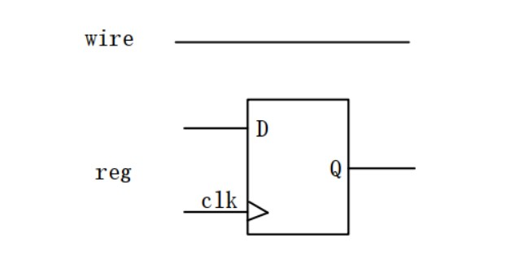
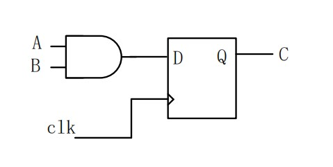
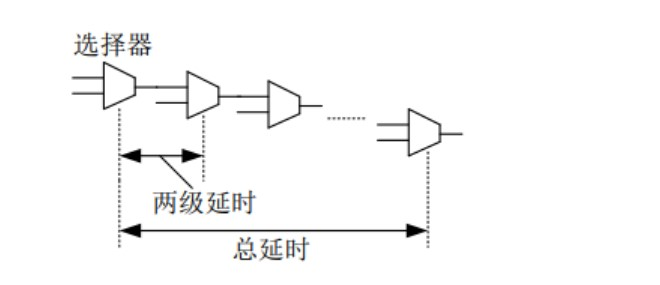
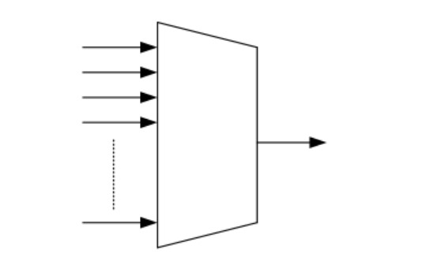

# Verliog 语法基础

## 模块

在 FPGA 开发中，是以模块为基础的，每一个可综合的.v 文件都是一个模块，模块由 module——endmodule 来声明，在这两个关键字内部，完成模块功能的实现。

下面以一个简单的与门来演示如何声明模块。

```v
module and_gate (
    input  wire a,
    input  wire b,
    output wire c
);

    assign c = a & b;

endmodule
```

在第一行声明了一个与门模块，模块名后面是模块的接口的信号，其中输入信号用 input 指示，输出信号用 output 指示。声明的信号之间用逗号隔开。

## 变量类型

在 Verliog 开发中有两种数据类型，一种是 wire(线)，另一种是 reg(寄存器)。在数字电路中信号只有两种形态，一种是传输，一种是存储，传输是通过连接线，存储是用寄存器， 因此也就清楚了在 Verilog HDL 中常用 wire 和 reg 变量了。wire 和 reg 变量模型如下图所示:



wire 型变量在物理结构上只是一根线，在 Verilog HDL 描述时，对线型变量赋值用 assign 即可，相对比较简单

reg 型变量左端有一个输入端口 D，右端有一个输出端口 Q，并且 reg 型存储数据需要在 clk(时钟)沿的控制下完成。

在对 reg 型变量进行赋值时，必须在 always 块内完成，可以选择用时钟上升沿，也可以选择时钟下降沿，具体用上升沿还是用下降沿可以根据需要所定。

我们可以试着将前面与门模块声明中的输出改为 reg 型变量，完成两个输入相与之后的结果传输给寄存器变量 c，RTL 电路图如下图所示:



其 verliog 代码如下:

```v
module and_gate (
    input  wire clk,
    input  wire a,
    input  wire b,
    output reg  c
);

    always @(posedge clk) begin
        c <= a & b;
    end

endmodule
```

第二行为输入的时钟，由晶振提供.

由于输出变量 c 在 always 中赋值，所以其必须是 reg 类型

always 块对 reg 类型变量进行赋值，@(posedge clk)表示的是，每当遇到 clk 上升沿时执行 always 块中的语句。

赋值符号 (<=) 是非阻塞赋值，在 Veriog 中有两种赋值方式，一种是非阻塞赋值 (<=),另一种是阻塞赋值 (=)，在时序逻辑中使用非阻塞赋值，组合逻辑中使用阻塞赋值。

阻塞赋值时，输入改变输出也同时改变，在非阻塞赋值中，只有在时钟变化的时候，输出才会发生变化。


## 数据位宽

在之前定义的数据中，由于没有指定位宽，所以每个变量只能传输或者存储 1bit 数据，这些变量都只能表达 0 或者 1，若想表达的数据不止 0 或者 1 需要声明其位宽。对前面的代码做以下改变

```v
module and_gate (
    input wire clk,
    input wire [1:0] a,
    input wire [1:0] b,
    output reg [1:0] c
);

    always @(posedge clk) begin
        c <= a & b;
    end

endmodule
```

## 赋值语句

在 Verliog HDL 常见的赋值语句有三种，在前面已经接触到了两种，assign 和 always 这两种赋值语句可以最终被综合生成电路

其中 assign 用于组合逻辑的赋值；always 用于时序逻辑赋值；

还有一种赋值语句是 initial，其常常用于仿真时给变量赋值，一般情况下，initial 赋值语句，只使用在仿真文件当中。

### assign 赋值

assign 语句在赋值的时候，只能对组合逻辑进行赋值，在赋值的时候无法加时钟，只能由线和运算符组成，使用 assign 赋值的变量必须是 wire 型。

```v
wire [2:0] a;
reg  [2:0] b;
wire [2:0] c;

assign c = a | b;
```

上面所示的代码中，第 1 到 3 行定义了三个 3bit 的变量，采用 assign 方式对 wire 变量 c 进行赋值，c 的结果是 a 与 b 取或，可以看到，等号右边的变量既可以是 wire 型也可以实 reg 型

### always 赋值

使用 always 进行赋值，既可以实现组合逻辑，也可以实现时序逻辑，但是其**赋值的对象只能是寄存器类型的数据**。

always 赋值语句实现时序逻辑，在前面已经有过介绍，下面介绍下，如何使用 always 语句实现时序逻辑

```v
wire [2:0] a;
reg  [2:0] b;
reg  [2:0] c;

always @(a or b) begin
    c = a & b;
end
```

第三行定义一个 reg 类型变量 c，c 在 always 块中进行赋值，所以其只能是寄存器类型，但由于该 always 块是对组合逻辑进行赋值，所以其在综合器综合的时候将会被综合为 wire 类型。

第五行，always 后面是有@()形式的另外一种写法，此处括号内没有写 posedge 或者 negedge，表明此语句不是由沿触发，而是由电平触发，所以该电路实现的是跟沿无关的组合逻辑。此处括号内的 or 可改为 “，”;

### initial 语句

initial 语句是初始化语句，会在上电（电路刚刚运行时）执行一次，不会循环执行。在电路中只有可以存储数据的寄存器才有初始化的必要，所以 initial 语句中被赋值的变量也必须为 reg。

某些第三方综合软件认为 initial 是不可以被综合的，也就是说不可以被写到功能文件中的，所以为了代码的兼容性，我们尽量只在测试文件中写 initial 语句。

当 initial 和 always 同用时可以很好的描述出时钟，示例代码如下所示。

```v
reg clk;

initial begin
    clk = 0;
    always #(5) clk = ~clk;
end
```

上述代码，将会产生一个周期是 10ns 的时钟。第一行定义了一个 reg 类型的变量，第三行对其进行了初始化，第 4 行每隔 5ns 对 clk 进行赋值一次


## 运算符

Verilog HDL 中的运算符与 C 语言中的运算符基本相同，本小结中不会对其做过多介绍，只介绍几种比较常用的操作符

### 关系运算符（< 、<=、== 、>= 、> 、!=）

### 逻辑运算符（&& 、||、 ！）

### 位运算符（& 、|、 ~）

与和或运算, 位宽不一样位宽少的在高位补 0

### 条件运算符

```v
assign a = (b > 6) ? 1'b1 : 1'b0;
```

### 赋值运算符

前面已经介绍过 Verilog 中的赋值运算符，<= 和=，其中<= 是非阻塞赋值，用于时序逻辑，=是阻塞赋值，用于组合逻辑。

### 移位运算符(<< 、>>)

`>>` 为向右移位，每次右移一位，数据高位补零，向下溢出的数据丢弃。`<<` 与之相反。


###  位拼接运算符（{}）

位拼接运算符，可以将不同数据的位拼接成一个新的数据。

```v
reg[3:0] a=4'b0110;
reg[4:0] b=5'b10110;

always@(posedge clk)
c <= {b[1],a[1:0],b[3],b[1]};
```

拼接完成后，c = 5'b11001;

## 条件判断语句

同一个变量可以在不同的情况下获得不同的值，不同的情况需要判断语句来描述。

Verilog HDL 中经常使用的判断语句有 if else 语句和 case endcase 语句，两种判断语句必须写在 always 语句中，不能写在 assign 中。

### if-else

```v
always @(posedge clk) begin
    if (a == 1) b <= 1;
    else if (a == 2) b <= 2;
    else if (a == 3) b <= 3;
    else if (a == 4) b <= 4;
    else if (a == 5) b <= 5;
end
```

if else 叠加不易过多，不然可能造成线路的延时过多。每一个 if else 语句都会生成一选择器，当 if else 过多时，选择器链路就会很长，

而每两级选择器之间都会有线路的延时，当链路过多时，造成的延时就会很多，这样对于描述的电路的时序影响会很大，时序出问题时，就算是功能仿真正确，下板后电路也是不正确的。



使用 if-else 语句时需要考虑优先级的顺序，优先执行的条件放在上方，优先级较低的条件放在后方。

### case 语句

在 if-else 级数过多的情况下，也可以使用 case 语句，case 语句生成的时多路器



```v
always @(posedge clk)
    case (a)
        0: b <= 0;
        1: b <= 1;
        2: b <= 2;
        default: b <= 0;
    endcase
```


# 个人理解

变量就像 C 语言一样，其实仅仅只是一个标签而已. 而且 verilog 没有顺序概念, 基本都是并行， 一条条语句不过是定义电路如何连接。并没有说先定义的

