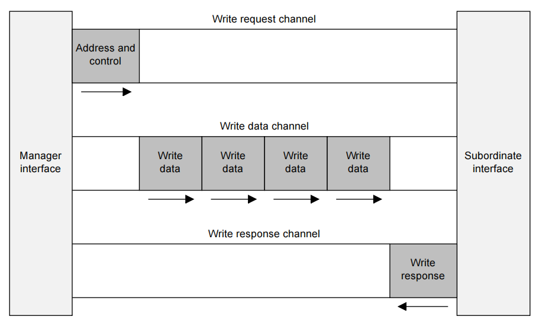
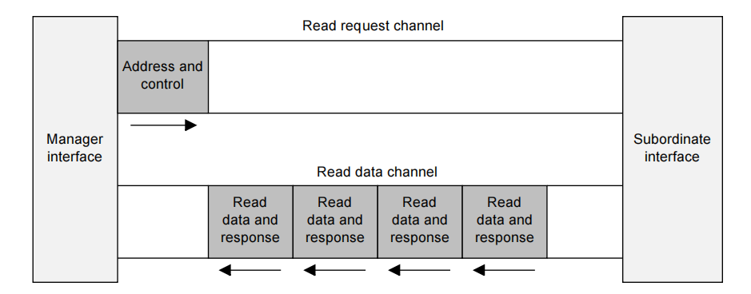

## 介绍

AXI 协议基于事务的 (transactions-based), 其定义了 5 个独立的通道

* 写请求 (Write request), 信号名称以 AW 开头
* 写数据 (Write data), 信号名称以 W 开头
* 写响应 (Write response), 信号名称以 B 开头
* 读请求 (Read request), 信号名称以 AR 开头
* 读数据 (Read data), 信号名称以 R 开头

请求通道携带控制信息用于描述要传输的数据的性质，这被称为一个请求。

数据在 Manager 和 Subordinate 之间进行传输:

* 写数据通道将数据从 Manager 传输到 Subordinate。在写事务中，Subordinate 会使用写响应通道来向 Manager 发出完成传输的信号。
* 读数据通道则将数据从 Subordinate 传输到 Manager。

AXI 协议:

* 允许在实际数据传输之前分配地址信息
* 支持多个未完成 (outstanding) 的事务
* 支持无序完成事务

下图显示了一个写事务是如何使用写请求、写数据以及写响应通道的

下图显示了一个读事务是如何使用读请求和读数据通道的

#### 通道定义

这五个独立通道中的每一个都由一组信息信号以及用于提供双向握手机制的 `VALID` 和 `READY` 信号组成。

信息源端使用有效信号 (VALID) 来指示通道上的有效地址、数据或控制信息何时可用。目的地端使用就绪信号 (READY) 来指示它何时可以接受这些信息。

读数据通道和写数据通道还包括一个 `LAST` 信号，以指示事务中最后一个数据项的传输。

数据信号 WDATA 支持 8、16、32、64、128、256、512或1024位宽。该宽度将使用DATA_WIDTH属性来表示。

每 8 个比特都会有一个字节选通信号 `WSTRB (strobe signal) `，用来指示这些数据的哪些字节是有效的。

写数据通道的信息始终被视为已经缓存了的，因此 Manager 可以直接执行写事务，而不需要等待 Subordinate 应答前一个的写事务。

* 写请求和读请求通道，携带事务所需的地址和控制信息
* 读数据通道
