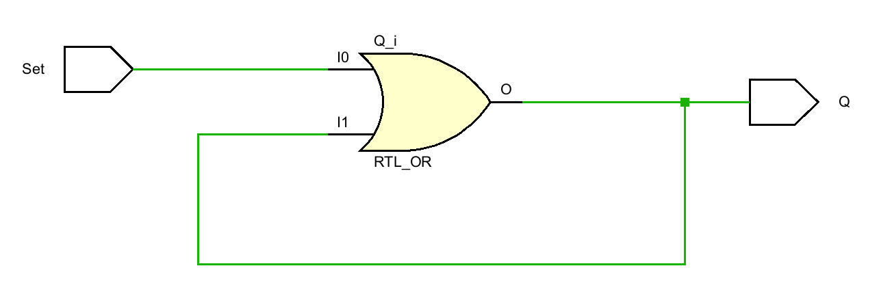
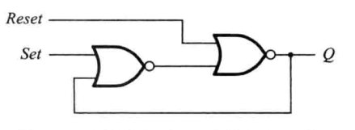

## RS 锁存器

设计一个具有记忆功能的器件, 具有 Set 和 Reset 输入引脚和 Q 输出引脚。

当 Set = 1 时 Q = 1 并锁存，这时即使 Set 变回 = 0, Q 依然 = 1
除非令 Reset = 1 将 Q 复位 = 0

上例通过对或门引入一个反馈回路，实现了 Set = 1 时 Q = 1 并锁住，但是没有复位信号，无法将 Q 状态恢复为 0

> 或非门只要输入有 1 输出总是 0, 只有 0 0 才输出 1

上图中只要 Reset = 1, 则 Q 总是 0，假设初始情况下 Reset = 0，这时 Q 的输出将其由另一个输入信号决定

当 Set = 1 时，第一个与非门输出 0，从而第二个与非门输入为 0 0，Q 输出 1

这时当 Set 变回 0 时, 因为输入的反馈信号总是有 1，从而第一个与非门总是输出 0，从而第二个与非门输出还是 1

也就意味着无论 Set 如何变化, Q 都将保持为 1。直到将 Reset = 1，Q 才变回 0

