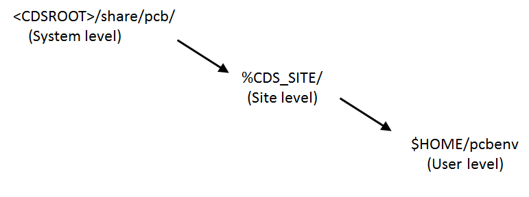

一般来说 Capture CIS 中的 Orcad Capture CIS 进行原理图绘制，Allegro PCB Designer 则用来进行 PCB 设计。PSpice 用来仿真

CIS 是附加集成的，即零件信息管理系统（Component Information System) 。使用 CIS 可以将一些零件信息通过属性的方式添加到零件上。可以使用第三方的工具如 CircuiteXpert 进行替代

# 环境

[参考](https://www.parallel-systems.co.uk/wp-content/uploads/2020/02/environments.pdf)

Cadence 可以通过定义一些设置来帮助用户管理 PCB Editor 软件。

HOME、PCBENV 和 ENV 等变量下的用户设置，使用户能够自定义元件库路径、默认设置和功能键。

还有像 CDS_SITE 和 CDSROOT 这样的管理员级别的设置，允许管理员为公司内的所有用户预设选项。

本技术说明介绍如何定义和管理这些环境设置：
## 1. HOME 

HOME 是一个系统变量，它定义了您的印刷电路板编辑环境设置的位置。建议每个用户都有自己的主文件夹。这可以在安装 Cadence 印刷电路板编辑器软件时定义。

HOME 包含符号库和示意图库的所有路径定义以及最近设计的列表。

HOME 可以是用户变量，也可以是系统变量。如果将 HOME 设置为用户变量，则每个用户都需要自己的变量。如果只有一个用户在系统上工作，则可以将其定义为系统变量。

Candence 启动印刷电路板编辑器时会去 HOME 目录加载 `.ini` 格式的用户配置文件，而且比较坑的是一开始不知道，然后安装时默认会覆盖你的环境变量 HOME，即：

```
HOME=C:\Users\shino\AppData\Roaming\SPB_Data
```

这就导致你的 HOME 目录被更改，不过，可通过更改快捷方式的起始位置属性来更改 SPB_Data 目录，例如将 SPB_Data 文件夹复制到 `C:\Users\shino` 后，在快捷方式的`属性->起始位置`中设置为 

```
C:\Users\shino\SPB_Data
```

那么下次打开后加载配置的目录就是上面所设置的路径 （如果 Candence 在 HOME 中没有找到配置文件，则会创建并加载默认配置） 。

但这仅限于用快捷方式的形式打开，如果直接双击设计文件打开，Candence 是无法知道配置文件夹在哪的，因此最终只能将配置信息放在 HOME 目录下。
* Orcad Capture 会从 $HOME/cdssetup/OrCAD_Capture 文件夹中加载配置
* PSpice 从 $HOME/cdssetup/OrCAD_Capture 文件夹加载配置
* Allegro PCB Designer 从 $HOME/pcbenv 文件夹中加载配置

## 2. pcbenv

pcbenv 是 HOME 中的一个文件夹，包含了 PCB 编辑器环境。如果该目录不存在，将自动生成该目录。以下是通常在此目录中找到的一些文件的列表：

##### 1) Env 

这是环境文件。当软件启动时，它由 PCB Editor 读取。它包含个别用户设置，如别名、功能键定义、访问系统上文件的库路径，以及由 PCB Editor 用来查找软件的系统变量。

##### 2) allegro.ini 

该文件跟踪您正在工作的文件所在的路径。它跟踪主工具窗口的大小和位置。**请勿编辑此文件！**

如果您在使用 PCB Editor 时遇到问题，作为故障排除的一种形式，可以删除该文件。它将在您下次启动印刷电路板编辑器时自动创建。

##### 3) Allegro.mru

此文件存储最近使用的电路板文件的列表。 **请勿编辑此文件！**

##### 4) Allegro.ilinit

此文件包含软件启动时自动加载的所有 skill 文件的位置。有关 skill 的更多信息，请参阅如何添加 skill 例程。

##### 5) allegro.geo

该文件记录表单最后出现的位置，并将相同类型的表单放置在相同位置。**请勿编辑此文件！**

##### 6) myfavorites.txt

此文件包含要在颜色对话框窗体的我的收藏夹文件夹中显示的类/子类。

##### 7)  my_favorites

此文件包含已在用户首选项中设置为收藏设置的任何用户首选项。

##### 8) pad_designer.geo

这存储了 Pad Designer 窗体的位置和大小。

##### 9) pad_designer.mru

这存储了最近使用的焊盘堆栈和路径的列表。

##### 10) license_cache_allegro_17.4-2019.txt

该文件存储了可供 PCB Editor 使用的许可证的缓存，并且是自动生成的。如果您可以访问一个新的许可证文件，您可以手动删除该文件，也可以使用 PCB Editor 许可证选取器对话框上的 Reset 许可证缓存按钮。

## 3. cdssetup 

cdssetup 是 HOME 中的一个文件夹，其中包含 OrCAD_Capture(CIS 或 DE CIS) 的用户设置结构 (user setup structure)。如果该目录不存在，将自动生成该目录。

最初将有一个 OrCAD_Capture 文件夹和一个 OrCAD_PSpice 文件夹（依赖于许可证） ，然后里面将有像 17.2.0 或 17.4.0 这样的发布版本文件夹用于包含用于用户自定义和安装 tcl 脚本的文件夹。
在 OrCAD_Capture\Release_Version 文件夹中有一些默认文件，其中可能包含以下一些文件：

##### 1) Capture.ini

当 Capture 启动时，它使用一组预定义的应用程序设置的默认值。这些默认值在 Capture 配置文件 (Capture.ini) 中定义。

如果您是第一次在计算机上运行 Capture，它将使用一组预定义的配置来创建 INI 文件。此后，每次您进行任何配置更改时，此文件都会在您关闭 Capture 时更新。

##### 2) Spinfo.ini

这将列出 OrCAD Capture 起始页上可用的最近文件列表

##### 3) Backini.unk

这是一个自动生成的文件，存储用于 Capture 的默认库设置，包括 PCB 封装外形位置和已添加的任何库。

##### 4) BackupCaptureCIS.ini

这是一个自动生成的文件，存储了 Capture CIS 的默认库设置，包括 PCB 封装外形位置、零件库目录位置和在 Options-CIS Configurations 下定义的 CIS DBC 文件。

## 4. ENV 文件中的路径定义

Env 文件包含与默认系统设置不同的所有路径定义。当您通过使用 Setup>User Preferences>Pats>Library or Config 在 PCB Editor 中更改这些设置时，更改会写入到该 env 文件中。

您也可以通过使用诸如写字板之类的文本编辑器打开环境文件来更改它。

下面是一些可能的路径设置的概述。

库定义的两个最重要的参数是 padpath 和 psmPath

这些文件存储了印制电路板封装外形和焊盘堆栈定义的默认路径。

有关所有用户首选项信息的描述，请从 Setup>User Preferences 打开用户首选项，然后选择 Info with the LMB。

### 4.1 路径类别-库 (Library)

##### 1) devpath

库设备 (library devices) (.txt) 的搜索路径。不用于  OrCAD Capture 或 DE HDL。仅第三方网表用到。

##### 2) interfacepath

界面文件 (.idf) 的搜索路径

##### 2) interfacepath

其他文件类型的搜索路径。支持的类型为 DXF 转换 (.cnv)。

##### 2) modulepath

搜索设计重用模块 (.mdd) 的路径。

##### 2) padpath

搜索存储库焊盘堆栈的路径 (.pad)。

##### 2) parampath

搜索参数文件 (.prm) 的路径。这些允许重复使用物理设计数据选项设置，如文本、可见性和网格设置。

##### 2) psmpath

库符号的搜索路径 (.psm.osm.bsm.ssm.fsm)

##### 2) step_facet_path

库符号的搜索路径 (.psm.osm.bsm.ssm.fsm)

##### 2) step_mapping_path

搜索设备的步骤映射文件 (.map) 的路径。

##### 2) steppath

STEP 模型 (.stp.Step) 的搜索路径

##### 2) techpath

技术文件 (.tech) 的搜索路径。

##### 2) topology_template_path

拓扑模板文件 (.TOP) 的搜索路径。

### 4.2 路径类别-配置 (Config)

##### 2) accpath

搜索 ACC 项目的路径。

##### 2) aptpath

光圈闪存文件的搜索路径--这在。fsm 支持 (.bsm) 中已过时。

##### 2) artpath

搜索图稿参数文件 (.txt) 和图稿光圈文件 (.txt) 的路径。

##### 2) clippath

子工程图文件 (.clp) 的搜索路径。

##### 2) dclpath

搜索解耦电容器列表文件 (.dcf) 的路径。

##### 2) dfaauditpath

DFA 审核的搜索路径 (.arl.rle)

##### 2) dfacnspath

DFA 约束电子表格文件 (DFA) 的搜索路径。

##### 2) Idxfilterpath

IDX 对象筛选器配置文件 (.config) 的搜索路径

##### 2) Idxpath

IDX 文件 (.idx) 的搜索路径。

##### 2) ipc2581attrpath

IPC2581 属性配置文件 (.atr) 的搜索路径

##### 2) ipc2581spec_path

IPC2581 规范配置文件 (.xml) 的搜索路径。

##### 2) ldfpath

库定义文件 (.ldf) 的搜索路径。

##### 2) lstpath

查找列表文件 (.lst) 的搜索路径

##### 2) materialpath

搜索路径以找到 Materials.dat（快板）或 mcmmat.dat(Apd)(.dat)

##### 2) ncdpath

NC 钻孔参数文件 (.txt) 的搜索路径。

##### 2) pcell_lib_path

PCell 组件实现的搜索路径 (.il.ile)

##### 2) prfeditpath

搜索用户首选项文件的路径。

##### 2) scriptpath

脚本的搜索路径

##### 2) textpath

extracta 命令文件 (.txt) 的搜索路径

##### 2) tilepath

可重复使用的 die pin tiles (.til) 的搜索路径 (Apd)

##### 2) viewpath

可见性架构文件 (.color) 的搜索路径。

##### 2) wizard_template_path

Allegro 模板的搜索路径 (.brd.dra)

##### 2) xtalk_table_path

串口表 (.xtb) 的搜索路径。

## 5. CDS_SITE

CDS_SITE 是在系统级别设置的变量。它允许管理员为所有用户定义标准设置和路径。CDS_SITE 通常位于服务器上。注：使用 CDS_SITE，您只能管理印刷电路板编辑器和 DE HDL 语言。此变量不用于 DE CIS 或 OrCAD Capture。

定义 CDS_SITE 变量后，将所需的任何文件夹结构从、Share\复制到 CDS_SITE 文件夹，例如，如果您需要用户定义的菜单复制 c：\Cadence\SPB_17.4\Share\pcb\Text\ncLegend 到 c：\My_CDS_Site\pcb\Text\ncLegend。

然后修改 ncLegend Contents 和 ncdPath，以便 PCB Editor 首先查找 CDS_SITE 菜单。使用 CDS_SITE 定义，您可以管理几乎所有的 PCB 编辑器设置。

这里有一些例子：符号和焊盘堆栈的路径、功能键、图稿和报告的子目录、脚本的路径、视图的路径、技能例程。



如果您想要定义一个基于站点的 env 文件，该文件为所有用户定义默认设置，如 padpath、psmpath、steppath 等，则可以通过以下方式进行管理：-定义具有您需要的站点设置的 site.env 文件。
将该文件存储在$CDS_SITE\site.env 中。

## CDSROOT 用在不同的版本中

CDSROOT 是定义用于启动工具的安装目录的系统变量。在安装过程中，会自动设置此变量。如果您只使用一个软件版本，则不需要使用此功能。

如果您使用两个或更多软件版本，知道设置了哪个值很重要。您可以使用 Cadence Switch Release 命令手动修改 CDSROOT。Cadence Switch Release 设置 CDSROOT 和所有必要的路径设置。

您可以通过选择开始>Cadence>Cadence Switch Release 来启动它。仅供参考-Cadence 版本 17.x 不再需要使用 CDSROOT（或任何基于计算机的环境变量，如 PATH)。

当您安装 17.x 并且不再需要访问 16.6 或更早版本时，安装将删除所有 Cadence 环境变量。如果需要同时使用两个版本，请确保设置了环境变量。您可以将 CDSROOT 变量设置为 C：\Cadence\SPB_16.6，并从开始菜单运行 16.6 和 17.x，而不需要开关松开注意：Cadence 开关松开不会更改 HOME 变量设置

#### Capture.ini 配置文件

Capture.ini 配置文件是 Candence 原理图编辑工具  Capture CIS 的主要用户配置文件，里面包含了各种用户自定义配置，若删除该文件，则 Candence 会从默认配置中复制并加载，这时打开的界面内容就和第一次安装后打开的一样，各种设置都是默认的了

[配置 .ini](https://embedded-systems-design.github.io/configuring-cadence/)

```ini
; 指定 Footprints 的目录
[Allegro Footprints]
Dir0=

; 项目向导所默认的路径
[Project Wizard]
Project Directory=

; 默认打开和保存的位置
[Directories]
SaveDir=C:\Users\shino\Documents\Candence\design\
OpenDsnDir=C:\Users\shino\Documents\Candence\design\

; 零件选择器配置库
[Part Selector Configured Libraries]
Number of Configured Libraries=1
Library0=C:\USERS\SHINO\DOCUMENTS\CANDENCE\MYLIBRARY\MYLIBRARY1.OLB

; 符号选择器配置库 （内置库） 
[Symbol Selector Configured Libraries]
Number of Configured Libraries=1
Library0=C:\Cadence\SPB_17.4\tools\capture\LIBRARY\CAPSYM.OLB

[Configured Schematic Macros]
Number of Configured Macros=0

; 列出了最近打开的文件
[Recent File List]
File1=
```

capsym 顾名思义就是 capture symbol，是为 capture 软件而制作的电气符号库，里面的任何一个 symbol 仅是一种符号，在电路图中同一 symbol 连接处具有相同的电气特性，即这些连接处实际上都连接在同一个节点上。如果没有将这个 capture symbol 与 source 中的激励源相连，它不具有任何的电压或电流值。capture sympol 中唯一一个具有电气特性的就是“0”或叫”0/capsym“，它可以放在电路图中作为直流地。但是像”GND“或叫”GND/capsym“就必须与”0“相连后才能作为地使用，本身只是个符号。

# 快捷键自定义

# 脚本与插件

<!-- 官方采用一种叫 [SKILL Language](https://cpb-us-w2.wpmucdn.com/sites.gatech.edu/dist/0/367/files/2016/03/Generic_functions_reference.pdf) 的脚本 

这里有一篇不错的 [教程](https://wiki.to.infn.it/vlsi/workbook2/skill) -->

Orcad Capture 使用 [TCL (Tool Command Language)](https://www.tcl.tk/about/language.html) 来完成各种脚本功能。(Altium 和 vivado 也使用） 

可在 MSYS 中调试 

```
pacman -S mingw-w64-ucrt-x86_64-tcl
```

详情请查阅 TCL 语言专题，这里给出简单示例：
```tcl
puts "Hello World"
```
