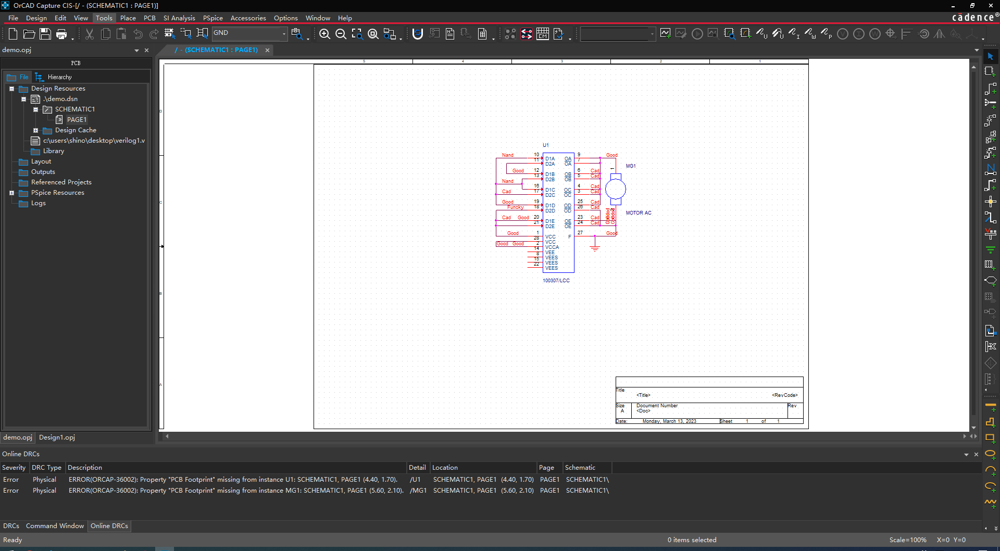

本文主要介绍 OrCad Capture CIS 中原理图绘制
<!-- more -->

# 界面默认布局

最顶层是一个菜单栏，菜单栏下面是一个个独立的小工具栏。

再往下左边是项目管理窗口集合，右边较大的窗口就是一个个文件的窗口集合，文件窗口下方是包含各种信息输出和命令窗口集合。

最右边有一个工具栏窗口，在原理图绘制时可执行一些快捷命令。

## 2. 原理图绘制

放置功能有三种使用方法:

* 第一种是在菜单栏中选择 `Place`，然后在下拉框中选中要放置的内容
* 第二种是直接在左侧工具栏种选中要放置的内容
* 第三种是直接使用快捷键进行放置，根据快捷键的不同，放置的内容不同

放置功能在原理图绘制中占据非常重要的地位，以至于很多单字母的快捷键都是为它们准备的。

##### 1) 放置元件 (Part)

快捷键 P, 放置元件命令执行后会弹出一个选择框，需要从元件库中选中一个元件然后放到原理图中。可在 Libraries 栏中新增或删除一个元件库。

###### 内置库

一般来说放置一些常规的如电容电阻元件，电源和地符号等，直接使用内置的元件库就可以了，内置的元件库有很多，一般放置在安装目录下的 `tools\capture\library` 文件夹中。选择添加元件库时，默认打开的文件路径就是该文件夹，因此可以非常方便地选择添加内置库文件。

以下是列出 `tools\capture\library` 文件夹中包含的一些常用的内置元件或符号库:

| 库名                     | 零件个数 | 内容                                                                      |
| ------------------------ | -------- | ------------------------------------------------------------------------- |
| capsym.olb               | 35  个   | 存放一些常用的电源和地符号 (注: 电源、地仅是一些电气符号, 不属于真实元件) |
| Discrete.olb             | 872个    | 存放分立式元件，如电阻，电容，电感，开关，变压器等常用零件                |
| Counter.olb              | 816个    | 存放连接器，如4 HEADER，CON AT62，RCA JACK等                              |
| Transistor.olb           | 210个    | 存放晶体管（含FET，UJT，PUT等），如 2N2222A，2N2905等                     |
| Amplifier.olb            | 182个    | 存放模拟放大器IC，如CA3280，TL027C，EL4093等                              |
| Arithmetic.olb           | 182个    | 存放逻辑运算IC，如TC4032B，74LS85等                                       |
| ATOD.OLB                 | 618个    | 存放A/D转换IC，如ADC0804，TC7109等                                        |
| BusDriverTransceiver.olb | 632个    | 存放汇流排驱动IC，如74LS244，74LS373等数字IC                              |
| Counter.olb              | 182个    | 存放计数器IC，如74LS90，CD4040B                                           |
| DRAM.OLB                 | 623个    | 存放动态存储器，如TMS44C256，MN41100-10等                                 |
| ElectroMechanical.olb    | 6个      | 存放马达，断路器等电机类元件。 MICROPHONE，蜂鸣器也在里面                 |
| FIFO.OLB                 | 177个    | 存放先进先出资料暂存器，如40105，SN74LS232                                |
| Filter.olb               | 80个     | 存放滤波器类元件，如MAX270，LTC1065等                                     |
| FPGA.OLB                 |          | 存放可编程逻辑器件，如XC6216/LCC                                          |
| Gate.olb                 | 691个    | 存放逻辑门（含CMOS和TLL）                                                 |
| Latch.olb                | 305个    | 存放锁存器，如4013，74LS73，74LS76等                                      |
| LineDriverReceiver.olb   | 380个    | 共380个零件，存放线控驱动与接收器。如SN75125，DS275等                     |
| Mechanical.olb           | 110个    | 共110个零件，存放机构图件，如M HOLE 2，PGASOC-15-F等                      |
| MicroController.olb      | 523个    | 存放单晶片微处理器，如68HC11，AT89C51等                                   |
| MicroProcessor.olb       | 288个    | 存放微处理器，如80386，Z80180等                                           |
| Misc.olb                 | 1567个   | 存放杂项图件，如电表（METER MA），微处理器周边（Z80-DMA）等未分类的零件   |
| Misc2.olb                | 772个    | 存放杂项图件，如TP3071，ZSD100等未分类零件                                |
| Misc3.olb                | 365个    | 存放线性杂项图件（未分类），如14573，4127，VFC32等                        |
| MiscMemory.olb           | 278个    | 存放记忆体杂项图件（未分类），如28F020，X76F041等                         |
| MiscPower.olb            | 222个    | 存放高功率杂项图件（未分类），如REF-01，PWR505，TPS67341等                |
| MuxDecoder.olb           | 449个    | 存放解码器，如4511，4555，74AC157等                                       |
| OPAmp.olb                | 610个    | 存放运放，如101，1458，UA741等                                            |
| PassiveFilter.olb        | 14个     | 存放被动式滤波器，如DIGNSFILTER，RS1517T，LINE FILTER等                   |
| PLD.OLB                  | 355个    | 存放可编程逻辑器件，如22V10，10H8等                                       |
| PROM.OLB                 | 811个    | 存放只读记忆体运算放大器，如18SA46，XL93C46等                             |
| Regulator.olb            | 549个    | 存放稳压IC，如78xxx，79xxx等                                              |
| ShiftRegister.olb        | 610个    | 存放移位寄存器，如4006，SNLS91等                                          |
| SRAM.OLB                 | 691个    | 存放静态存储器，如MCM6164，P4C116等                                       |

###### Design Cache 

Design Cache 列出当前放置到原理图中的所有元件，使用起来非常方便。即使导入的元件库都清空了，Design Cache 中的元件依然存在。

###### 从元件库中筛查元件技巧

* 当在 Libraries 栏里选中一个元件库，在 Part 栏中就会只列出当前选中的元件库，在输入栏中输入想要查找的元件即可筛查。

* 可以通过在 Libraries 栏中按 Ctrl 进行复选多个库，如果要选中全部，则按 `Ctrl + A`，这时 Part 栏中就会列出所有选中的库元件，并且以 `元件名/库名` 的形式列出。

* 输入栏支持通配符查找，例如要查找 51 单片机, 输入 `*89*51*`，若库中有，则将可匹配出 `AT89C51` 或者 `STC89S51` 等。

* 在最下方有一个 `+ Search for`, 点击加号展开后可用用于在指定的库文件夹中查找某个元件，并将元件所在的库列出来，非常方便。

> 放置完后可以直接把元件选择框 × 掉的，因为下次再点放置还会弹出，不用担心找不到

##### 2) 放置基本

选择菜单栏的 Place 可以看到每一种放置的快捷键, 以下只是列出...

| 放置类型     | 快捷键 | 备注                                                                       |
| ------------ | ------ | -------------------------------------------------------------------------- |
| 连线         | W      | 默认走直角。若想走任意角度，画线过程按 Shitf, 也可以在画完后拖动时按 Shitf |
| 连接点       | J      | 要去除某个连接点，再点一次放置连接点即可                                   |
| 网络         | N      | 放置网络 (Net Alias 只在同一个原理图中有效?)                               |
| 不连接       | X      | 放置 NC (从而识别该引脚悬空，电气检查时就不会报错)                         |
| 电源         | F      |                                                                            |
| 地           | G      |                                                                            |
| 总线         | B      | 放置总线, 总线网络标签可使用 NAME[0..7] 或 NAME[0:7] 或 NAME[0-7]          |
| 总线入口     | E      | 放置总线引出线, 总线引出线必须使用 Entry 不能直接使用 NET Alias            |
| 跨原理图网络 | 无     | 跨原理图不能直接使用 Net Alias 连接, 需使用 Off-page connector             |

###### 画线技巧

* 一个引脚引出网络已经绘制完成, 可按住 Ctrl 并选中该网络往下拖会自带复制线和网络, 如果网络以数字结尾，则会自动递增数字
* **F4 可复刻上一个步骤所进行的操作**，因此在拖动完后可直接按 F4 重复上一次操作，这样就可以快速添加网络
    例如添加总线入口时只需添加第一个，然后按Ctrl + 拖动入口线到第二个，随后按F4，系统会自动添加入口线
* 画线没有设置网络系统会默认分配网络, 可通过鼠标悬停在线上查看实际某根线连接到的网络

## 3. 编辑原理图

绘制完原理图后可能需要进行修改和检查。

菜单栏下的 Edit 选项有很多

### 1) Edit->Browse

Browse 功能可对原理图整体进行概览 (先在工程栏中选中要预览的 dsn 文件, 否则该功能可能为灰色), 包括所有元器件，网络等。可通过对原理图的概览中快速发现问题, 例如

* Parts 可对元件进行概览, 将列出所有元件，发现未命名元件可直接双击，软件会自动转到该元件。

* Nets 可对网络概览, 将列出所有网络，包括软件自动命名的。通过浏览，可以很快发现比如电源网络没设置问题 (这在电气检查不出, 因为默认 电源 VCC_BAR, 它本身也是一个合法的网络，只是我们根本没在那个网络连接电源)

* FlatNetlist：扁平的网络连接，包括不用页面的连接，在平坦式原理图中，所有的网络都是Flat Netlist，只有在层次化原理图中，部分的网络才是Schematic Net；

* Port与Off-page：这两个都是查看原理图中的分页连接符；

* TitleBlocks：浏览原理图中的的标题栏；

* Bookmarks：浏览原理图中的的书签标记；

* DRCMarkers：浏览原理图中的DRC的标记符号；可定位 DRC 检查中的错误.

* Powerpins：浏览原理图中的电源管脚管脚。

常规操作:

* 重新设置所有元件标号为 ?: 只需在 Tools->Annotate 选中 Reset part reference to "?" 
  全部设为 ？ 后再在同样的设置界面选中 Unconditional reference update 即可更新元件标号.

* DRC 检查, 对原理图进行 DRC 检查 17.4 版本后怎么放在 PCB 菜单栏下了?

### 2) Edit->Find

快捷键直接 `Ctrl + F` 

可在多个原理图 (弹出查找窗口后可选中工程栏中的多个原理图进行多个查找) 中快速查找某个元件，网络，Text 等内容。

支持正则表达式, 非常不错. 比如查找 xxV 电源, 那么只需输入 `[0-9].*V`，下面查找类型为 Power/GND 则可以查找如 3.3V, 3V3, 12V 等电源网络.

Flat Net 会列出和该网络相连的引脚都高亮，这样可以有一个整体的概念，知道该网络都连接到哪个地方...

### 3) Design Cache 操作

**替换**: 可通过对 Cache 中列出的元件进行替换来实现对整个工程一些元件的批量替换，例如将 R 电阻的风格 (默认美标）全部替换成国标的, 只需替换 Cache 中 R 为 R2。

此外替换还可以改变元件和原理图库的连接关系。

**更新** 在原理图库中更改了元件可通过 update 来进行更新

注意替换时更新属性和不更新属性的区别, 如果需要更新元件的 PCB 封装, 不能通过更新来完成，而是需要使用替换并更新属性? 我感觉直接更改元件的封装并更新后是可以更改封装的。

**Cleanup** (右击Designe Cache 文件夹) 没放一个元件都会在 Cache 中创建副本, 即在原理与中删除了也依然存在，CLeanup 可以清除哪些在原理中已经被删除的元件副本。

### 4) 原理图编辑的一些小技巧

* 拖动元件时一般都会粘连网络连接，要拖动时断开这种连接，可按 Alt 
* 点击对象后按 R 旋转
* 点击对象后按 V 垂直镜像，H 水平镜像, 两个方向都同时镜像 Edit->Mirror->Both (文本对象无法镜像操作)
* 拖动时按 Ctrl 可直接拷贝出副本

## 编辑元件属性

### PCB 封装属性

#### 1) 原理图中单个添加或更改

双击原理图后会弹出属性编辑界面 (如果是横排的, 可以右击属性栏，选择 Piovt)， 然后更改封装属性

#### 2）通过更改元件库来添加或更改

对元件库中元件的封装信息进行更改，然后在原理图 Cache 中更新即可添加或更改封装信息，但是 Replace 才行 ?

#### 3) 原理图中选中后批量修改

原理图中框选多个元件(可按 Ctrl 重复框选) 右击修改属性。(单击一个元件后，再按住 Shift 单机另一个元件可完成多选) 。

注意在属性栏列表下面可以选择 Object 类型，如果直接框选会带有很多 Object, 选择 part 对象即可。

#### 4) 右击原理图文件后通过 Edit Object Properties 来批量修改

整个原理图肯定包含多个对象，元件只是其中一个，可以在下方选择 part 来显示所有元件对象，这时就可以批量修改了。

可以单独查看和检查某一个原理图元件的封装情况，也可以整个工程所有元件一起检查...

封装添加完后检查 DRC 就不会报错了，至于封装实际是否存在 DRC 并不检查这些。因为添加封装属性只是为了导出网表时包含有元件的封装属性。

绘制 PCB 时，PCB 绘制工具通过网表中的封装信息，从封装库中导入实际的封装。而 PCB 工具可是 AD, PADS 或其他第三方工具。因此原理图 DRC 确实没必要检查封装是否存在。只要有个封装的名字即可。

## 生成网表

原理图最终目的就是要生成网表给 PCB 绘制软件。

原理图 DRC 检查 OK 后菜单栏中选择 Tools->Create NetList 来生成网表。

网表类型有很多选择，可生成 PCB, Verilog，SPICE 网表，这也是为什么很多人都喜欢用 OrCad 绘制原理图的原因。

## 生成元器件清单 (BOM)

导出功能居然要选择 OrCad + CIS 功能才有，否则 Report 选项.

选中dsn 文件后，在菜单中选择 Report-->CIS Bill of Materials

弹出的对话框中，有一个输出选择栏，左边选择想要选择输出哪些属性，右边是哪些属性已经被选择。

Tools下面的 Bill of Materials 也可以生成 BOM 有什么不同?

## 打印原理图

设置原理图属性页面属性, 点击单张原理图， 右击-->原理图属性

在这里可以设置纸张大小, 打印属性等

