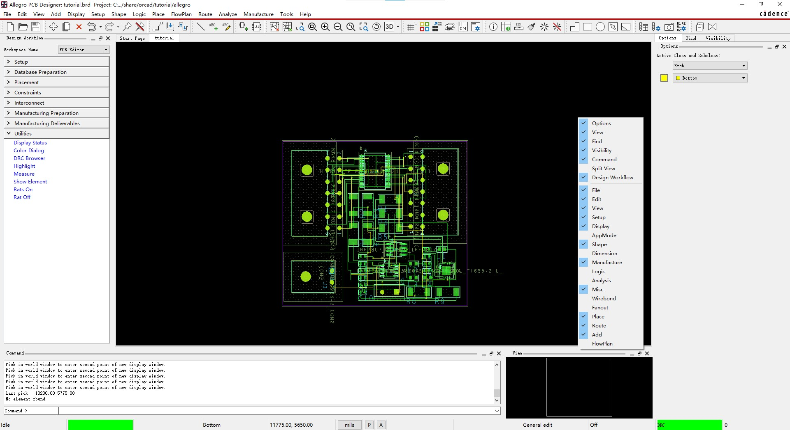

软件界面如下

和原理图绘制差不多，最上面是菜单栏，菜单栏下面是快捷工具栏，工具栏可通过 View->Customize toolsbar 来自定义化.

然后中间就是绘图窗口，左右和下边的控制面板可自定义开启个关闭，**只需要右击控制面板边栏**，然后打勾即可。

Allegro 软件操作是很严谨的，很多操作都是基于命令，命令是如此的重要，因此键盘的全字母字符输入都和 Ctrl快捷键都服务于 Command 输入框

可用于快捷键的几乎就只有 Fn 快捷键。

不过这些命令可以有对应的快捷按钮，然后放到工具栏，或是菜单栏中直接选择。这就像是拥有图形化的命令行而已，核心还是命令行命令。

## 控制面板

### options 

### find 对象过滤器

执行某个命令后会列出该命令可正对哪些对象进行操作，通过过滤器来指定要操作的是哪些对象，从而避免误操作了不想要的对象。

下边还有一个 Find by name 来根据名称进行过滤

### visibility

Conductors 布线层

Plants 层 (非布线层)

## 类和子类的概念

凡是放到 PCB 中的对象都被分为某一类中的某一子类, 通过类和子类可对显示，布线，导出等进行筛选。

