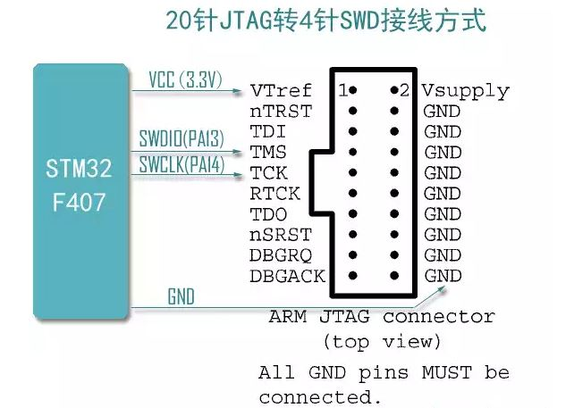

本文主要介绍JTAG接口知识
<!-- more -->

ARM JTAG 20Pin 定义:

* VTREF       参考电压, 决定 JTAG 接口使用的逻辑电平
* nTRST       (可选) 复位信号, 只对当前连接到JTAG的 TAG Controller 进行复位, 对* 于系统的其他部分, 比如电源模块等是不可见的, 通过 TMS 也可以发送该复位信号
* TDI         输出输入
* TMS         模式选择信号，用于控制TAP状态机的转换, 测试模式选择
* RTCK        (可选) 反馈信号, 由目标端反馈给仿真器的时钟信号, 用来同步TCK信号的* 产生, 不使用时直接接地
* TDO         数据输出 
* TCK         时钟信号
* nSRST       (可选) 系统复位信号, 与目标板上的系统复位信号相连,对目标系统所有模块进行复位, 等同于按下 RESET 键

对于 SWD 模式, 除电源和地, 只有两根线

* SWDIO   对应到      TMS
* SWDCLK  对应到      TCK

JTAG接口

STLink

ARM20Pin_SWD

参考文献

https://blog.csdn.net/weixin_60713230/article/details/122691494

