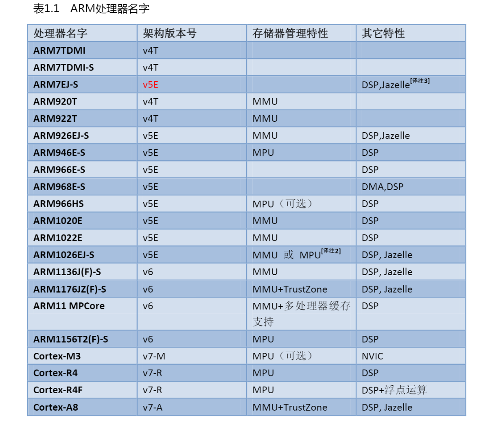
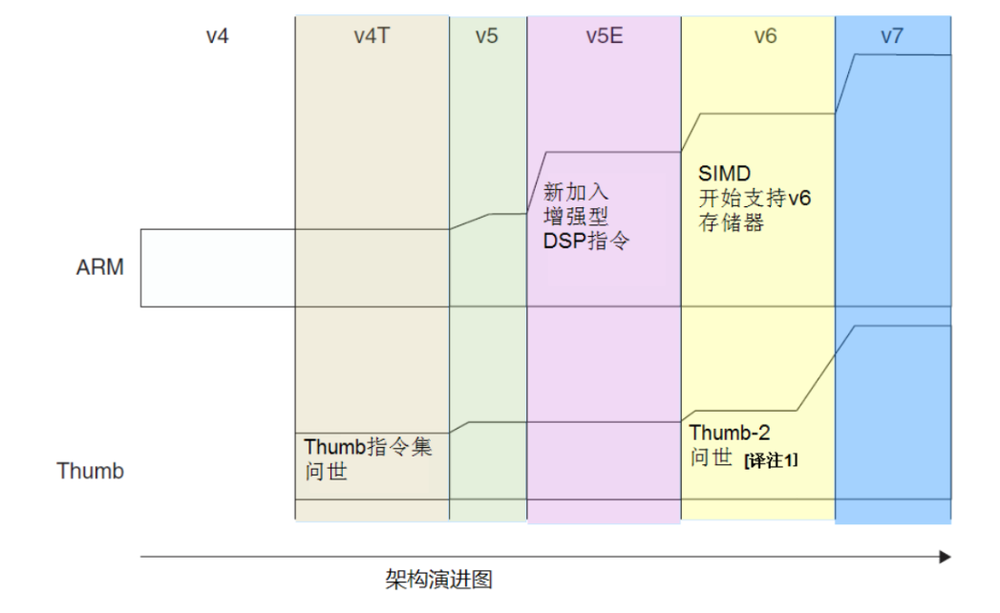
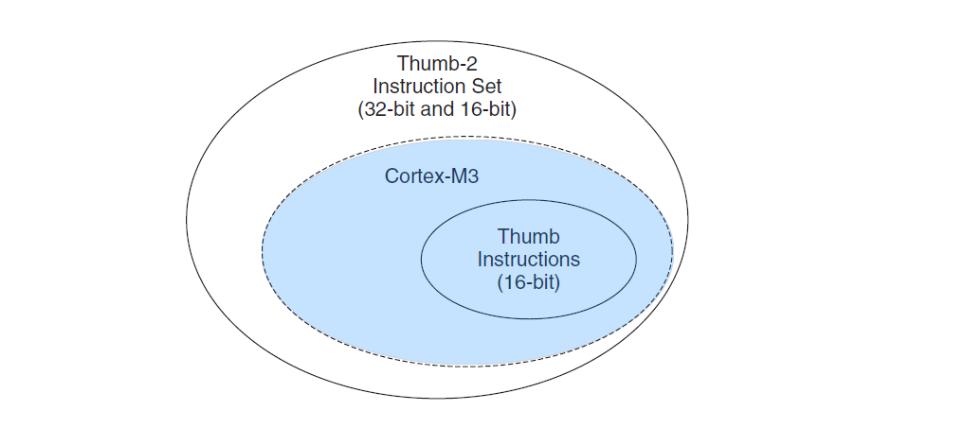

本文主要介绍ARM 和 CortexM3
<!-- more -->

# 1. ARM 处理器命名：
1. 早期的命名方法是在数字后面添加字母后缓，用来进一步明细该处理器支持的特性。
   > 例如：ARM7TDMI 来说，T: Thumb 指令集，D：支持 JTAG 调试，M 指快速乘法器，则对应一个嵌入式 ICE 模块。

2. 后来，这 4 项基本功能成了任何新产品的标配，便不再使用这 4 个字母后缓。而是采用数字加字母的命名方法：
   * 数字 1：表示产品系列
   * 数字 2：表示性能级别。较小的数字通常表示低功耗和低性能，而较大的 数  字表示高性能级别
   * 字母后缀：用于指示具体的配置和特性
     * T：表示支持 Thumb 指令集，使用 16 位指令来提高代码密度
     * F：表示支持浮点运算单元（FPU）
     * E：表示支持嵌入式特性
    > 例如 ARM920T，9: 9 代表产品系列，20: 处理器的性能级别和种类。数字越大，代表着更高性能的处理器版本。T: Thumb 指令集。

3. 再后来，新的特性不断加入，于是形成了新一套命名法，这套命名法也是一直在使用的。
   以 Cortex 作为主名，根据应用领域分为 Cortex-M，Cortex-A，Cortex-R。后面字越大代表性能和功能较新和更高级别的处理器架构。

# 2. 指令集的发展

由于历史原因（从 ARM7TDMI 开始），ARM 处理器一直支持两种形式上相对独立的指令集，它们分别是：

* 32 位的 ARM 指令集。可以实现 ARM 架构下所有功能。对应处理器状态：ARM 状态
* 16 位的 Thumb 指令集。是 ARM 指令集的一个子集，能带来更高的代码密度。对应处理器状态：Thumb 状态

这两种指令集也对应了两种处理器执行状态。在程序的执行过程中，处理器可以动态地在两种执行状态之中切换。

Thumb 指令集仅仅把常用的 ARM 指令压缩成 16 位的指令编码方式。在指令的执行阶段，16 位的指令被重新解码，完成对等的 32 位指令所实现的功能。

与全部用 ARM 指令集的方式相比，使用 Thumb 指令可以在代码密度方面改善大约 30%。但是，这种改进是以代码的效率为代价的。尽管每个 Thumb 指令都有相对应的 ARM 指令，但是，相同的功能，需要更多的 Thumb 指令才能完成。

因此，当指令预取需要的时间没有区别时，ARM 指令相对 Thumb 指令具有更好的性能。

Thumb-2 指令集在现有的 Thumb 指令的基础上做了如下的扩充：

* 增加了一些新的 16 位 Thumb 指令来改进程序的执行流程
* 增加了一些新的 32 位 Thumb 指令以实现一些 ARM 指令的专有功能 32 位的 ARM 指令也得到了扩充
* 增加了一些新的指令来改善代码性能和数据处理的效率给 Thumb 指令集增加 32 位指令就解决了之前 Thumb 指令集不能访问协处理器、特权指令和特殊功能指令的局限
* 新的 Thumb 指令集现在可以实现所有的功能，这样就不需要在 ARM/Thumb 状态之间反复切换了，代码密度和性能得到的显著的提高

参考
论 ARMv7 Thumb-2 指令集的性能（含 Thumb 指令集介绍）【转载】

可以看到 Cortex-M3 只支持 Thumb-2 指令集，并且只实现了 Thumb‐2 的一个子集。
