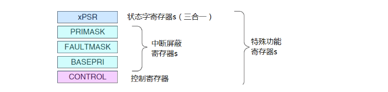

本文主要介绍 CortexM3 的基础知识

<!-- more -->


# 1. 简介

Cortex-M3 是 32 位处理器内核

哈弗结构，指令和数据拥有独立的数据和地址总线 （独立编址）。这样一来数据访问不再占用指令的总线，从而提升了性能

不过指令总线和数据总线共享同一个存储空间，寻址空间不变，为 $2^{32} = 4GB$

比较复杂的应用可能需要更多的存储系统功能，为此 CM3 提供一个可选的 MPU，而且在需要的情况下也可以使用外部的 cache。另外在 CM3 中，小端模式和大端模式都是支持的。


# 2. 寄存器组

Cortex-M3 处理器拥有 R0-R15 的寄存器组。其中 R13 作为堆栈指针 SP。

SP 有两个，但在同一时刻只能有一个可以看到，这也就是所谓的 banked 寄存器。


## R0 - R12: 通用寄存器

R0-R12 都是32位通用寄存器，用于数据操作。但是注意：绝大多数16位Thumb指令只能访间R0-R7，少部分可访问 R8-R12。而32位Thumb-2指令可以访问所有寄存器。

## Banked R13: 两个堆栈指针

Cortex-M3拥有两个堆栈指针，然而它们是banked，因此任一时刻只能使用其中的一个。当引用R13（或写作SP）时，引用到的是当前正在使用的那一个，另一个必须用特殊的指令来访问（MRS,MSR指令）。
* 主堆栈指针（MSP）：复位后默认使用的堆栈指针，用于操作系统内核以及异常处理例程（包
括中断服务例程）
* 进程堆栈指针（PSP）：由用户的应用程序代码使用

堆栈指针的最低两位永远是 0，这意味着堆栈总是4字节对齐的。

> 在ARM编程领域中，凡是打断程序顺序执行的事件，都被称为异常（exception）。除了外部中断外，当有指令执行了“非法操作”，或者访问被禁的内存区间，因各种错误产生的fault，以及不可屏蔽中断发生时，都会打断程序的执行，这些情况统称为异常。在不严格的上下文中，异常与中断也可以混用：另外，程序代码也可以主动请求进入异常状态的（常用于系统调用）

push 操作: sp--, 然后保存操作数
pop 操作: 先取出值，然后 sp++

```s
push {r0}   ; 等价于  *(--r13) = R0
pop {r0}    ; 等价于 r13 = *r13++
```

也就说初始化一般让 sp 处于高内存地址，随着push的进行, 往低地址栈满

```
      | Low  |                  | Low  |    
      |      |                  |      | 
      |      |  [push]  sp ->   |      | 
sp -> | High |                  | High |  
```

## R14: 连接寄存器

当呼叫一个子程序时，由R14存储返回地址。

> 不像大多数共它处理器，ARM为了减少访问内存的次数（防问内存的操作往往要3个以上指令周期，带 MMU 和 cache 的就更加不确定了），把返回地址直接存储在寄存器中。
> 
> 这样足以使很多只有 1 级子程序调用的代码无需访问内存（堆栈内存），从而提高了子程序调用的效率。如果多于1级，则需要把前一级的R14值压到堆栈里。
> 
> 在ARM上编程时，应尽量只使用寄存器保存中间结果，迫不得以时才访问内存。

## R15: 程序计数寄存器

指向当前的程序地址。如果修改它的值，就能改变程序的执行流

## 特殊功能寄存器

特殊功能寄存器有预定义的功能，而且必须通过专用的指令来访问。



| 寄存器    | 功能                                                                                   |
| --------- | -------------------------------------------------------------------------------------- |
| xPSR      | 记录 ALU 标志 (0 标志, 进位标志, 负数标志，溢出标志)，执行状态以及当前正在服务的中断号 |
| PRIMASK   |                                                                                        |
| FAULTMASK |                                                                                        |
| BASEPRI   |                                                                                        |
| CONTROL   |                                                                                        |

# 3. 操作模式和特权级别

* 两种模式: handler 模式 和 thread 模式，用于区别普通应用程序的代码和异常服务例程的代码
* 两级特权级别: 特权级和用户级，提供了存储器访问的保护机制，使得普通的用户程序代码不能意外地，甚至是恶意地执行涉及到要害的操作。


在CM3运行主应用程序时（线程模式），既可以使用特权级，也可以使用用户级：但是异常服务例程必须在特权级下执行。

复位后，处理器默认进入线程模式，特权极访问。在特权级下，程序可以访问所有范围的存储器（如果有MPU，还要在MPU规定的禁地之外），并且可以执行所有指令。


# 4. 内建的嵌套向量中断控制器

嵌套向量中断控制器（Nested Vectored Interrupt Controller）提供如下的功能：

* 可嵌套中断支持 (高优先级中断可打断低优先级中断)
* 向量中断支持 (中断来时自动根据中断号，从向量表中加载执行 ISR)
* 动态优先级调整支持 (在 ISR 中更改了自身优先级, 要等离开 ISR了才生效, 故不会自己打断自己)
* 中断延迟大大缩短 (引入新特性来缩短中断嵌套时 ISR 间的延迟)
* 中断可屏蔽 (既可以屏蔽优先级低于某个阈值的中断/异常 (BASEPRI寄存器)，也可以全体封杀 (PRIMASK和FAULTMASK))

# 5. 存储器映射


# 6. 总线接口

Cortex-M3内部有若干个总线接口，以使CM3能同时取址和访内（访问内存），它们是：

* 指令存储区总线（I-Code 和 D-Code）
* 系统总线 (AHB-Lite)
* 私有外设总线 (诸如APB等的其它低速总线, 挂在 AHB)

有两条代码存储区总线负责对代码存储区的访问，分别是I-Code总线和D-Code总线。前者用于取指，后者用于查表等操作，它们按最佳执行速度进行优化。

系统总线用于访问内存和外设，覆盖的区域包括SRAM，片上外设，片外RAM，片外扩展设备，以及系统级存储区的部分空间。

私有外设总线负责一部分私有外设的访问，主要就是访问调试组件。它们也在系统级存储区。

# 7. 存储器保护单元

可以对特权级访问和用户级访问分别施加不同的访问限制。当检测到犯规（violated）时，MPU就会产生一个fault异常，可以由fult异常的服务例程米分析该错误，并且在可能时改正它。


最常见的就是由操作系统使用MPU，以使特权级代码的数据，包括操作系统本身的数据不被其它用户程序弄坏。

MPU在保护内存时是按区管理的,它可以把某些内存 region 设置成只读，从而避免了那里的内容意外被更改。

还可以在多任务系统中把不同任务之间的数据区隔离。

# 8. 指令集

Cortex-M3只使用Thumb-2指令集。这是个了不起的突破，因为它允许32位指令和16位指令水乳交融，代码密度与处理性能两手抓，两手都硬。而且虽然它很强大，却依然易于使用。

在过去，做AM开发必须处理好两个状态。这两个状态是井水不犯河水的，它们是：32位的ARM状态和16位的Thumb状态。

当处理器在ARM状态下时，所有的指令均是32位的（哪怕只是个NOP指令），此时性能相当高。而在Thumb状态下，所有的指令均是16位的，代码密度提高了倍。

不过，thumb状态下的指令功能只是ARM下的一个子集，结果可能需要更多条的指令去完成相同的工作，导致处理性能下降。


为了取长补短，很多应用程序都混合使用ARM和Thumb代码段。然而，这种混合使用是有额外开销（overhead）的，时间上的和空间上的都有，主要发生在状态切换之时。

另一方面，ARM代码和Thumb代码需要以不同的方式编译，这也增加了软件开发管理的复杂度。


如图通过 BLX 指令，转跳到 ARM 代码部分同时切换处理器为 ARM 状态, 处理完后后返回继续以 Thumb 状态执行。

伴随着Thumb-2指令集的横空出世，终于可以在单一的操作模式下搞定所有处理了，再也没有来回切换的事来烦你了。

事实上，Cortex-M3内核干脆都不支持ARM指令，中断也在Thumb态下处理（以前的ARM总是在ARM状态下处理所有的中断和异常）。

这可不是小便宜，它使CM3在好几个方面都比传统的ARM处理器更先进：

* 消灭了状态切换的额外开销，节省了both执行时间和指令空间。
* 不再需要把源代码文件分成按ARM编译的和按Thumb编译的，软件开发的管理大大减负。
* 无需再反复地求证和测试：究竞该在何时何地切换到何种状态下，我的程序才最有效率。开发软件容易多了。

不少有趣和强大的指令为Cortex-M3注入了新鲜的青春血液，下面给出几个例子：

* UBFX,BFI,BFC：位段提取，位段插入，位段清零。支持C位段，也简化了外设寄存器操作。
* CLZ,RBIT： 计算前导零指令和位反转指令。二者组合使用能实现一些特技UDIV,SDIV：
无符号除法和带符号除法指令。
* SEV,WFE,WFI：发送事件，等待事件以及等待中断指令。用于实现多处理器之间的任务同步，还可以进入不同的休眠模式。
* MSR,MRS：通向禁地一访问特殊功能寄存器。

# 9. 中断和异常


