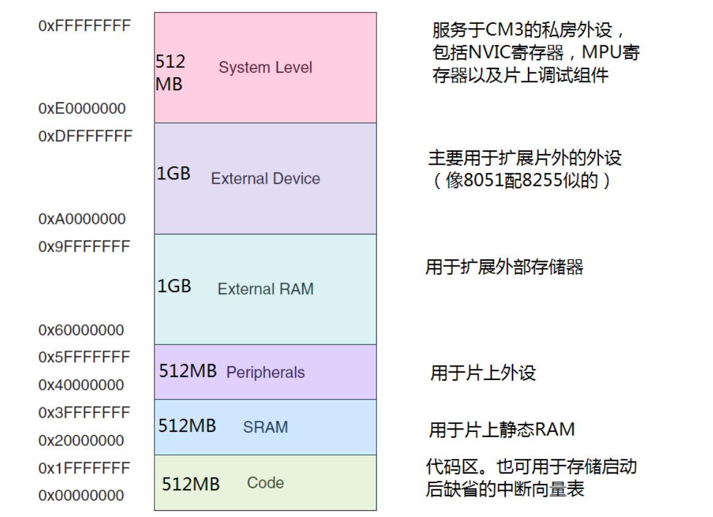

本文主要介绍 CortexM3 的基础知识

<!-- more -->


# 1. 简介

Cortex-M3 是 32 位处理器内核

哈弗结构，指令和数据拥有独立的数据和地址总线 （独立编址）。这样一来数据访问不再占用指令的总线，从而提升了性能

不过指令总线和数据总线共享同一个存储空间，寻址空间不变，为 $2^{32} = 4GB$

比较复杂的应用可能需要更多的存储系统功能，为此 CM3 提供一个可选的 MPU，而且在需要的情况下也可以使用外部的 cache。另外在 CM3 中，小端模式和大端模式都是支持的。


# 2. 寄存器组

Cortex-M3 处理器拥有 R0-R15 的寄存器组。其中 R13 作为堆栈指针 SP。

SP 有两个，但在同一时刻只能有一个可以看到，这也就是所谓的 banked 寄存器。


## R0 - R12: 通用寄存器

R0-R12 都是32位通用寄存器，用于数据操作。但是注意：绝大多数16位Thumb指令只能访间R0-R7，少部分可访问 R8-R12。而32位Thumb-2指令可以访问所有寄存器。

## Banked R13: 两个堆栈指针

Cortex-M3拥有两个堆栈指针，然而它们是banked，因此任一时刻只能使用其中的一个。当引用R13（或写作SP）时，引用到的是当前正在使用的那一个，另一个必须用特殊的指令来访问（MRS,MSR指令）。
* 主堆栈指针（MSP）：复位后默认使用的堆栈指针，用于操作系统内核以及异常处理例程（包括中断服务例程）
* 进程堆栈指针（PSP）：由用户的应用程序代码使用

堆栈指针的最低两位永远是 0，这意味着堆栈总是4字节对齐的。

> 在ARM编程领域中，凡是打断程序顺序执行的事件，都被称为异常（exception）。除了外部中断外，当有指令执行了“非法操作”，或者访问被禁的内存区间，因各种错误产生的fault，以及不可屏蔽中断发生时，都会打断程序的执行，这些情况统称为异常。在不严格的上下文中，异常与中断也可以混用：另外，程序代码也可以主动请求进入异常状态的（常用于系统调用）

push 操作: sp--, 然后保存操作数
pop 操作: 先取出值，然后 sp++

```s
push {r0}   ; 等价于  *(--r13) = R0
pop {r0}    ; 等价于 r13 = *r13++

也就说初始化一般让 sp 处于高内存地址，随着push的进行, 往低地址栈满

      | Low  |                  | Low  |    
      |      |                  |      | 
      |      |  [push]  sp ->   |      | 
sp -> | High |                  | High | 
```

栈的使用

```
; 子程序举例
.syntax unified          ; 注意 thumb 不支持操作 r8 以上寄存器, 因此使用 .syntax unified 表示支持 ARM, thumb 混合编程
push {r0-r7, r12, r14}   ; 保存寄存器列表, 调试发现入栈顺序似乎是从后往前 r14, r12, r7-r0
...                      ; 执行处理
pop {r0-r7, r12, r14}    ; 恢复到寄存器列表, 出栈顺序自然是和入栈顺序相反的 r0-r7, r12, r14
bx r14                   ; 函数返回, 或写作 bx lr
```
## R14: 连接寄存器 (LR)

当呼叫一个子程序时，由R14存储返回地址。

> 不像大多数共它处理器，ARM为了减少访问内存的次数（防问内存的操作往往要3个以上指令周期，带 MMU 和 cache 的就更加不确定了），把返回地址直接存储在寄存器中。
> 
> 这样足以使很多只有 1 级子程序调用的代码无需访问内存（堆栈内存），从而提高了子程序调用的效率。如果多于1级，则需要把前一级的R14值压到堆栈里。[具体示例 src/入栈和出栈测试.s]
> 
> 在ARM上编程时，应尽量只使用寄存器保存中间结果，迫不得以时才访问内存。

历史原因, LR 的 LSB 是可读可写的的, 因为以前使用该 LSB 作为 ARM 和 Thumb 状态的标识和切换, 而现在有 BLX 指令可以转跳后自动切换，同时通过状态寄存器检查当前处理处于 ARM 还是 Thumb 状态

## R15: 程序计数寄存器 (PC)

指向当前的程序地址。如果修改它的值，就能改变程序的执行流

因为 CM3 内部使用了指令流水线，读 PC 时返回的值是当前指令的地址 + 4. 比如说：

```s
0x1000: mov r0, pc  ; r0 = 0x1004
```

如果向PC中写数据，就会引起一次程序的分支（但是不更新LR寄存器）。

CM3中的指令至少是半字对齐的，所以PC的LSB总是读回0。然而，在分支时，无论是直接写PC的值还是使用分支指令，都必须保证加载到PC的数值是奇数（即LSB=1），用以表明这是在 Thumb 状态下执行。倘若写了0，则视为企图转入ARM模式，CM3将产生一个fut异常。

[具体示例 src/操作pc指针.s]

## 特殊功能寄存器

[参考](https://blog.csdn.net/weixin_47447179/article/details/122884198)

Cortex-M3中的特殊功能寄存器包括：

* 程序状态寄存器组（PSRs或日xPSR）
* 中断屏蔽寄存器组（PRIMASK, FAULTMASK, BASEPRI)
* 控制寄存器（CONTROL）

它们只能被专用的 MSR/MRS 指令访问，而且它们也没有与之相关联的访问地址

```s
mrs r0, BASEPRI
mrs BASEPRI, r0
```

### 程序状态寄存器

在内部被分为三个子状态寄存器:

* 应用程序 PSR (APSR)
* 中断号 PSR (IPSR) 
* 执行 PSR (EPSR)


单独访问，也可2个或3个 (这时直接 xPSR 或 PSR) 组合访问

| 位       | 描述                                               |
| -------- | -------------------------------------------------- |
| N        | 负标志                                             |
| Z        | 零标志                                             |
| C        | 进位(或非借位)标志                                 |
| V        | 溢出标志                                           |
| Q        | 饱和标志                                           |
| ICI/IT   | 中断继续指令(ICI)位, IF-THEN指令状态位用于条件执行 |
| T        | Thumb 状态, 总是 1, 清除此位会引起错误异常         |
| 异常编号 | 表示处理器正在处理的异常 (只读)                           |

> 无法使用MRS（读出为0）或MSR直接访问EPSR。IPSR为只读寄存器。


### 中断屏蔽寄存器组
| 名字      | 功能描述                                                                                                     |
| --------- | ------------------------------------------------------------------------------------------------------------ |
| PRIMASK   | 1位宽寄存器。置位后关闭NMI（不可屏蔽中断和HardFault外的所有可屏蔽异常/中断                                   |
| FAULTMASK | 1位宽寄存器。置位后只有NMI可以响应（相比于PRIMASK，可屏蔽的中断/异常多了HardFault）。                        |
| BASEPRI   | 根据优先级屏蔽中断/异常，该寄存器最多有9位（由设计实现的优先级位数决定）。该寄存器定义了被屏蔽优先级的阈值。 |
|           | 当它被设置为某个值后，所有优先级号大于等于此值的中断都被关（注意：优先级号越大，优先级越低）；若设置成0，则不关断任何中断。  |

> 注意：FAULTMASK和BASEPRI寄存器在ARMv6-M中不存在(如Cortex-M0)。
>
> 只有特权状态才可以操作三个寄存器（非特权状态下的写操作会被忽略，读操作返回0）。三个寄存器默认值为0，即屏蔽（禁止异常/中断）不起作用。

```s
MRS    R0, BASEPRI
MSR    BASEPRI, R0

; 可通过CSP（修改处理器状态）指令快速设置中断/异常的开关：
CPSID    I    ;PRIMASK=1，关中断
CPSIE    I    ;PRIMASK=0，开中断
CPSID    F    ;FAULTMASK=1，关异常    
CPSIE    F    ;FAULTMASK=0，开异常
```

### 控制寄存器

控制寄存器有两个用途，其一用于定义特权级别，其二用于选择当前使用哪个堆栈指针。由两个比特来行使这两个职能。

| 位                 | 描述                                                 |
| ------------------ | ---------------------------------------------------- |
| CONTROL[0] (nPRIV) | 用于定义线程模式中的特权等级：                       |
|                    | 0 (默认) 处于线程模式模式中的特权等级                |
|                    | 1 处于线程模式模式中的非特权等级                     |
| CONTROL[1] (SPSEL) | 0（默认）：线程模式使用主栈指针（MSP）               |
|                    | 1：线程模式使用进程栈指针                            |
|                    | handler 模式下只允许使用 MSP, 该位始终为0，且无法写入 |

> 该寄存器复位后默认为0
>
> 只有特权状态才能修改（写操作）CONTROI寄存器。（读操作则不需要特权状态）

```
MRS    R0, CONTROL            ;将CONTROL寄存器的值写入R0
MSR    CONTROL, R0            ;将R0的值写入CONTROL寄存器
```

# 3. 操作模式和特权级别

* 两种模式: handler 模式 和 thread 模式，用于区别普通应用程序的代码和异常服务例程的代码
* 两级特权级别: 特权级和用户级，提供了存储器访问的保护机制，使得普通的用户程序代码不能意外地，甚至是恶意地执行涉及到要害的操作。

在CM3运行主应用程序时（线程模式），既可以使用特权级，也可以使用用户级：但是异常服务例程必须在特权级下执行。

复位后，处理器默认进入线程模式，特权极访问。在特权级下，程序可以访问所有范围的存储器（如果有MPU，还要在MPU规定的禁地之外），并且可以执行所有指令。


在线程模式+用户级下，对系统控制空间（SCS）的访问将被阻止一一该空间包含了配置寄存器组以及调试组件的寄存器组。

除此之外，还禁止使用MRS/MSR访问刚才讲到的，除了APSRR之外的特殊功能寄存器。

如果以身试法，则对于访问特殊功能寄存器的，访问操作被忽略：而对于访问SCS空间的，将fault同候。

在特权级下的代码可以通过置位CONTROL[0]来进入用户级。而不管是任何原因产生了任何异常，处理器都将以特权级来运行其服务例程，异常返回后，系统将回到产生异常时所处的级别。

用户级下的代码不能再试图修改CONTROL[0]来回到特权级。它必须通过一个 SVC 异常，由那个异常handler来修改CONTROL[0]，才能在返回到线程模式后拿到特权级。

> 在异常服务中，通过读取PSP的值，OS就能够获取用户应用程序使用的堆栈，进一步地就知道了在发生异常时，被压入寄存器的内容，而且还可以把其它寄存器进一步压栈（使用SSTMDB和LDMIA的书写形式）。
> 
> OS还可以修改PSP，用于实现多任务中的任务上下文切换。

# 4. 内建的嵌套向量中断控制器

嵌套向量中断控制器（Nested Vectored Interrupt Controller）提供如下的功能：

* 可嵌套中断支持 (高优先级中断可打断低优先级中断)
* 向量中断支持 (中断来时自动根据中断号，从向量表中加载执行 ISR)
* 动态优先级调整支持 (在 ISR 中更改了自身优先级, 要等离开 ISR了才生效, 故不会自己打断自己)
* 中断延迟大大缩短 (引入新特性来缩短中断嵌套时 ISR 间的延迟)
* 中断可屏蔽 (既可以屏蔽优先级低于某个阈值的中断/异常 (BASEPRI寄存器)，也可以全体封杀 (PRIMASK和FAULTMASK))

# 5. 存储器映射




# 6. 总线接口

Cortex-M3内部有若干个总线接口，以使CM3能同时取址和访内（访问内存），它们是：

* 指令存储区总线（I-Code 和 D-Code）
* 系统总线 (AHB-Lite)
* 私有外设总线 (诸如APB等的其它低速总线, 挂在 AHB)

有两条代码存储区总线负责对代码存储区的访问，分别是I-Code总线和D-Code总线。前者用于取指，后者用于查表等操作，它们按最佳执行速度进行优化。

系统总线用于访问内存和外设，覆盖的区域包括SRAM，片上外设，片外RAM，片外扩展设备，以及系统级存储区的部分空间。

私有外设总线负责一部分私有外设的访问，主要就是访问调试组件。它们也在系统级存储区。

# 7. 存储器保护单元

可以对特权级访问和用户级访问分别施加不同的访问限制。当检测到犯规（violated）时，MPU就会产生一个fault异常，可以由fult异常的服务例程米分析该错误，并且在可能时改正它。


最常见的就是由操作系统使用MPU，以使特权级代码的数据，包括操作系统本身的数据不被其它用户程序弄坏。

MPU在保护内存时是按区管理的,它可以把某些内存 region 设置成只读，从而避免了那里的内容意外被更改。

还可以在多任务系统中把不同任务之间的数据区隔离。

# 8. 指令集

Cortex-M3只使用Thumb-2指令集。这是个了不起的突破，因为它允许32位指令和16位指令水乳交融，代码密度与处理性能两手抓，两手都硬。而且虽然它很强大，却依然易于使用。

在过去，做AM开发必须处理好两个状态。这两个状态是井水不犯河水的，它们是：32位的ARM状态和16位的Thumb状态。

当处理器在ARM状态下时，所有的指令均是32位的（哪怕只是个NOP指令），此时性能相当高。而在Thumb状态下，所有的指令均是16位的，代码密度提高了倍。

不过，thumb状态下的指令功能只是ARM下的一个子集，结果可能需要更多条的指令去完成相同的工作，导致处理性能下降。


为了取长补短，很多应用程序都混合使用ARM和Thumb代码段。然而，这种混合使用是有额外开销（overhead）的，时间上的和空间上的都有，主要发生在状态切换之时。

另一方面，ARM代码和Thumb代码需要以不同的方式编译，这也增加了软件开发管理的复杂度。


如图通过 BLX 指令，转跳到 ARM 代码部分同时切换处理器为 ARM 状态, 处理完后后返回继续以 Thumb 状态执行。

伴随着Thumb-2指令集的横空出世，终于可以在单一的操作模式下搞定所有处理了，再也没有来回切换的事来烦你了。

事实上，Cortex-M3内核干脆都不支持ARM指令，中断也在Thumb态下处理（以前的ARM总是在ARM状态下处理所有的中断和异常）。

这可不是小便宜，它使CM3在好几个方面都比传统的ARM处理器更先进：

* 消灭了状态切换的额外开销，节省了both执行时间和指令空间。
* 不再需要把源代码文件分成按ARM编译的和按Thumb编译的，软件开发的管理大大减负。
* 无需再反复地求证和测试：究竞该在何时何地切换到何种状态下，我的程序才最有效率。开发软件容易多了。

不少有趣和强大的指令为Cortex-M3注入了新鲜的青春血液，下面给出几个例子：

* UBFX,BFI,BFC：位段提取，位段插入，位段清零。支持C位段，也简化了外设寄存器操作。
* CLZ,RBIT： 计算前导零指令和位反转指令。二者组合使用能实现一些特技UDIV,SDIV：
无符号除法和带符号除法指令。
* SEV,WFE,WFI：发送事件，等待事件以及等待中断指令。用于实现多处理器之间的任务同步，还可以进入不同的休眠模式。
* MSR,MRS：通向禁地一访问特殊功能寄存器。

# 9. 中断和异常


