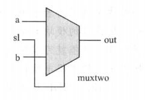
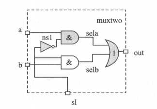
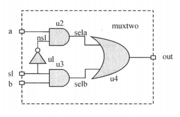
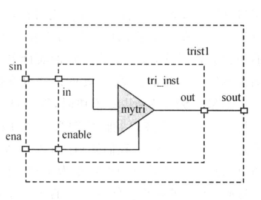

本文主要介绍Verilog语法的基本概念
<!-- more -->

# 02Verilog语法的基本概念

下面介绍几个简单的 Verilog HDL 程序， 从中了解 Verilog 模块的特性。

## 1. 二选一多路选择器

### 1.1 通过判断语句实现 (行为级)

```v
module muxtwo(out, a, b, sl);
    input a, b, sl;
    output out;
    reg out;

    always @ (sl or a or b) begin
        if (! sl) out = a;
        else out = b;
    end

endmodule
```

其原理图如下:



当控制信号 sl 为低电平时，输出与输入 a 相同，否则与 b 相同。

`always @ (sl or a or b)` 表示只要 sl 或 a 或  b 其中有一个发生变化时就执行下面的语句。

### 1.2 通过布尔表达式实现

```v
module muxtwo(out, a, b, sl);
    input a, b, sl;
    output out;

    wire nsl, sela, selb;   // 定义内部连接线
    
    assign nsl = ~sl;
    assign sela = a & nsl;
    assign selb = b & sl;
    assign out = sela | selb;

endmodule
```

原理图如下:




### 1.3 通过与或非基本模块实现 (门级)

```v
module muxtwo(out, a, b, sl);
    input a, b, sl;
    output out;

    not u1(nsl, sl);
    and #1 u2(sela, a, nsl);
    and #1 u3(selb, b, sl);
    or  #2 (out, sela, selb);

endmodule
```

原理图如下:



通过使用 verilog 内置的与或非门模块来实现，其中 `#n` 表示门输入到输出的延迟为 n 个单位.

通过工具将 1.1 和 1.2 的形式自动转换为 1.3 的门级形式的模块称为综合 (synthesis).

1.3 模块很容易与某种工艺的基本元件对应起来，再通过布局布线工具自动地转换为某种具体工艺的电路布线结构。


## 2. 通过连续赋值实现一个 3 位加法器

```v
module adder(cout, sum, a, b, cin);
    input [2:0] a, b;
    input cin;

    output [2:0] sum;
    output cout;

    assign {cout, sum} = a + b + cin;

endmodule
```

> { } 可实现位拼接，将进位放在高位很自然地就实现了进位

testbench

```v
module test ();

    reg [2:0] a, b;
    reg cin;

    wire [2:0] sum;
    wire cout;

    adder DUT(cout, sum, a, b, cin);

    initial begin
        $dumpfile("wave.vcd");
        $dumpvars;

        #500;
        $finish;
    end

    initial begin
        a   = 7;
        b   = 0;
        cin = 0;
        
        forever begin
            #5;
            a = a - 3;
            b = b + 1;
        end
    end

endmodule
```

> 两个 initial 并行运行, 其中一个 initial 声明输出波形文件，然后延时 500 个单位时间后终止仿真
> 另一个 initial 先给输入信号初值，然后进入死循环每隔 5 个单位时间改变 a, b 的值


## 3. 通过连续赋值实现一个比较器

```v
module compare(equal, a, b);
    input a, b;
    output equal;

    assign equal = a == b;

endmodule
```

## 4. 三态门选择器


```v
module trist2(out, in, enable);
    output out;
    input in, enable;

    bufif1 mybuf(out, in, enable);

endmodule
```

通过调用 Verilog 语言提供的原语库中现存的三态驱动元件 bufif1 来实现逻辑功能。这种引用现成元件或模块的方法叫做实例化或实例引用。



当然也可以自己定义一个三态门然后在其他模块中实例化:

```v
module mytri(out, in, enable);
    output out;
    input in, enable;

    assign out = enable ? in : 'bz;

endmodule
```

> `'bz` 表示高阻态


# Verilog 用于模块的测试

下面是一个对上面例子中 muxtwo 模块的测试代码:

```v
module test ();

    reg a, b, sl;
    reg clock;
    
    wire out;

    muxtwo m(out, a, b, sl);
    
    initial begin
        $dumpfile("wave.vcd");
        $dumpvars;

        a = 0;
        b = 0;
        sl = 0;
        clock = 0;

        // 50000 单位时间后停止仿真
        #50000 $finish;
    end

    // 产生一个不断重复地周期为 100 个时钟信号的 clock
    // 也可以简写成 always #50 clock = ~clock;
    always begin
        #50;
        clock = ~clock;
    end

    // 生成随机 0, 1 信号
    always @ (posedge clock) begin
        #1 a = $random % 2;
        #3 b = $random % 2;
    end

    always #10000 sl = !sl;

endmodule
```

其中 muxtwo 可以是行为模块，也可以是布尔逻辑表达式或门级结构模块。

模块 test 可以对 muxtwo 模块进行逐步深人的完整测试。这种测试可以在功能（即行为）级上进行，也可以在逻辑网表（逻辑布尔表达式）和门级结构级上进行。它们分别称为前（RTL）仿真、逻辑网表仿真和门级仿真。

如果门级结构模块与具体的工艺技术对应起来，并加上布局布线引人的延退模型，此时进行的仿真称为布线后仿真，这种仿真与实际电路情况非常接近。可以通过运行仿真器，并观察输人/输出波形图来分析设计的电路模块的运行是否正确。


###### 个人总结

对于端口和赋值的变量类型的总结:

模块本身的端口，输入必须是 wire 类型, 输出可以是 wire/reg 类型

调用模块时，连到输入端口可以是 wire/reg 类型，但是连到输出端口必须是 wire 类型

assign 左值必须是 wire 类型, 右值可以是 wire/reg

always 中左值必须是 reg 类型, 右值可以是 wire/reg
