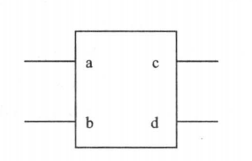

# 1. 模块的结构

例如一个模块如下:

```v
module block (a, b, c, d);

    input a, b;
    output c, d;

    assign c = a | b;
    assign d = a & b;

endmodule
```

电路图符号如下:



从中可以看出，每个模块包括 4 个主要部分: 

* 端口定义
* I/O 说明
* 内部信号声明
* 和功能定义

## 1.1 模块的端口定义

模块的端口声明了模块的输入输出口，其格式如下:

```v
module module_name(port1, port2, port3, ...);
```

在引用模块时，其端口可以用两种方法来连接:

1) 按照端口定义的顺序来连接, 这时不用标明原模块定义时规定的端口名
2) 用 . 符号标明原模块定义时规定的端口名, 这样做的好处在于不必严格按端口顺序对应, 比如:
   ```v
   mod m(.in(in), .out(o));
   ```
## 1.2 I/O 说明

```v
// 输入口
input [n:0] port1;
input [n:0] port2;

// 输出口
output [n:0] port3;

// 输入/输出口
inout [n:0] port4;
```

其中 `[n:0]` 是位宽, 默认为 1 位时可不写


I/O 说明也可写在端口声明语句里:

```
module module_name(input port1, input port2, output port3, ...);
```

## 1.3 内部信号说明

在模块内用到的与端口有关的 wire 和 reg 类型变量的声明

```v
reg  [n:0] reg1;
wire [n:0] wire1;
```

## 1.4 功能定义

模块中最重要的部分是逻辑功能定义部分，有 3 种方法可在模块中产生逻辑。

##### (1) 用 assign 声明语句

这种方法的句法很简单，只需写一个 assign 后面再加一个方程式即可。例如:

```v
assign a = b & c;
```

> 例中方程式描述了一个有两个输入的与门

##### (2) 用实例元件

采用实例元件的方法像在电路图中调入库元件一样，键入元件的名字和相连的引脚即可。例如:

```v
and #2 u1(a, b, c);
```

> 例中实例化了一个与门元件，命名为 u1, 其两个输入端连接到 b 和 c, 输出连接到 a, 并要求输出延时 2 个单位时间。

每个实例元件的名字必须是唯一的，以避免与其他实例或变量混淆。

##### (3) 用 always 块

采用 assign 语句是描述组合逻辑最常用的方法之一，而 always 块既可用于描述组合逻辑，也可描述时序逻辑。例如:

```v
always @(posedge clk or posedge clr); begin 
    if(clr) q <= 0;
    else if(en) q <= d;
end
```

> 例中, 用 always 块生成了一个带有异步清除端的 D 触发器.

always 块可用很多种描述手段来表达逻辑，例如上例就用了 if-else 语句来表达逻辑关系。

通过综合工具 always 和 assign 语句最终被综合成用门级结构表示的组合或时序逻辑电路。

## 1.5 理解要点

要用 verilog 模块实现一定的功能，首先应该清楚哪些是同时发生的，哪些是顺序发生的。

例如 1.3 节的例子中分别采用了 assign 语句、实例元件和 always 块实现逻辑，如果把这 3 个例子写到一个 verilog 模块中，它们的顺序不会影响实现的功能，也就说说，这 3 项是同时执行的，是并发的。

然而在 always 块内部，逻辑是按照指定的顺序执行的，因此 always 块中的语句也被称为顺序语句，always 块也称为过程块。

请注意，**两个或更多的 always 块都是同时执行的，而 always 块内部的语句是顺序执行的**。

看 always 内的 if-else 语句也能很快发现其内部是顺序执行的，因为 if-else 必须顺序执行，否则其功能就没有任何意义，如果 else 语句在 if 语句之前执行，其功能就会不符合要求。

## 1.6 要点总结

1. 在 verilog 模块中所有过程块 (如: initial、always)、连续赋值语句、实例引用之间都是并行的；
2. 它们表示的是一种通过变量名互相连接的关系；
3. 在同一模块这三者出现的先后顺序没有关系；
4. 只有连续赋值语句 assign 和实例引用语句可以独立于过程块而存在于模块的功能定义部分，if-else 语句、for 循环只能存在于过程块中

# 2. 数据类型

verilog 中总共有 19 种数据类型。数据类型用来表示数字电路硬件中数据的存储和传输，常用的 4 个基本数据类型是: `reg、wire、integer、parameter`

其他类型如下:

```
large、medium、scalared、time、small、tri、trio、tril、triand、trior、trireg、vectored、wand、wor
```

这些类型中除了 time 外，都和基本逻辑单元的建库有关，与系统设计没有很大的关系。这些基本部件库一般是由半导体厂家和 EDA 工具厂家共同提供，系统设计工程师不必过多关系门级和开关级的 verilog 语法现象。

# 3. 常量

在程序运行过程中，其值不能被改变的量称为常量。

## 3.1 数字常量

##### (1) 整数

数字表达方式有 3 种:

* <位宽><进制><数字> 这是一种全面的描述方式
* <进制><数字> 这种描述方式中，数字的位宽采用默认位宽 (这由具体的机器系统决定，但至少 32 位)
* <数字> 这种描述方式中，采用默认的十进制

例如:

```v
8'b10101100 // 位宽为 8 的二进制表示形式， 'b 表示二进制
8'hac       // 位宽为 8 的十六进制表示形式, 'h 表示十六进制
```

> 有 4 种进制表示形式, 二进制 b 或 B, 十进制 d 或 D, 十六进制 h 或 H, 八进制 o 或 O

当数字常量不说明位数时，默认 32 位, 因此以下是等价的:

```v
10 == 32'd10 == 32'b1010
1 == 32'd1 == 32'b1
-1 == -32'd1 == 32'hFFFFFFFF
'bx == 32'bx == 32'bxxxxxxxx
```

##### (2) x 和 z 值

x 代表不定值，z 和 ? 代表高阻值，将其插在数字常量种表示某些位为不定值或高阻值.

例如:

```v
4'b10x0     // 位宽为 4 的二进制数，第 2 位为不定值
12'dz       // 位宽为 12 的十进制数，其值为高阻态
12'd?       // 含义同上
8'h4x       // 位宽为 8 的十六进制数，其弟 4 位未不定值
```

##### (3) 负数

负数减号必须写在数字定义表达式的最前面:

```v
-8'd5   // 这个表达式代表 5 的补数
8'd-5   // 非法格式
```
##### (4) 下划线

下划线可用来分隔数的表达式以提高可读性，它只能用在具体的数字之间

```v
15'b1010_1011_1111_1010     // 合法格式
8'b_1010_1011               // 非法格式
```

## 3.2 字符串常量

字符串常量根据文本编码和长度而定, 例如

```v
"A" == 8'h41
"AB" == 16'h4142
"中" == 24'hE4B8AD      // UTF-8 '中' 字占了 3 字节即0xE4B8AD
```

因此要存储或传输字符串常量，需考虑其长度和文本编码格式, 例如:

```v
reg [3*8*2:0] str;  // UTF-8 格式, "中文" 两字占用 6 个字节长度的位宽
str = "中文";
```
> reg 类型变量 str 将被赋值 "中文" 这个字符串常量

## 3.3 参数 (parameter) 型常量

parameter 类型可作为常量标识符代表一个常量以提高可读性和可维护性。

格式如下:

```v
parameter name1 = const_expr, name2 = const_expr;
```

例如:

```v
parameter msb = 7;
parameter = average_delay = (a + b) / 2;    // a, b 也是一个常量标识符
```

##### 1) 实例化模块时传入参数

参数型常数经常用于定义延迟时间和变量宽度，在模块或实例引用时，可通过参数传递改变在被引用模块或实例中已定义的参数。

例如, 模块 Decode 定义了两个参数类型的变量 width 和 polarity, 默认都为 1。在 Top 模块中引用 Decode 实例时，开头通过参数的传递来改变定义时已经规定的参数值:

```v
module Decode(A, F);
    parameter width = 1, polarity = 1;
    ...
endmodule

module Top;

    wire [3:0] A4;
    wire [4:0] A5;
    wire [15:0] F16;
    wire [31:0] F32;

    Decode #(4, 0)  D1(A4, F16);
    Decode #(5)     D2(A5, F32);

endmodule
```

当然参数映射也可以像模块调用那样是由 `.` 符号来指定参数和改变默认顺序.

##### 2) 在一个模块中改变另一个模块的参数

通过 defparam 语句可在一个模块中改变另一个模块的参数:

```v
module Block;
    parameter P = 0;
endmodule

module Top;
    wire W;
    Block B1();
    Block B2();
endmodule

module Test;
    wire W;
    Top T();
endmodule

module Annotate;

    defparam Test.T.B1.P = 2, Test.T.B2.P = 3;

endmodule 
```

> 通过 Annotate 模块对参数变量的设置，最终改变了 Test 中 T.B1 和 T.B1 实例的参数值.

在做布线后仿真时，就是利用这种方法把布线延迟参数反标注 (Back-Annotate) 到门级 verilog 网表上

###### 个人测试
```v
module outx(output out);
    parameter P = 1;
    assign out = P;
endmodule

module test ();
    wire a, b, c;
    
    outx m1(a);
    outx #(0) m2(b);
    outx m3(c);

    initial begin
        $dumpfile("wave.vcd");
        $dumpvars;
        #500 $finish;
    end

endmodule

module pardef();
    defparam 
        test.m2.P = 1,
        test.m3.P = 0;
endmodule
```

> 测试后发现同样是设置参数, defparam 的优先级高于实例化时设置参数，即 b 最终输出是高电平
> 细想也合理的，因为先有实例化 pardef 模块才能对实例化的模块进行更改，更改时覆盖了实例化时设置的参数值

# 4. 变量

变量是一种在程序运行过程中其值可以改变的量, 在 verilog 中变量的数据类型有很多种，这里只对常用几种进行介绍。

## 4.1 wire 型

wire 型数据常用来表示以 assign 关键字指定的组合逻辑信号。

verilog 程序模块中输入输出信号类型默认时自定定义为 wire 型。

wire 型信号可以用作任何方程式的输入，也可以用作 assign 语句或实例元件的输出。

```v
wire a;             // 定义了一个 1 位的 wire 型数据
wire [7:0] b;       // 定义了一个 8 位的 wire 型数据
wire [4:1] c, d;    // 定义了二个 4 位的 wire 型数据
```

## 4.2 reg 型

寄存器是数据存储单元的抽象。通过赋值语句可以改变寄存器存储的值，其作用与改变触发器存储的值相当。

reg 类型数据的默认初始值为不定值 x。

reg 型数据常用来表示 always 模块内指定的信号，常代表触发器。通常，在设计中要由 always 模块通过使用行为描述语句来表达逻辑关系。

**在 always 模块内被赋值的每一个信号都必须定义成 reg 型**。

## 4.3 memory 型

verilog 通过对 reg 型变量建立数组来对存储器建模，可以描述 RAM 型存储器、ROM 存储器和 reg 文件。

例如:

```v
reg [7:0] mem[255:0];
```
> 定义一个名为 mem 的存储器，该存储器有 256 个 8 位存储器, 其地址范围是 0 ~ 255

# 5. 运算符及表达式


| 运算符类型 | 符号               |
| ---------- | ------------------ |
| 算术运算符 | +, -, x, /, %      |
| 赋值运算符 | =, <=              |
| 关系运算符 | >, <, >=, <=       |
| 逻辑运算符 | &&, \|\|, !        |
| 条件运算符 | ?:                 |
| 位运算符   | ~, \|, ^, &, ^~    |
| 等式运算符 | ==, !=, =\==, !\== |
| 移位运算符 | <<, >>             |
| 拼接运算符 | { }                |
| 缩减运算符 | &, \|, ~           |

使用基本和 C 类似, 个别说明一下:

* 整除除法时，结果值略去小数部分，只取整数部分
* 取模运算时，结果值的符号位采用 % 的第一个操作数的符位号
* ^~ 按位同或 (异或非)
* 不同长度的数据进行位运算，系统会自动地将两者按右端对齐，位数少的操作数会在相应高位用0填满后再进行位运算
* 关系运算符在关系不确定时结果可为不定值 x
* == 和 != 操作数存在不定值，则结果也为不定值 x
* === 和 !== 在对操作数比较时对 x 值和 z 值也进行比较，需要完全一致结果才为 1, 否则为 0

位拼接用法如下

```v
{a, b[3:0], w, 3'b101}

// 也可以写成
{a, b[3], b[2], b[0], w, 1'b1, 1'b0, 1'b1}

// 使用重复法简化表达式
{4{w}} == {w, w, w, w}

// 还支持嵌套的方式来表达
{b, {3{a, b}}}  == {b, a, b, a, b, a, b}
```

缩减运算是单目运算，与或非运算不同, 其运算是这样的， 第一步先将操作数的第 1 位于第 2 位进行与或非运算，第二步将运算结果与第 3 位进行与或非运算，依次类推，直到最后一位, 例如:

```v
reg [3:0] B;
reg C;
C = &B;
// 相当于
C = ( (B[0] & B[1]) & B[2] ) & B[3];
```