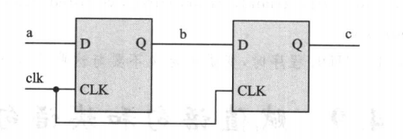
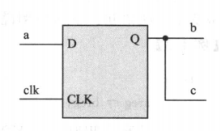

# 1. 赋值语句

在 verilog 中信号有两种赋值方式:

## 1.1 非阻塞赋值方式 (<=)

在语句块中，上条语句所赋值的变量不能立即就为下面的语句所用, 需块结束后才能完成这次赋值操作，而所赋的值是上一次赋值得到的。

在编写可综合的时序逻辑模块时，这是最常用的赋值方法。

例如:

```v
always @(posedge clk) begin
    b <= a;
    c <= b;
end
```

其电路图如下:



## 1.2 阻塞赋值方式 (=)

赋值完成后值立刻就改变，且赋值语句执行完后块才结束

例如:

```v
always @(posedge clk) begin
    b = a;
    c = b;
end
```

其电路图如下:



> clk 信号上升沿到来时，将发生如下变化: b 马上取 a 的值, c 马上取 b 的值 (即等于 a)

###### 个人测试

```v
module test ();
    
    reg a, b, c, clock;

    initial begin
        $dumpfile("wave.vcd");
        $dumpvars;
        #500 $finish;
    end

    initial begin
        clock = 0;
        {a, b, c} = 0;
    end

    always #10 clock = ~clock;

    always @(posedge clock) begin
        c <= b;
        b <= a;
        a <= 1;
    end

endmodule
```

> 可以看到在非阻塞式赋值中 a 在第一个时钟上升沿到来时变高电平, 而 b 要等到第二个时钟上升沿, c 要等到第三个时钟上升沿
>
> 同时从该例子也可以看到, 逻辑行为与非阻塞语句的次序没有关系，因为在 begin and 之间的所有非阻塞都在同一时刻被赋值
> 
> 如果将赋值改为阻塞式, 则 a, b, c 都在第一个时钟上升沿到来时变高电平, 看起来是在同一时刻运行，但实际上是有先后的，即在前面的先运行，然后再运行下面的语句，阻塞语句的次序与逻辑行为有很大的关系

# 2. 块语句

块语句通常用来将两条或多条语句组合在一起，使其在格式上看更像一条语句。

块语句有两种：

一种是begin end语句，通常用来标识顺序执行的语句，用它来标识的块称为顺序块；

另一种是fork join语句，通常用来标识并行执行的语句，用它来标识的块称为并行块。

## 2.1 顺序块

顺序块有以下特点:

(1) 块内的语句是按顺序执行的，即只有上面一条语句执行完后下面的语句才能执行;
(2) 每条语句的延迟时间是相对于前一条语句的仿真时间而言的。
(3) 直到最后一条语句执行完，程序流程控制才跳出该语句块。

格式如下:

```v
begin: 块名
    语句 1;
    语句 2;
    ...
end
```

`: 块名` 作为标识名, 可忽略不写; 

块内声明语句可以是 parameter 声明语句、reg 型变量声明语句、integer 型变量声明语句和 real 型变量声明语句;

## 2.2 并行块

(1) 块内语句是同时执行的，即程序流程控制一进入到该并行块，块内语句则开始同时并行地执行。
(2) 块内每条语句的延迟时间是相对于程序流程控制进入到块内的仿真时间的。
(3) 延迟时间是用来给赋值语句提供执行时序的。
(4) 当按时间时序排序在最后的语句执行完后或一个 disable 语句执行时，程序流程控制跳出该程序块。

其格式如下:

```v
fork: 块名
    语句 1;
    语句 2;
    ...
join
```

块内声明语句可以是 parameter 声明语句、reg 型变量声明语句、integer 型变量声明语句、real 型变量声明语句、time 型变量声明语句和 event 说明语句

##### 个人测试

```v
module test ();

    reg clock;

    initial begin
        $dumpfile("wave.vcd");
        $dumpvars;
        clock = 0;
        #500 $finish;
    end

    always #10 clock = ~clock;

    always @(posedge clock) fork
        
        begin: block1
            parameter d = 50;
            reg [7:0] r;

            #d r = 'h35;
            #d r = 'hE2;
            #d r = 'h00;
            #d r = 'hF7;
        end

        fork: block2
            parameter d = 50;
            reg [7:0] r;

            #(1*d) r = 'h35;
            #(2*d) r = 'hE2;
            #(3*d) r = 'h00;
            #(4*d) r = 'hF7;
        join
    join
endmodule
```

> always 后的语句是一个并行块，当上升沿到达时，内部的两个语句块 block1 和 block2 将同时运行。
> 
> 在 block1 内部，语句是按照顺序执行的，语句将依次输出到 r 寄存器
> 在 block2 内部，语句是并行的, 但每条语句执行前都被延时不同长度的时间
> 
> 最终 block1 和 block2 中 r 输出的波形是相同的

## 2.3 块名

添加块名的作用

(1) 可以在块内定义局部变量，即只在块内使用的变量。
(2) 可以允许块被其他语句调用，如 disable 语句。
(3) 在 Verilog 语言里，所有的变量都是静态的，即所有的变量都只有一个唯一的存储地址，因此进入或跳出块并不影响存储在变量内的值。

块名提供了一个在任何仿真时刻确认变量值的方法

## 2.4 起始时间和结束时间

在并行块和顺序块中都有一个起始时间和结束时间的概念。

对于顺序块，起始时间就是第一条语句开始被执行的时间，结束时间就是最后一条语句执行完的时间。

而对于并行块来说，起始时间对于块内所有的语句是相同的，即程序流程控制进入该块的时间，其结束时间是按时间排序在最后的语句执行结束的时间。

当一个块嵌人另一个块时，块的起始时间和结束时间是很重要的。至于跟在块后面的语句只有在该块的结束时间到了才开始执行。也就是说，只有该块完全执行完后，后面的语句才可以执行。

在 fork join 块内，各条语句不必按顺序给出，因此在并行块里，各条语句在前还是在后是无关紧要的。

## 2.5 disable 命名块

Verilog 通过关键字 disable 提供了一种中止命名块执行的方法。

disable可以用来从循环中退出、处理错误条件以及根据控制信号来控制某些代码段是否被执行。

对块语句的禁用导致紧接在块后面的那条语句被执行。

对于C程序员来说，这一点非常类似于使用 break 退出循环。两者的区别在于break只能退出当前所在的循环，而使用 disable 则可以禁用设计中任意一个命名块。

例如:

```v

module test ();
    initial begin

        begin: loop
            reg [7:0] cnt;
            for (cnt = 0; cnt < 100; cnt++) begin: continue
                if (cnt == 3) begin
                    $display("now stop");
                    disable loop;
                end
                $display("cnt %d", cnt);
            end
        end
    end
endmodule
```

> 上例中当 disable continue; 时则只会中止当前循环，继续下一次循环，不会完全退出循环
> 
> 可以理解为当 disable block_name 后，程序立刻转到该 block_name 的 end 处, 而对于循环的 begin end 来说，进入 end 只会进入下一次循环，要完全退出循环，需要将循环再套一层块，然后结束最外层的块
