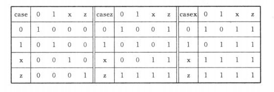
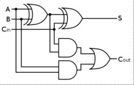

# 1. 条件语句 (if_else 语句)

条件语句必须在过程块中使用，即除 initial 和 always 引导的 begin end 块中可以编写条件语句外，模块中的其他地方都不能编写。

if 中的表达式值若为 0, x, z 则为假，其他情况都为真

# 2. case 语句

其结构如下:

```v
case (控制表达式)
    (分支表达式): 语句;
    default: 语句;
endcase 
```

和 C 不同的是不需要 break 执行, 执行完 case 分支项后会自动跳出 case 语句结构

case 控制表达式的值和分支表达式的值是按位进行比较，相当于 === 运算符，完全相等时才进入分支, 因此位宽最好相等。

casez 在比较过程中会忽略表达式可能存在的 z 值

casex 在比较过程中会忽略表达式可能存在的 x 值 和 z 值

case、casez、casex 真值表如下:



##### 个人测试

```v
module test ();

    initial begin: block_test

        reg [1:0] a;
        a = 2'b1x;

        if (3'b1x)
            $display("if (3'b1x)");           // 有输出

        if (3'bx)
            $display("if (3'bx)");            // 无输出

        case (a)
            2'b1x: $display("case 2'b1x");    // 有输出
        endcase

        case (a)
            2'bzx: $display("case 2'bzx");    // 无输出
        endcase

        casez (a)
            2'bzx: $display("casez 2'bzx");   // 有输出
        endcase
        
        casez (a)
            2'b10: $display("casez 2'b10");   // 无输出
        endcase

        casex (a)
            2'bzx: $display("casex 2'bzx");   // 有输出
        endcase

        casex (a)
            2'bx0: $display("casex 2'bx0");   // 有输出
        endcase

        casex (a)
            2'b00: $display("casex 2'b00");   // 无输出
            2'b10: $display("casex 2'b10");   // 有输出
            2'b1z: $display("casex 2'b1z");   // 相等，但是没输出，因为进入前面的分支就退出了
        endcase

        casex (a)
            2'b11: $display("casex 2'b11");   // 有输出
        endcase
    end

endmodule
```


当条件语句不能处理所有情况的分支时，综合就可能生成锁存器，避免锁存器的方法是 if 中加入 else 和 case 中加入 default，即当没有符合任何条件时，也能输出一个默认值。

例子: case 实现四选一多路选择器和测试

```v

module mux4_to_1(out, in0, in1, in2, in3, sl0, sl1);

    output reg out;
    input in0, in1, in2, in3;
    input sl0, sl1;

    always @(in0 or in1 or in2 or in3 or sl0 or sl1) begin
        case ({sl1, sl0})
            2'b00: out = in0;
            2'b01: out = in1;
            2'b10: out = in2;
            2'b11: out = in3;
            default: out = 1'bx;
        endcase
    end

endmodule

module test ();

    wire out;
    reg [1:0] sl;
    mux4_to_1 m(out, 1'b1, 1'b0, 1'b1, 1'b0, sl[0], sl[1]);

    initial begin
        $dumpfile("wave.vcd");
        $dumpvars;
        sl = 0;
        #1000 $finish;
    end
    
    initial begin
        #100 sl = 2'b00;
        #100 sl = 2'b01;
        #100 sl = 2'b10;
        #100 sl = 2'b11;
        #100 sl = 2'bx1;
    end

endmodule
```

# 3. 循环语句

verilog 存在 4 种循环语句:

## 3.1 forever 语句

```v
forever 语句;

forever begin
    多条语句;
end
```

forever 循环语句常用于产生周期性的波形，用来作为仿真测试信号。

forever 只能写在 initial 块中。

## 3.2 repeat 语句

```v
repeat(表达式) 语句;

repeat(表达式) begin
    多条语句;
end
```

表达式地值表示重复次数

实例: 使用 repeat 循环语句及加法和移位操作实现一个乘法器

```v
module mult(result, opa, opb);
    parameter size = 8, longsize = 16;

    input [size:1] opa, opb;
    output reg [longsize:1] result;

    always @(opa or opb) begin: blocl_mult
        reg [longsize:1] shift_opa, shift_opb;
        shift_opa = opa;
        shift_opb = opb;
        result = 0;

        repeat(size) begin
            if(shift_opb[1]) result = result + shift_opa;
            shift_opa = shift_opa << 1;
            shift_opb = shift_opb >> 1;
        end
    end
endmodule

module test ();
    wire [31:0] result;
    reg [15:0] opa, opb;

    mult #(16, 32) m(result, opa, opb);

    initial begin
        $dumpfile("wave.vcd");
        $dumpvars;

        repeat (100) begin
            opa = $random % 16'hffff;
            opb = $random % 16'hffff;
            #10;
        end
    end
endmodule
```

## 3.3 while 语句 和 for 语句

同 C 略。


# 4. 生成语句


生成语句可以动态地生成 Verilog 代码。

生成实例可以是以下的一种或多种类型:

（1）模块；
（2）用户定义原语；
（3）门级原语；
（4）连续赋值语句；
（5）initial 和 always 块

在生成范围内允许声明下列数据类型:

（1）net（线网）、reg（寄存器）；
（2）integer（整型数）、real（实型数）、time（时间型）、realtime（实数时间型）；
（3）event（事件）。

###### 个人理解

生成类似于 C 种的宏, 在综合前被执行并替换为实际的 verilog 代码

下面介绍三种创建生成语句的方法：

## 4.1 循环生成语句

下面是一个通过生成语句实现的按位异或模块, 位宽默认 32:

```v
module bitxor (out, i0, i1);
    parameter N = 32;
    output [N - 1: 0] out;
    input [N - 1: 0] i0, i1;

    // 声明一个临时循环变量, 该变量只用于生成块的循环计算
    // verilog 仿真时该变量在设计种并不存在
    genvar j;

    generate
        for (j = 0; j < N; j = j + 1) begin: xor_loop
            xor g1 (out[j], i0[j], i1[j]);
        end
    endgenerate

    // 改生成块展开后等价于连续写 N 行异或代码
    // xor g0 (out[0], i0[0], i1[0]);
    // xor g1 (out[1], i0[1], i1[1]);
    // xor g2 (out[2], i0[2], i1[2]);
    // ...
    // xor gn (out[N-1], i0[N-1], i1[N-1]);

    // 另一种编写形式: 通过连续赋值和运算符实现
    // generate
    //     for (j = 0; j < N; j = j + 1)
    //         assign out[j] = i0[j] ^ i1[j];
    // endgenerate
    
    // 还有另一种编写形式: 异或门可用 always 块来替代, 这时要注意 out 改为 reg 类型
    // reg [N - 1: 0] out;
    // generate
    //     for (j = 0; j < N; j = j + 1)
    //         always @(i0[j] or i1[j]) out[j] = i0[j] ^ i1[j];
    // endgenerate
endmodule

module test ();
    wire [31:0]out;
    reg [31:0] i0, i1;

    bitxor m(out, i0, i1);

    initial begin
        $dumpfile("wave.vcd");
        $dumpvars;

        i0 = 32'b1010;
        i1 = 32'b1001;
        #10;
    end
endmodule
```

> 生成代码中若存在实例，还可以通过块名进行引用，例如上例中可通过 xor_loop 引用各个块中的异或门 xor_loop[0].g1


**例子2**: 用循环生成语句实现门级脉动加法器

全加器电路如下:



```v
module ripple_adder (co, sum, a0, a1, ci);
    parameter N = 4;

    output [N - 1: 0] sum;
    output co;

    input [N - 1: 0] a0, a1;
    input ci;

    // 内部进位信号
    wire [N: 0] carry;

    // 输入进位连到 carry[0]
    assign carry[0] = ci;

    // 输出进位连到 carry[N]
    assign co = carry[N];

    generate
        genvar i;
        for (i = 0; i < N; i = i + 1) begin: loop
            wire t1, t2, t3;

            xor g1 (t1, a0[i], a1[i]);
            xor g2 (sum[i], t1, carry[i]);
            and g3 (t2, a0[i], a1[i]);
            and g4 (t3, t1, carry[i]);
            or g5 (carry[i + 1], t2, t3);
        end
    endgenerate
endmodule

module test ();
    
    parameter N = 4;

    wire [N - 1: 0] out;
    wire co;

    reg [N - 1: 0] a0, a1;

    ripple_adder #(N) m(co, out, a0, a1, 1'b0);

    initial begin
        $dumpfile("wave.vcd");
        $dumpvars;

        repeat(100) begin
            a0 = $random;
            a1 = $random;
            #10;
        end
    end
endmodule
```


## 4.2 条件生成语句

例子: 使用条件生成语句实现参数化乘法器

```v
module multiplier (result, a0, a1);
    parameter a0_width = 8;
    parameter a1_width = 8;

    // 本地参数不能用 defparam 修改, 也不能在实例化时通过参数传递修改
    localparam result_width = a0_width + a1_width;

    output[result_width - 1: 0] result;
    input[a0_width - 1: 0] a0;
    input[a1_width - 1: 0] a1;

    generate
        if (a0_width < 8 || a1_width < 8)
            cal_multiplier #(a0_width, a1_width) m(result, a0, a1);  // 超前进位乘法器
        else
            tree_multiplier #(a0_width, a1_width) m(result, a0, a1); // 树形乘法器
    endgenerate
endmodule
```

## 4.2 case 生成语句

例子: 使用 case 生成语句实现 N 位加法器

```v
module adder ( co, sum, a0, al, ci);

    parameter N = 4;

    output [N - 1: 0] sum;
    output co;

    input [N - 1: 0] a0, al;
    input ci;

    generate
        case (N)
            1: adder_1bit adder1 (co, sum, a0, al, ci);
            2: adder_2bit adder2 (co, sum, a0, al, ei);
            //默认的情况下选用位宽为 N 位的超前进位加法器
            default: adder_cla #(N) adder3 (co, sum, a0, al, ci);
        endcase
    endgenerate

endmodule
```
