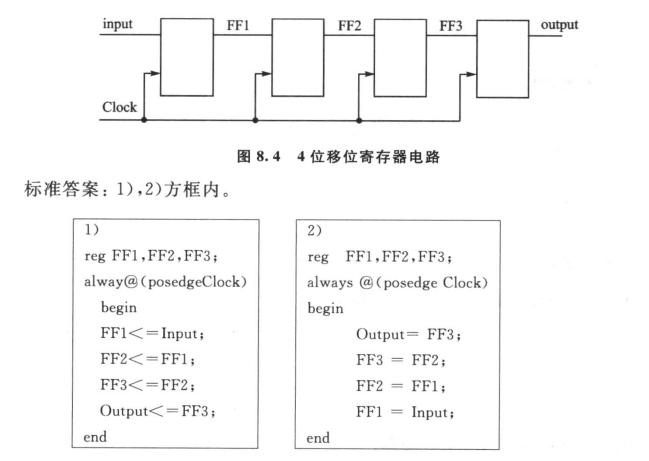

```v
module test();

    reg [2:0] a;
    integer b;

    initial begin
        a = -1;
        b = a;
        $display("%d %d", a, b);    // 7 7

        b = -1;
        $display("%d %d", a, b);    // 7 -1
    end

endmodule
```

## 17 异步复位和同步复位

即复位时是否总是跟时钟信号是同步的

> integer 有正负之分, reg 无符号


受阻塞赋值和非阻塞赋值:




## 28

数字常量表示时，若最高位含 x 或 z, 则赋值时具有扩展性:

```v
V = 8'b0     ==> V = 8'b00000000
V = 8'b1     ==> V = 8'b00000001
V = 8'bx     ==> V = 8'bxxxxxxxx
V = 8'bzx    ==> V = 8'bzzzzzzzx
V = 8'bxxzz  ==> V = 8'bxxxxxxzz
V = 8'b1x    ==> V = 8'b0000001x
```

