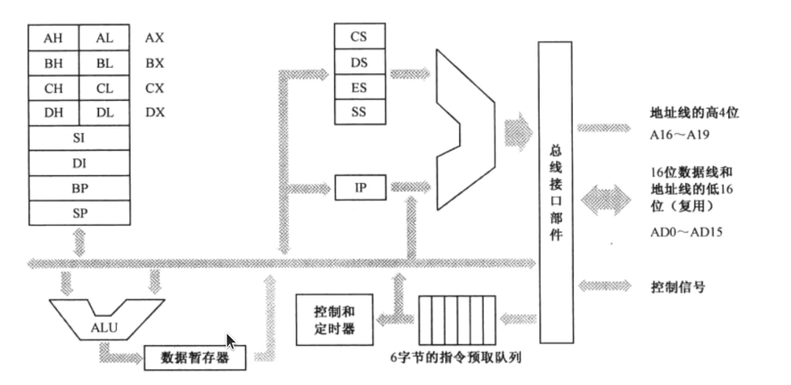

# 古老的 Intel 8086 处理器

8 个16位通用寄存器: AX, BX, CX, DX, SI, DI, BP, SP

其中 AX, BX, CX, DX 又各自可以拆分成两个 8 位寄存器来使用, 比如 AL, AH

# 程序的重定位问题

8086 内存分段机制, 内存被分为一个一个小段。段可以开始于内存中的任何位置，一个内存单元的实际地址 = 段地址:偏移地址。

硬件层对`段地址:偏移地址`内存访问模式的支持, 提供代码段寄存器 CS 和数据段寄存器 DS, 除此之外，最重要的时，当处理器访问内存时，它把指令中指定的内存地址看成是段内的偏移地址，而不是物理地址。

这样，一旦处理器遇到一条访问内存的指令，它将把DS中的数据段起始地址和指令中提供的偏移相加，来得到访问内存所需的物理地址。

#### 另外

附加段寄存器 ES: 当需要在程序中同时使用两个数据段时，DS指令另一个。可以在指令中指定使用 DS和ES中的哪一个，如果没有指定，则默认使用 DS。

栈段寄存器 SS, 用于栈地址的设置和访问。

# 8086 内部组成框图

IP 是指令指针（Instruction Pointer）寄存器，它只和CS 一起使用，而且只有处理器才能直接改变它的内容。当一段代码开始执行时，CS 指向代码段的起始地址，IP 则指向段内偏移。这样，由CS 和IP 共同形成逻辑地址，并由总线接口部件变换成物理地址来取得指令。然后，处理器会自动根据当前指令的长度来改变IP 的值，使它指向下一条指令。

如果在指令的执行过程中需要访问内存单元，那么，处理器将用 DS 的值和指令中提供的偏移地址相加，来形成访问内存所需的物理地址。

#### 20 位地址线

8086 的段寄存器和IP 寄存器都是16 位的，如果按照原先的方式，把段寄存器的内容和偏移地址直接相加来形成物理地址的话，也只能得到16 位的物理地址。麻烦的是，8086 却提供了20根地址线。

8086 处理器在形成物理地址时，先将段寄存器的内容左移 4 位形成20 位的段地址，然后再同 16 位的偏移地址相加，得到20 位的物理地址。寻址能力变成了 1MB.

段地址16位，限制了最大可分有65536个段 (这时每个段 16字节), 偏移地址16位限制了每个段最大 64KB, 这时最大可分配 16 个段。

但是因为程序的偏移地址总是要求从0000H开始，在加载程序时到内存时需要考虑加载到的内存处是否符合要求。例如 82255H 地址，无法给出一个段地址满足 0000H 的偏移地址。 

