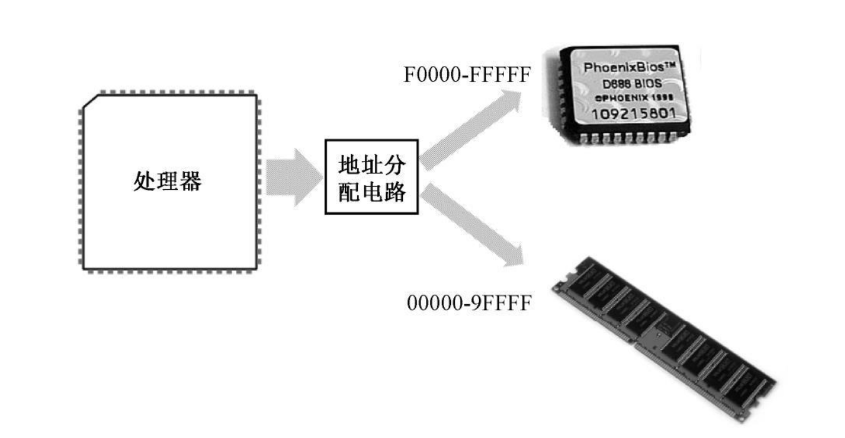
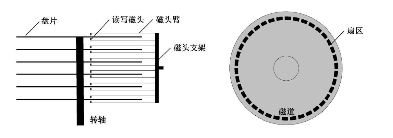

# 基本输入输出系统

8086 有20 根地址线，但并非全都用来访问DRAM，也就是内存条。

事实上，这些地址线经过分配，大部分用于访问DRAM，剩余的部分给了只读存储器ROM 和外围的板卡，如图所示



在以Intel 8086 为处理器的系统中，ROM 占据着整个内存空间顶端的64KB，物理地址范围是0xF0000～0xFFFFF，里面固化了开机时要执行的指令；

DRAM 占据着较低端的640KB，地址范围是0x00000～0x9FFFF；中间还有一部分，分给了其他外围设备。

8086 加电或者复位时，CS=0xFFFF，IP=0x0000，所以，它取的第一条指令位于物理地址0xFFFF0，正好位于ROM 中，那里固化了开机时需要执行的指令。这个位置离1MB 内存的顶端（物理地址0xFFFFF）只有 16 个字节的长度。

若一直顺序执行下去，CS:IP 形成的物理地址将会溢出，这将回绕到 1MB 内存的最低端，所以，ROM 中位于物理地址0xFFFF0 的地方，通常是一个跳转指令，它通过改变CS 和IP的内容，使处理器从ROM 中的较低地址处开始取指令执行。

例如 nasm 汇编语言中一个典型的转跳指令像这样:

```s
jmp 0xf000:0xe05b
```

执行后 CS 和 IP 寄存器被加载，从而转跳到对应地址处执行。

#### BIOS

这块ROM 芯片中的内容包括很多部分，主要是进行硬件的诊断、检测和初始化。

最后，它还负责提供一套软件例程，让人们在不必了解硬件细节的情况下从外围设备（比如键盘）获取输入数据，或者向外围设备（比如显示器）输出数据。

设备当然是很多的，所以这块ROM 芯片只针对那些最基本的、对于使用计算机而言最重要的设备，而它所提供的软件例程，也只包含最基本、最常规的功能。

正因为如此，这块芯片又叫基本输入输出系统(BIOS)ROM。

ROM-BIOS 的容量是有限的，当它完成自己的使命后，最后所要做的，就是从辅助存储设备读取指令数据，然后转到那里开始执行。


# 硬盘及其工作原理




每个盘片都有两个磁头（Head），上面一个，下面一个，所以经常用磁头来指代盘面。磁头都有编号，第1 个盘片，上面的磁头编号为0，下面的磁头编号为1；第2 个盘片，上面的磁头编号为2，下面的磁头编号为3，以此类推。

每个磁头不是单独移动的。相反，它们都通过磁头臂固定在同一个支架上，由步进电动机带动着一起在盘片的中心和边缘之间来回移动。也就是说，它们是同进退的。步进电动机由脉冲驱动，每次可以旋转一个固定的角度，即可以步进一次。

可以想象，当盘片高速旋转时，磁头每步进一次，都会从它所在的位置开始，绕着圆心“画”出一个看不见的圆圈，这就是磁道（Track）。磁道是数据记录的轨迹。因为所有磁头都是联动的，故每个盘面上的同一条磁道又可以形成一个虚拟的圆柱，称为柱面（Cylinder）。

磁道，或者柱面，也要编号。编号是从盘面最边缘的那条磁道开始，向着圆心的方向，从0开始编号。

柱面是一个用来优化数据读写的概念。初看起来，用硬盘来记录数据时，应该先将一个盘面填满后，再填写另一个盘面。实际上，移动磁头是一个机械动作，看似很快，但对处理器来说，却很漫长，这就是寻道时间。为了加速数据在硬盘上的读写，最好的办法就是尽量不移动磁头。这样，当0 面的磁道不足以容纳要写入的数据时，应当把剩余的部分写在1 面的同一磁道上。如果还写不下，那就继续把剩余的部分写在2 面的同一磁道上。换句话说，在硬盘上，数据的访问是以柱面来组织的。

实际上，磁道还不是硬盘数据读写的最小单位，磁道还要进一步划分为扇区（Sector）。磁道很窄，也看不见，但在想象中，它仍呈带状，占有一定的宽度。将它划分许多分段之后，每一部分都呈扇形，这就是扇区的由来。

每条磁道能够划分为几个扇区，取决于磁盘的制造者，但通常为63 个。而且，每个扇区都有一个编号，与磁头和磁道不同，扇区的编号是从1 开始的。

扇区与扇区之间以间隙（空白）间隔开来，每个扇区以扇区头开始，然后是512 个字节的数据区。扇区头包含了每个扇区自己的信息，主要有本扇区的磁道号、磁头号和扇区号，用来供硬盘定位机构使用。现代的硬盘还会在扇区头部包括一个指示扇区是否健康的标志，以及用来替换该扇区的扇区地址。用于替换扇区的，是一些保留和隐藏的磁道。

# 硬盘的逻辑块地址 （LBA）

硬盘的读写是以扇区为最小单位的。所以，无论什么时候，要从硬盘读数据，或者向硬盘写数据，至少得是 1 个扇区。

通常，一个扇区的尺寸是512 字节，可以看成一个数据块。所以，从这个意义上来说，硬盘是一个典型的块（Block）设备。

采用磁头、磁道和扇区这种模式来访问硬盘的方法称为CHS 模式，但不是很方便。想想看，如果有一大堆数据要写，还得注意磁头号、磁道号和扇区号不要超过界限。

所以，后来引入了逻辑块地址（Logical Block Address，LBA）的概念。现在市场上销售的硬盘，无论是哪个厂家生产的，都支持LBA 模式

LBA 模式是由硬盘控制器在硬件一级上提供支持，所以效率很高，兼容性很好。LBA 模式不考虑扇区的物理位置（磁头号、磁道号），而是把它们全部组织起来统一编号。在这种编址方式下，原先的物理扇区被组织成逻辑扇区，且都有唯一的逻辑扇区号。

例如逻辑扇区和物理扇区之间的简单转化:

```
LBA = C x 磁头总数 x 没道扇区数 + H x 每道扇区数 + (S - 1)
```

这里，LBA 是逻辑扇区号，C、H、S 是想求得逻辑扇区号的那个物理扇区所在的磁道、磁头和扇区号。

实际还应该考虑坏道，并用相应的算法处理吧。

# 一切从主引导扇区开始

当ROM-BIOS 完成自己的使命之前，最后要做的一件事是从外存储设备读取更多的指令来交给处理器执行。现实的情况是，绝大多数时候，对于ROM-BIOS 来说，硬盘都是首选的外存储设备。

硬盘的第一个扇区是 0 面 0 道 1 扇区，或者说是 0 头 0 柱 1 扇区，这个扇区称为主引导扇区。如果计算机的设置是从硬盘启动，那么，ROM-BIOS 将读取硬盘主引导扇区的内容，将它加载到内存地址0x0000:0x7c00 处（也就是物理地址0x07C00），然后用一个jmp 指令跳到那里接着执行：

```s
jmp 0x0000:0x7c00
```

为什么偏偏是0x7c00 这个地方？还不太清楚。反正当初定下这个方案的家伙已经被人说了很多坏话，我也就不准备再多说什么了。

