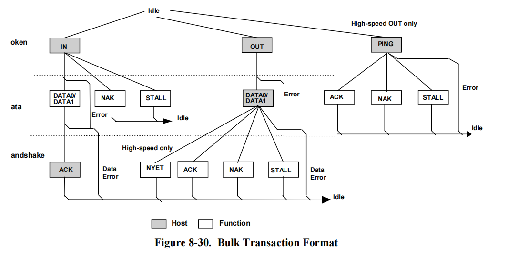
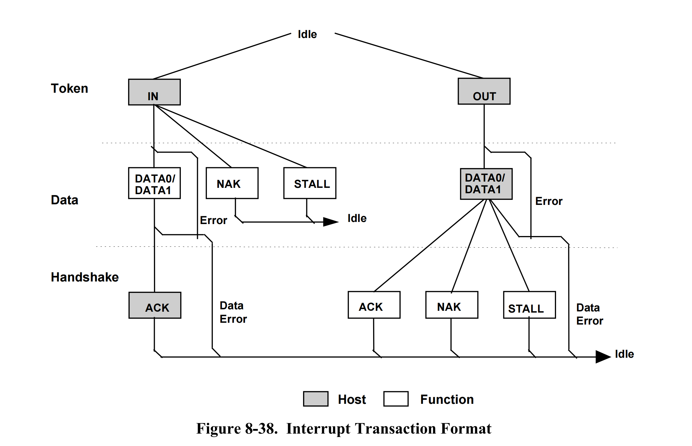
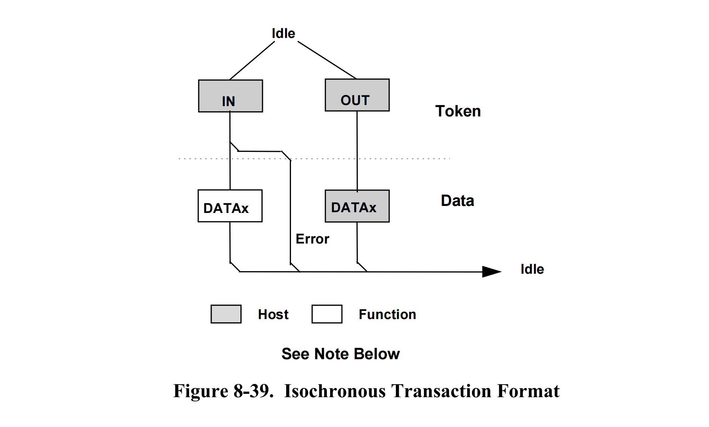
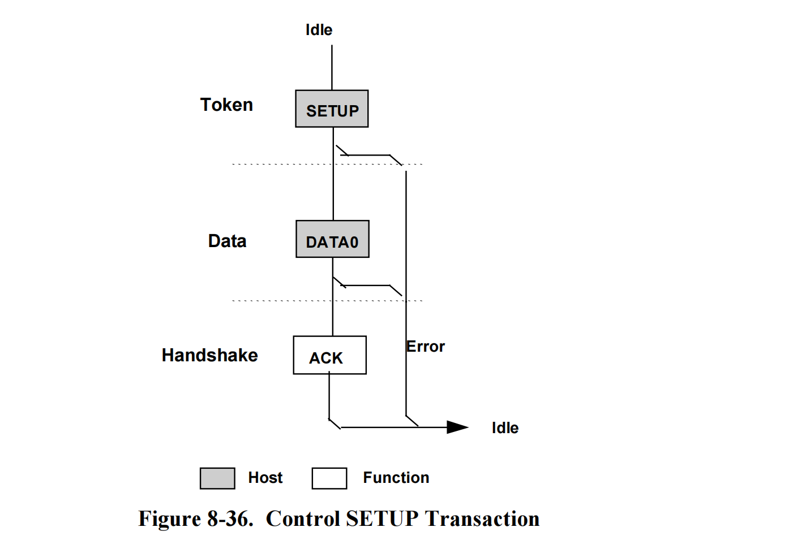

本文主要介绍USB的基本概念和基础知识
<!-- more -->

### USB 

[USB 中文网](https://www.usbzh.com/) 有很多资料, 很实用哦.

USB 是通用串行总线 (Universal Serial Bus) 的缩写.

| 版本                                                     | 理论最高速度          |
| -------------------------------------------------------- | --------------------- |
| USB 1.0 Low Speed                                        | 1.5Mb/s 或 0.1875MB/s |
| USB 1.0 Full Speed                                       | 12Mb/s 或 1.5MB/s     |
| USB 1.1 (即 USB 1.0 Full Speed)                          | 12Mb/s 或 1.5MB/s     |
| USB 2.0 Full Speed（即USB 1.1）                          | 12Mb/s 或 1.5MB/s     |
| USB 2.0 High Speed                                       | 480Mb/s 或 60MB/s     |
| USB 3.0                                                  | 5Gb/s 或 600MB/s      |
| USB 3.1 Gen 1 （即USB 3.0）                              | 5Gb/s 或 600MB/s      |
| USB 3.1 Gen 2                                            | 10Gb/s 或 1250MB/s    |
| USB 3.2 Gen 1（即USB 3.1 Gen 1）                         | 5Gb/s 或 600MB/s      |
| USB 3.2 Gen 2（即USB 3.1 Gen 2）                         | 10Gb/s 或 1250MB/s    |
| USB 3.2 Gen 2×2（即USB 3.1 Gen 2双通道，仅限Type-C接口） | 20Gb/s或2500MB/s      |
| USB 4 （仅限Type-C接口）                                 | 40Gb/s 或 5000MB/s    |
| 雷电1代 (Thunderbolt 1)                                  | 10Gb/s 或 1250MB/s    |
| 雷电2代（Thunderbolt 2）                                 | 20Gb/s或2500MB/s      |
| 雷电3代（Thunderbolt 3）                                 | 40Gb/s 或 5000MB/s    |

### USB 拓扑结构

USB 是一种主从结构的系统, 主机叫做 Host, 从机叫做 Device (也叫做设备).

主机一般有一个或多个`主控制器(host controller)` 和 `根集线器(root hub)`. 主控制器主要负责数据处理, 而根集线器则提供主机和设备之间的接口和通路.

有一类特殊的 USB 设备 -- USB 集线器 (USB hub), 它可以在原有的 USB 口上扩展出更多的 USB 口, 但是需要注意的是: **集线器只能扩展出更多接口的USB口，而不能扩展出更多的带宽。带宽是共享同一个USB主控制器的。** 因此当有多个不同的 USB 设备都需要较大的数据带宽时, 可以考虑将它们分别连接到不同的主控制器的根集线器上以避免带宽不足.

级连的 USB 集线器的层数也是有限制的, USB1.1 规定最多级连4层, USB 2.0 规定最多级连6层. 理论上， 一个 USB 主控制器最多可接 127 个设备, 因为协议规定每个 USB 设备具有一个 7bit 的地址 (取值范围 0 ~ 127， 而 0 是保留给未是初始化设备使用的)

一个完整的 USB 数据传输过程如下:

先由 USB 主控制器发出命令和数据, 通过集线器发给 USB 设备, 设备对接收到的数据进行处理, 再通过集线器发送给主机. 在标准的 PC 中, USB 主控制器是直接挂接在 PCI 总线上的.

在 Windows 中, 各个 USB 功能的驱动程序负责产生和管理 USB 功能设备 (FDO), 这就是我们最终看到的实际设备。

### USB 电气特性

标准的 USB 为 4 线: `VBUS`、`D+`、`D-` 以及 `GND`.

USB 的主从模式的结构也就意味着, 从机与从机、主机与主机之间不能直接互连和交换数据. 由此出现了 USB OTG (On The Go), 即让同一个设备, 在不同的场合下可以在主机和从机之间切换. 

> USB OTG 的接头 (比如 USB MINI 头) 比普通的 4 线 USB 多了一条 ID 标识线, 用来表明它是主机还是设备.

USB 使用的是 NRZI 编码方式, 一般芯片内置, 具体过程略.

USB 协议规定 (USB 3.0之前) 设备未配置前, 可以从 VBUS 上最多获取 100mA 的电流, 配置后最多获取 500mA.

USB 各种接头规格参考这篇[文章](https://zhuanlan.zhihu.com/p/447595295)

### USB 插入检测机制

USB 集线器每个端口的 D+ 和 D- 分别接 15kΩ 的下拉电阻, 而设备端在 D+ 或 D- 接 1.5kΩ 的上拉电阻. 当设备插入时, 集线器端口的数据线由默认的低电平转为高电平, 集线器检测到这个状态后, 它就报告给上一层集线器最终传递给主机, 从而识别设备插入.

对于低速设备, 上拉电阻接在 D-, 对于全速或高速, 上拉电阻接在 D+, 高速先被识别为全速, 再由集线器和设备相互确认后切换到高速模式. 另外, 因为高速模式是电流传输模式, 这时要将 D+ 上的上拉电阻断开.

> 一个实验, 用 10k 电阻接在 USB 5V  和 D+  或 D-, Windows 会提示发现新硬件, 但是无法识别设备. 这时因为 D+ 或 D- 被拉高, 集线器认为有设备插入了,  它就报告给主机, 但是主机请求获取数据却没有响应, 就会得到一个无法识别的 USB 设备. 这时设备管理器里面显示一个未知设备, 并且其 `VID` 和 `PID` 都是 0.
> 
> `VID` 和 `PID` 是设备在设备描述符中规定的, 在调试时如果发现 VID 和 PID 都为 0, 那么很可能设备什么都没返回.

一些 USB 芯片内部已经集成了一个 1.5kΩ 的上拉电阻， 并且还具有软连接功能, 可通过软件来实现上拉电阻的连接和断开, 这样就可以做到通过软件断开或重连 USB , 而 USB口 实际一直在插着供电. 

### USB 的描述符及其之间的关系

主机通过描述符来识别和处理设备, 描述符中记录了设备类型, 厂商 ID 和产品 ID (通常依赖它们来加载对应的驱动程序)、端点情况、版本号等.

USB 1.1 协议定义的标准描述符有:

* 设备描述符 (Device Descriptor)
* 配置描述符 (Configuration Descriptor)
* 接口描述符 (Interface Descriptor)
* 端点描述符 (End-point Descriptor)
* 字符串描述符 (String Descriptor)

USB 2.0 又新增了 2 个标准描述符:

* 设备限定符描述符 (Device Qualifier Descriptor)
* 其他速度配置描述符 (Other Speed Configuration Descriptor)

另外还有一些特殊的描述符, 例如类特殊描述符 (如 HDI 描述符和音频接口描述符), 厂商自定义的描述符等.

#### 1. 描述符的内容

一个USB设备只有一个设备描述符。设备描述符里决定了该设备有多少种配置，每种配置都有一个配置描述符；而在每个配置描述符中又定义了该配置里有多少个接口，每个接口都有一个接口描述符；在接口描述符里又定义了该接口有多少个端点，每个端点都有一个端点描述符；端点描述符定义了端点的大小、类型等。如果有类特殊描述符，它跟在相应的接口描述符之后。

由此可以看出，USB的描述符之间的关系是一层一层的，最上一层是设备描述符，接下来是配置描述符，再下来是接口描述符，最下面是端点描述符。

下面是每种类型描述符的主要内容:

* **设备描述符**：USB协议版本号、设备类型、端点0的最大包大小、厂商ID（VID）和产品ID（PID）、设备版本号、厂商字符串索引、产品字符串索引、设备序列号索引、可能的配置数等。
* **配置描述符**：配置所包含的接口数、配置的编号、供电方式、是否支持远程唤醒、电流需求量等。
* **接口描述符**：接口的编号、接口的端点数、接口所使用的类、子类、协议等。
* **端点描述符**：端点号及方向、端点的传输类型、最大包长度、查寻时间间隔等。
* **字符串描述符**: 主要是提供共一些方便人们阅读的信息，它不是必需的。

在主机获取描述符时，首先获取设备描述符，接着再获取配置描述符，然后根据配置描述符中的配置集合的总长度，一次将配置描述符、接口描述符、类特殊描述符（如果有）、端点描述符一次读回。

对于字符串描述符，是单独获取的。主机通过发送获取字符串描述符的请求以及描述符的索引号、语言ID来获取对应的字符串描述符。

#### 2. 描述符与设备的关系

每个接到集线器上的 USB 设备都分配有一个独立的地址, USB 主机通过该地址来访问设备 (类似于计算机网络中的 IP 地址), 而在设备内部有可能还会分出多个通信端点 (类似于计算机网络中的端口), 每个端点都有自己的端点号. 要向设备发送或读取数据, 就需要像计算机网络那样, 同时给出设备地址和端点号.

与计算机网络不同的是, USB设备种类众多, 每种设备的端点数量和通信方式都不同, 为了更方便地管理这些零散的端点, USB 协议抽象出了配置和接口的概念. 它是这样管理的:

###### 设备和接口对端点的管理

一个设备可以有多个配置, 但是同一时刻只能有一个配置有效, 当我们需要不同的功能时, 只要选择不同的配置即可.

每个配置下可以有多个接口, 每个接口有一些端点, 它被定义为一种功能, 例如U盘、USB声卡、USB串口等. 根据功能的不同接口下的端点数也不同. 并且多个接口可以同时有效, 这种情况一般被称为**复合设备**, 例如一个 USB 设备同时具有声卡和串口功能, 声卡功能用来传输音频, 而串口则用来对声卡设备进行控制.

总结如下：由端点构成一个接口（或者反过来说，接口是端点的集合），由接口又构成一个配置（反过来说，配置是接口的集合），再由配置构成一个设备（设备是配置的集合）

### USB 域，包，事务及传输

USB 是串行总线, 使用 LSB 方式传输。在USB系统中，主机处于主导地位，所以把从设备到主机的数据叫做输入，从主机到设备的数据叫做输出。

虽说包是 USB 传输的基本单位, 但为了方便解释包的各个部分, USB 协议又定义了域的概念, 域是包的组成成分, 由域组成包, 多个包按照一定的顺序排列组成一个事务 (Transaction), 将不同的事务进行组合成形成一次传输 (Transfer)。
#### 0. 概览

域通常来说有八个

| SYNC | PID | ADDR | ENDP | FRAME | DATA | CRC | EOP |
| ---- | --- | ---- | ---- | ----- | ---- | --- | --- |

多个域组成包，USB 的包分为四大类

* token：令牌包
* data：数据包
* handshake：握手包
* special：特殊包

多个包组成不同的事务，事务通常有三个

* setup 事务
* out 事务
* in 事务

多个事务组成传输，共有四类传输

* 批量传输：bulk transaction
* 控制传输：control transaction
* 中断传输：interrupt transaction
* 等时传输：isochronous transaction

#### 1. 域

USB 通常有八个域，即同步域 (SYNC)、包标识 (PID)、地址域 (ADDR)、端点域 (ENDP)、帧号域 (FRAME)、数据域 (DATA)，校验域 (CRC)，包结束 (EOP)

| SYNC      | PID    | ADDR   | ENDP   | FRAME  | DATA         | CRC       | EOP |
| --------- | ------ | ------ | ------ | ------ | ------------ | --------- | --- |
| 8/32 bits | 8 bits | 7 bits | 4 bits | 11 bis | 0-1024 bytes | 5/16 bits | —   |

注意，并不是每个 USB 包都包含上述的八个域，也就是说有些包只包含其中的⼏个域。但它们都有以下共同特点:

* 以**同步域**开始
* 紧跟着一个**标识域**
* 最终以**结束域**

##### 1) SYNC
同步域主要是通知对⽅数据传输开始，并提供同步时钟。对于低速设备和全速设备，同步域使⽤的是 00000001（⼆进制数）；对于⾼速设备使⽤的是 00000000 00000000 00000000 00000001。

##### 2) PID
包标识主要⽤于标识包的类型，由 8 位组成：低 4 位是 PID 编码，⾼ 4 位是校验字段，是对低 4 位取反得到，USB 中各种包是通过 PID 字段来区分

##### 3) ADDR
由于接⼊ USB 总线的设备可能有多个，因此需要引⼊地址域，以便于区分当前通信的设备是哪个设备。地址域包含 7 个数据位，最多可以指定 128 个地址，地址 0 ⽤作缺省地址，不分配给 USB 设备。对于 USB 总线上的每个设备，地址唯⼀

##### 4) ENDP：
端点域⽤于指定 USB 总线上某个设备的⼀个端点号，包含 4 个数据位；全速 / ⾼速设备最多可以含有 16 个端点，低速设备最多含有 3 个端点。所有 USB 设备都必须含有⼀个端点号为 0 的端点，⽤于主机与设备间交换基本信息。除端点 0 外，其余的端点都是具体 USB 设备所特有的。地址域和端点域组合，明确了主机与设备间通信的通道。

##### 5) FRAME
帧号字段⽤于指出当前帧的帧号，它仅在每帧 / 微帧开始的 SOF 令牌包中被发送，其数据位⻓度为 11 位，每传输⼀帧，主机就将其加 1。全速设备每毫米产生一个帧，高速设备每 125us 产生一个微帧，即每毫秒 8 个微帧

##### 6) DATA
数据字段包含主机和 USB 设备间需要传输的数据，以字节为单位，最⼤⻓度为 1024，⽽实际⻓度取决于传输的具体情况。

##### 7) CRC
校验域主要是为了校验通信数据的正确性。USB 令牌包和数据包中都使⽤了 CRC。但是，CRC 是发送⽅在进⾏位填充之前产⽣的，这样要求接收⽅在去除位填充之后，再对 CRC 字段进⾏译码。信息包中的 PID 字段本⾝含有校验，所以 CRC 计算不包含有 PID 部分。令牌包的 CRC 采⽤的是 5 位 CRC，数据包中的数据字段使⽤的是 16 位 CRC

##### 8) EOP
全速 / 低速设备的 EOP 是一个大约 2 个数据位宽度的单端 0(SE0) 信号，高速设备的 EOP 使用故意的位填充错误来表示一个包被分成不同的域

#### 2. 包

域组成包

包 (Packet) 是 USB 系统中信息传输的基本单元，所有传输的数据都是以包为基本单位的

USB 的包分为四大类 (其中 * 号是 USB2.0 后新增的):

| PID 类型 | PID 名   | PID[3:0] | 说明                         |
| -------- | -------- | -------- | ---------------------------- |
| 令牌包   | OUT      | 0001     | 通知设备将要输出数据         |
|          | IN       | 1001     | 通知设备将要输入数据         |
|          | SOF      | 0101     | 通知设备这时一个帧起始包     |
|          | SETUP    | 1101     | 通知设备将要开始一个控制传输 |
| 数据包   | DATA0    | 0011     | 数据包(偶)                   |
|          | DATA1    | 1011     | 数据包(奇)                   |
|          | DATA2 *  | 0111     |                              |
|          | MDATA2 * | 1111     |                              |
| 握手包   | ACK      | 0010     | 确认                         |
|          | NACK     | 1010     | 不确认                       |
|          | STALL    | 1110     | 挂起                         |
|          | NYET *   | 0110     | 未准备好                     |
| 特殊包   | PRE      | 1100     | 前导 (这是一个令牌包)        |
|          | ERR *    | 1100     | 错误 (这是一个握手包)        |
|          | SPLIT *  | 1000     | 分裂事务 (这是一个令牌包)    |
|          | PING *   | 0100     | PING 测试 (这是一个令牌包)   |
|          | --       | 0000     | 保留, 未使用                 |

##### 1) 令牌包

令牌包用来启动一次USB传输。因为USB是主从结构的拓扑结构，所以所有的数据传输都是由主机发起的，设备只能被动地接听数据（唯一的例外是支持远程唤醒的设备能够主动改变总线的状态让集线器感知到设备的唤醒信号，但是这个过程并不传送数据，只是改变一下总线的状态）。

这就需要主机发送一个令牌来通知哪个设备进行响应，如何响应。令牌包有4种，分别为输出（OUT）、输入（IN）、建立（SETUP）和帧起始（SOF Start Of Frame）。

SOF 令牌

| SYNC      | PID    | FRAME  | CRC5  | EOP |
| --------- | ------ | ------ | ----- | --- |
| 8/32 bits | 8 bits | 11 bis | 5 bis | —   |

> SOF 令牌包在每帧（或微帧）开始时发送，它以广播的形式发送，所有USB全速设备和高速设备都可以接收到SOF包。

OUT 令牌 IN 令牌及 SETUP 令牌

| SYNC      | PID    | ADDR   | ENDP   | CRC5   | EOP |
| --------- | ------ | ------ | ------ | ------ | --- |
| 8/32 bits | 8 bits | 7 bits | 4 bits | 5 bits | —   |

> SETUP 令牌包只用在控制传输中, 它和 OUT 令牌包一样也是通知设备将要输出一个数据包, 两者的区别在于: SETUP 令牌包之后只使用 DATA0 数据包, 且只能发送到设备的控制端点, 并且设备必须要接收, 而 OUT 令牌包没有这些限制

每个令牌包最后都有一个 CRC5 校验， 它只校验 PID 之后的数据, 因为 PID 本身自带校验功能.

##### 2) 数据包

数据包有 4 种: DATA0、DATA1、DATA2、MDATA

| SYNC      | PID    | byte0  | byte1  | …      | byte N | CRC16   | EOP |
| --------- | ------ | ------ | ------ | ------ | ------ | ------- | --- |
| 8/32 bits | 8 bits | 1 byte | 1 byte | 1 byte | 1 byte | 16 bits | —   |

不同速度的数据负载

* low speed：8 bytes
* full speed：1023 bytes
* high speed：1024 bytes

之所以有不同类型的数据包，是用在当握手包出错时纠错。下面以DATA0包和DATA1包的切换为例进行具体的解释。

主机和设备都会维护自己的一个数据包类型切换机制：当数据包成功发送或者接收时，数据包类型切换。当检测到对方所使用的数据包类型不对时，USB系统认为这发生了一个错误，并试图从错误中恢复。

数据包类型不匹配主要发生在握手包被损坏的情形。当一端已经正确接收到数据并返回确认信号时，确认信号却在传输过程中被损坏。这时另一端就无法知道刚刚发送的数据是否已经成功，这时它只好保持自己的数据包的类型不变。

如果对方下一次使用的数据包类型跟自己的不一致，则说明它刚刚已经成功接收到数据包了（因为它已经做了数据包切换，只有正确接收才会如此）：如果对方下一次使用的数据包类型跟自己的一致，则说明对方没有切换数据包类型，也就是说，刚刚的数据包没有发送成功，这是上一次的重试操作。

##### 3) 握手包

握手包用来表示一个传输是否被对方确认。

| SYNC      | PID    | EOP |
| --------- | ------ | --- |
| 8/32 bits | 8 bits | —   |

握手包有ACK、NAK、STALL 和 NYET

* **ACK** 表示正确接收数据，并且有足够的空间来容纳数据。主机和设备都可以用ACK来确认，NAK、STALL、NYET 只有设备能够返回，主机不能使用这些握手包。

* **NAK** 表示没有数据需要返回，或者数据正确接收但是没有足够的空间来容纳它们。当主机收到NAK时，知道设备还未准备好，主机会在以后合适的时机进行重试传输。
* **STALL** 表示设备无法执行这个请求，或者端点已经被挂起了，它表示一种错误的状态。设备返回 STALL 后，需要主机进行干预才能解除这种 STALL 状态。
* **NYET** 只在 USB2.0 的高速设备输出事务中使用，它表示设备本次数据成功接收，但是没有足够的空间来接收下一次数据。主机在下一次输出数据时，将先使用PING令牌包来试探设备是否有空间接收数据，以避免不必要的带宽浪费。

需要注意的是，返回 NAK 并不表示数据出错，只是说明设备暂时没有数据传输或者暂时没有能力接收数据。当USB主机或者设备检测到数据出错时（如CRC校验错、PID校验错、位填充错等），将什么都不返回。这时等待接收握手包的一方就会收不到握手包从而等待超时。

##### 4) special 特殊包

特殊包是一些在特殊场合使用的包。总共有4种：PRE、ERR、SPLIT和PING。其中PRE、SPLIT、PING是令牌包，ERR是握手包。

* **PRE 令牌包**是通知集线器打开其低速端口的一种前导包。PRE 只使用在全速模式中。平时，为了防止全速信号使低速设备误动作，集线器是没有将全速信号传送给低速设备的。只有当收到PRE令牌包时，才打开其低速端口。PRE令牌包与握手包的结构一样，只有同步域、PID和EOP。当需要传送低速事务时，主机首先发送一个PRE令牌包（以全速模式发送）。对于全速设备，将会忽略这个令牌包。集线器在收到这个令牌包后，打开其连接了低速设备的端口。接着，主机就会以低速模式给低速设备发送令牌包、数据包等。
* **PING 令牌包**与OUT令牌包具有一样的结构，但是PING令牌包后并不发送数据，而是等待设备返回ACK或者NAK，以判断设备是否能够传送数据。在USB1.1中，是没有PING令牌包的。只有在USB2.0高速环境中才会使用PING令牌包，它只被使用在批量传输和控制传输的输出事务中。直接使用OUT令牌包发送数据时，不管设备是否有空间接收数据，都会在OUT令牌包之后跟着发送一个数据包，如果设备没有空间接收数据，就返回一个NAK。这样的结果就是浪费了总线带宽，白白传送了数据。在高速设备中增加了这个PNG机制，主机先用PING令牌包试试设备是否有空间接收数据，而不用事先把数据发送出去。在全速模式下，有时会遇到一个很有趣的现象，就是下位机程序慢了一点点处理完数据，结果传输速度却下降了很多。这就是前面所说的OUT过程直接发送数据导致的，也就是说，虽然程序只慢了一点，但是却丢弃了整个数据包。
* **SPLIT 令牌包**是高速事务分裂令牌包，通知集线器将高速数据包转化为全速或者低速数据包发送给其下面的端口。
* **ERR 握手包**是在分裂事务中表示错误使用。由于高速分裂事务过程比较复杂，主要属于集线器的功能，在此就不详述了，感兴趣可以阅读USB2.0协议相关部分。

###### 如何处理数据包

一般来说, USB接口芯片会完成如CRC校验、位填充、PID识别、数据包切换、握手等协议的处理。

当USB接口芯片正确接收到数据时，如果有空间保存，则它将数据保存并返回ACK，同时，设置一个标志表示已经正确接收到数据；如果没有空间保存数据，则自动会返回NAK。

收到输入请求时，如果有数据需要发送，则发送数据，并等待接收ACK。只有当数据成功发送出去（即接收到应答信号ACK）之后，它才设置标志，表示数据已成功发送；如果无数据需要发送，则它自动返回NAK。

通常只需要根据芯片提供的一些标志，准备要发送的数据到端点，或者从端点读取接收到的数据即可。所要发送和接收的数据是指数据包中的数据，至于同步域、包标识、地址、端点、CRC等是看不到的，在BUS Hound中抓到数据也是如此，仅是数据包，并且，BUS Hound中只能看到成功传输的数据，即只有ACK确认过的数据包。在USB接口芯片中，通过一些标志可以知道是哪个端点接收或者成功发送了数据。另外，由于控制传输比较特殊，SETUP包也会有相应的标志供我们使用。

#### 3. 事务

虽然USB定义了数据在总线上传输的基本单位是包，但是我们还不能随意地使用包来传输数据，必须按照一定的关系把这些不同的包组织成事务（transaction）才能传输数据。

事务通常由令牌包，数据包，握手包中的 2 个或者 3 个 包组成：

* 令牌包用来启动一个事务，总是由主机发送
* 数据包传送数据，可以从主机到设备，也可以从设备到主机，方向由令牌包来决定
* 握⼿包的发送者通常为数据接收者，当数据正确接收后，发送握⼿包，设备也可以使⽤ NACK 表⽰数据未准备好

> 注意，SOF 只是指⽰⼀帧的开始，⽆有效数据，并不是⼀次事务；EOF 帧发送结束后的⼀种电平状态，也不是事务

例如下面是一些常见的事务:
##### 1) setup 事务

setup 事务处理并定义了 Host 与 Device 之间的特殊的数据传输，它仅适⽤于 USB 控制传输的建⽴阶段。

正确的 setup 事务包括令牌、数据和握⼿三个阶段, 例如下面是一个正常的 setup 事务:

| 包类型                      |      |       |       |      |      |     |
| --------------------------- | ---- | ----- | ----- | ---- | ---- | --- |
| 1. 令牌包 (Host --> Device) | SYNC | SETUP | ADDR  | ENDP | CRC5 | EOP |
| 2. 数据包 (Host --> Device) | SYNC | DATA0 | CRC16 | EOP  |      |     |
| 3. 握手包 (Device --> Host) | SYNC | ACK   | EOP   |      |      |     |

setup 事务通常有三种状态，即：

* 正常 (握手包为 ACK)
* 设备忙 (握手包为 NAK)
* 设备出错 (握手包为 STALL)

##### 2) out 事务

out 事务是主机向 USB 设备的某个端点中发送数据的过程，正确的 out 事务包括令牌、数据和握⼿三个阶段, 例如下面是一个正常的 out 事务:

| 包类型                      |      |             |       |      |      |     |
| --------------------------- | ---- | ----------- | ----- | ---- | ---- | --- |
| 1. 令牌包 (Host --> Device) | SYNC | OUT         | ADDR  | ENDP | CRC5 | EOP |
| 2. 数据包 (Host --> Device) | SYNC | DATA0/DATA1 | CRC16 | EOP  |      |     |
| 3. 握手包 (Device --> Host) | SYNC | ACK         | EOP   |      |      |     |

同样的, out 事务也有三种状态:

* 正常 (握手包为 ACK)
* 设备忙 (握手包为 NAK)
* 设备出错 (握手包为 STALL)

##### 3) in 事务

in 事务是主机从 USB 设备的某个端点中获取数据的过程, 正确的输⼊事务包括令牌包、数据包和握⼿包三个阶段.

下面是⼀个 in 事务可能的三种状态

* 正常的 in 事务

| 包类型                      |      |             |       |      |      |     |
| --------------------------- | ---- | ----------- | ----- | ---- | ---- | --- |
| 1. 令牌包 (Host --> Device) | SYNC | IN          | ADDR  | ENDP | CRC5 | EOP |
| 2. 数据包 (Device --> Host) | SYNC | DATA0/DATA1 | CRC16 | EOP  |      |     |
| 3. 握手包 (Host --> Device) | SYNC | ACK         | EOP   |      |      |     |

* 设备忙或⽆数据时

| 包类型                      |      |      |      |      |      |     |
| --------------------------- | ---- | ---- | ---- | ---- | ---- | --- |
| 1. 令牌包 (Host --> Device) | SYNC | IN   | ADDR | ENDP | CRC5 | EOP |
| 2. 握手包 (Device --> Host) | SYNC | NACK | EOP  |      |      |     |

* 设备出错时

| 包类型                      |      |       |      |      |      |     |
| --------------------------- | ---- | ----- | ---- | ---- | ---- | --- |
| 1. 令牌包 (Host --> Device) | SYNC | IN    | ADDR | ENDP | CRC5 | EOP |
| 2. 握手包 (Device --> Host) | SYNC | STALL | EOP  |      |      |     |

#### 4. 传输

事务构成传输

##### 1）批量传输 (Bulk Transactions)

批量传输中有三种事务: IN 事务、OUT 事务、PING 事务. 

批量传输没有规定数据包中数据的意义和结构，具体的数据结构要由设备自己定义。批量传输通常用在数据量大、对数据的实时性要求不高的场合，例如USB打印机、扫描仪、大容量存储设备等。批量传输的流程图如下:

在图中从上往下看, 最开始主机处于 IDLE 状态, 然后开始进入三种传输状态种的一个: IN、OUT、PING.

###### IN 事务

主机首先往USB总线上发出一个 IN 令牌包, 然后进入数据接收状态, 等待设备返回数据, 此时

* 若USB总线上没有地址和端点匹配的设备或者虽然有匹配的设备, 但是设备检测到包错误, 不做任何响应, 则主机将等待超时.
* 若有地址和端点匹配的设备，并且设备没有检测到错误，则该设备要做出响应:
  * 如果设备有数据需要返回，那么它把一个数据包放到总线上（具体的数据包类型要看数据切换位）
  * 如果设备没有数据需要返回，则它直接使用NAK握手包来响应主机。主机在收到NAK握手包后，知道设备暂时无数据返回，主机会在稍后的时间里重试该输入事务
  * 如果该端点处于挂起状态，设备会返回一个STALL握手包

然后在主机端:

* 如果主机接收到设备发送的数据包并解码正确后，使用ACK握手包应答设备。
* 如果主机检测到错误，则不做任何响应，设备会检测到超时。

> USB协议规定，不允许主机使用NAK握手包来拒绝接收数据包（否则的话，设备会在下面想：U 真是  "SB" 啊！既然你没空间接收数据，你还请求我返回数据给你干啥！浪费表情）。

###### OUT 事务

> [TODO]: OUT 令牌包发完会有一个 Error 分支, 而这个时候设备还没有回复, 主机是怎么检测这个 Error 的呢？或则这个 Error 是什么意思呢? 难道是因为链路上能够知道一个数据有没有实际到达设备端. 
> 
> 也就是说每发送一个包都可能包含两种的错误: 1. 是数据根本没发送到设备端 (设备端不是一个正常 USB 设备或者设备已经拔掉了) 2. 数据发送到设备端了, 但是设备没有任何回复.

主机先发送一个 OUT 令牌包, 说明有数据要输出, 紧接着发送一个 DATA 包 (具体的数据包类型要看数据切换位), 然后进入等待回复状态: 设备的回复有以下几种种情况:

* 若设备解码令牌包、数据包都准确无误，并且有足够的缓冲区来保存数据就会发送 ACK 或 NYET 握手包来应答主机 (只有高速模式才有 NYET 握手包, 它表示本次数据接收成功, 但是没有能力接收下一次传输).
* 若设备没有足够的缓冲区来保存数据，那么他会返回一个 NAK 握手包, 主机会在稍后的时间重试该传输事务.
* 若设备检测到数据正确，但是端点处于挂起状态， 则返回一个 STALL 握手包。
* 若设备检测到有错误 (例如校验错误、位填充错误等) 则不做任何相应，让主机等待超时

###### PING 事务

在 USB2.0 高速设备中增加了一个 PING 令牌包，用来探测设备是否有空间接收数据，它不发出数据，直接等待设备的握手包。因此PING事务只有令牌包和握手包。

* ACK 握手包表示有空间接收数据
* NAK 握手包表示无空间接收
* STALL 握手包表示端点挂起

##### 2）中断传输 (Interrupt Transaction)

中断传输有 IN 事务 和 OUT 事务两种.

中断传输是一种保证查询频率的传输。中断端点在端点描述符中要报告它的查询间隔，主机会保证在小于这个时间间隔的范围内安排一次传输。

这里所说的中断，跟我们硬件上的中断是不一样的。它不是由设备主动地发出一个中断请求，而是由主机保证在不大于某个时间间隔内安排一次传输。

中断传输通常用在数据量不大，但是对时间要求较严格的设备中，例如人机接口设备（HID）中的鼠标、键盘、轨迹球等。中断传输也可以用来不断地检测某个状态，当条件满足后再使用批量传输来传送大量的数据。

除了在对端点查询的策略上不一样之外，中断传输和批量传输的结构基本上是一样的，只是中断传输中没有PING 和 NYET 两种包。中断传输的流程图如下:

##### 3）等时传输 (Isochronous Transaction.PNG)

等时传输（同步传输）用在数据量大、对实时性要求高的场合。

例如音频设备、视频设备等，这些设备对数据延迟很敏感。对于音频或者视频设备来说，对数据的100%正确要求不高，少量数据的错误还是能够容忍的，主要的是要保证不能停顿；

所以等时传输是不保证数据100%正确的。当数据错误时，并不进行重传操作。因此等时传输也就没有应答包。数据是否正确，可以由数据包的CRC校验来确认。至于出错的数据如何处理，由软件来决定。

等时传输的流程图如下:

##### 3）控制传输 (Isochronous Transaction.PNG)

控制传输与前面三种传输相比，要稍微复杂一些。

控制传输分为三个过程：

###### 第一个是建立过程

建立过程使用一个 SETUP (建立) 事务。SETUP 事务是一个输出数据的过程，与批量传输的 OUT 事务相比，有几处不一样：

* 首先是令牌包不一样，建立过程使用的是SETUP令牌包；
* 其次是数据包类型，SETUP只能使用DATA0包；
* 最后是握手包，设备只能使用ACK来应答（若出错则不应答），而不能使用NAK或者STALL来应答，**即设备必须要接收 SETUP 事务的数据**。

###### 第二个是可选的数据过程

数据过程是可选的，即一个控制传输可能没有数据过程。如果有，一个数据过程可以包含一笔或者多笔数据事务。控制传输所使用的数据事务与批量传输中的批量事务是一样的。

> 要注意的是，在数据过程中，所有的数据事务必须是同一个传输方向的。也就是说:
> 
> 在控制读传输中，数据过程中的所有数据事务都必须是输入的；
> 在控制写传输中，数据过程中的所有数据事务都必须是输出的。
> 
> 一旦数据传输方向发生改变，就会认为进入到了状态过程。
> 
> 数据过程的第一个数据包必须是 DATA1 (因为建立过程的数据包是 DATA0)，然后每次正确传输一个数据包后就在DATA0和DATA1之间交替。

###### 第三个是状态过程

状态过程也是一笔批量事务，它的传输方向刚好跟前面的数据阶段相反，即

* 若数据过程是输出，则在状态过程为一个批量输入事务；
* 若数据过程是输入，则在状态过程为一个批量输出事务；
* 若无数据过程, 则状态为一个批量输入事务, 因为建立过程就是输出

状态过程只使用DATA1包。

控制传输之所以要弄得这么复杂，是因为它要保证数据传输过程的数据完整性。

设备枚举过程中各种描述符的获取以及设置地址、设置配置等，都是通过控制传输来实现的。

例如下面是几种控制传输的实例:

| 控制类型 | 建立过程 | 数据过程 >> | >>     | >>  | >>       | 状态过程 |
| -------- | -------- | ----------- | ------ | --- | -------- | -------- |
| 控制写   | SETUP    | OUT(1)      | OUT(0) | ... | OUT(0/1) | IN(1)    |
|          | DATA0    | DATA1       | DATA0  |     | DATA0/1  | DATA1    |
| 控制读   | SETUP    | IN(1)       | IN(0)  | ... | IN(0/1)  | OUT(1)   |
|          | DATA0    | DATA1       | DATA0  |     | DATA0/1  | DATA1    |

若没有数据过程, 则直接进入状态过程:

| 控制类型     | 建立过程 | 状态过程 |
| ------------ | -------- | -------- |
| 无数据控制写 | SETUP    | IN(1)    |
|              | DATA0    | DATA1    |

### 端点类型与传输类型、最大数据包长的关系

一个具体的端点，只能工作在一种传输模式下。通常，我们把工作在什么模式下的端点，就叫做什么端点。例如，控制端点、批量端点等。

端点0是每个USB设备都必须具备的默认控制端点，它一上电就存在并且可点是可选的，需要根据具体的设备来决定。非0端点只有在Set Config之后才能使用。

每个端点描述符中都规定了端点所支持的最大数据包长。主机每次发送数据包，都不能超过端点的最大包长:

| 类型 \ 最大包长 \ 模式 | 低速模式  | 全速模式                    | 高速模式     |
| ---------------------- | --------- | --------------------------- | ------------ |
| 控制端点               | 固定8字节 | 可在8、16、32、64字节中选择 | 固定64字节   |
| 等时端点               | 不支持    | 上限1023字节                | 上限1024字节 |
| 中断端点               | 上限8字节 | 上限64字节                  | 上限1024字节 |
| 批量端点               | 不支持    | 可在8、16、32、64字节中选择 | 固定512字节  |

### USB 设备的枚举过程

USB主机在检测到USB设备插人后，就要对设备进行枚举了。枚举就是主机从设备读取各种描述符信息, 这样主机就可以根据这些信息加载合适的驱动程序, 从而知道设备是什么样的设备, 如何进行通信等.

调试USB设备，很重要的一点就是USB的枚举过程，只要枚举成功了，剩下的工作就不多了。

枚举过程使用的都是**控制传输**.

下面是枚举过程地详细介绍:

#### 1. 获取设备描述符

USB主机检测到USB设备插入后，就会先对设备复位。USB设备在总线复位后其地址为0，这样主机就可以通过地址0和那些刚刚插入的设备通信。

USB主机往地址为0的设备的端点0发送获取设备描述符的标准请求（这是一个控制传输的建立过程）。

设备收到该请求后，会按照主机请求的参数，将设备描述符返回给主机 (数据过程)。

主机在成功获取到一个数据包的设备描述符并且确认没有错误后，就会返回一个0长度的确认数据包（状态过程）给设备，从而进入到接下来的设置地址阶段。

该过程具体如下

| 过程     | 包类型              | 同步域 | PID   |                      |          |      |     |
| -------- | ------------------- | ------ | ----- | -------------------- | -------- | ---- | --- |
| 建立过程 | 1. 令牌包 (H -> D)  | SYNC   | SETUP | ADDR (0)             | ENDP (0) | CRC5 | EOP |
|          | 2. 数据包 (H -> D ) | SYNC   | DATA0 | 8 bytes              | CRC16    | EOP  |     |
|          | 3. 握手包 (D -> H)  | SYNC   | ACK   | EOP                  |          |      |     |
| 数据过程 | 1. 令牌包 (H -> D)  | SYNC   | IN    | ADDR (0)             | ENDP (0) | CRC5 | EOP |
|          | 2. 数据包 (D -> H)  | SYNC   | DATA1 | 8 bytes (设备描述符) | CRC16    | EOP  |     |
|          | 3. 握手包 (H -> D)  | SYNC   | ACK   | EOP                  |          |      |     |
| 状态过程 | 1. 令牌包 (H -> D)  | SYNC   | OUT   | ADDR (0)             | ENDP (0) | CRC5 | EOP |
|          | 2. 数据包 (H -> D ) | SYNC   | DATA1 | 8 bytes              | CRC16    | EOP  |     |
|          | 3. 握手包 (D -> H)  | SYNC   | ACK   | EOP                  |          |      |     |

即:

| 控制类型 | 建立过程 | 数据过程 | 状态过程 |
| -------- | -------- | -------- | -------- |
| 控制读   | SETUP    | IN(1)    | OUT(1)   |
|          | DATA0    | DATA1    | DATA1    |

> 这里需要注意的是，第一次主机只会读取一个数据包的设备描述符。
> 
> 标准的设备描述有18字节，有些USB设备的端点0大小不足18字节（但至少具有8字节），在这种情况下，USB主机也是只发送一次数据输输入请求，多余的数据将不会再次请求。
> 
> 因此，如果当设备端点0大小不足18字节时，就需要注意到这个问题。也就是说在第一次获取设备描述符时，只需要返回一次数据即可，不要再等主机继续获取剩余数据（如果还有），因为主机不会这么干的。
> 
> 当主机成功获取到设备描述符的前8字节之后（USB协议规定端点0最大包长至少要有8字节），它就知道端点0的最大包长度了，因为端点0最大包长度刚好在设备描述符的第八字节处。

#### 2. 设置地址

主机对设备又一次复位。这时就进人到了设置地址阶段。

USB主机往地址为0的设备的端点0发出一个设置地址的请求（控制传输的建立过程）。新的设备地址包含在建立过程的数据包中。具体的地址由USB主机负责管理，主机会分配一个唯一的地址给刚接入的设备。

USB设备在收到这个建立过程之后，就直接进入到状态过程，因为这个控制传输没有数据过程。然后设备等待主机请求状态返回（一个输入令牌包），收到输入令牌包后，设备就返回0长度的状态数据包。如果主机确认该状态包已经正确收到，就会发送应答包ACK给设备，设备在收到这个ACK之后，就要启用新的设备地址了。这样设备就分配到了一个唯一的设备地址，以后主机就通过它来访问该设备。

该过程具体如下

| 过程     | 包类型              | 同步域 | PID   |                      |          |      |     |
| -------- | ------------------- | ------ | ----- | -------------------- | -------- | ---- | --- |
| 建立过程 | 1. 令牌包 (H -> D)  | SYNC   | SETUP | ADDR (0)             | ENDP (0) | CRC5 | EOP |
|          | 2. 数据包 (H -> D ) | SYNC   | DATA0 | 8 bytes (含设备地址) | CRC16    | EOP  |     |
|          | 3. 握手包 (D -> H)  | SYNC   | ACK   | EOP                  |          |      |     |
| 状态过程 | 1. 令牌包 (H -> D)  | SYNC   | IN    | ADDR (0)             | ENDP (0) | CRC5 | EOP |
|          | 2. 数据包 (D -> H ) | SYNC   | DATA1 | 8 bytes (空包)       | CRC16    | EOP  |     |
|          | 3. 握手包 (H -> D)  | SYNC   | ACK   | EOP                  |          |      |     |

即:

| 控制类型     | 建立过程           | 状态过程 |
| ------------ | ------------------ | -------- |
| 无数据过程写 | SETUP (含设备地址) | IN(1)    |
|              | DATA0              | DATA1    |

#### 3. 主机再次获取设备描述符

这次跟第一次有点不一样，首先是主机不再使用地址0来访问设备，而是新的设备地址；另外，这次需要获取全部的18字节的设备描述符。如果你的端点0最大包长小于18字节，那就会有多次请求数据输入（即发送多个IN令牌包）。

#### 4. 主机获取配置描述符

配置描述符总共为9字节。主机在获取到配置描述符后，根据配置描述符中所描述的配置集合总长度，获取配置集合。获取配置描述符和获取配置描述符集合的请求是差不多的，只是指定的长度不一样。

有些主机干脆不单独获取配置描述符，而是直接使用最大长度来获取配置描述符集合，因为设备实际返回的数据可以少于指定的字节数。配置集合包括配置描述符、接口描述符、类特殊描述符（如果有）、端点描述符等。接口描述符、类特殊描述符、端点描述符是不能单独获取的，必须跟随配置描述符以一个集合的方式一并返回。

> 获取字符串描述符
> 
> 如果有字符串描述符，还要获取字符串描述符。另外，像HD设备还有报告描述符等，它们是单独获取的。我们可以使用BUS Hound（一个非常好的数据包监听软件，后面会介绍）查看数据包或者通过串口返回信息来查看具体的请求，从而在程序中增加对它们的响应代码。主机请求什么，你的程序就要响应什么。
