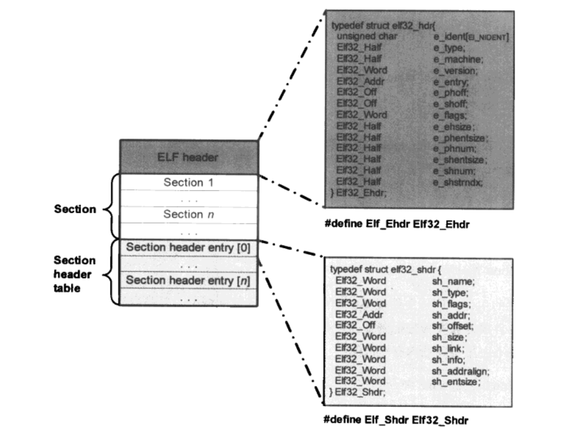

模块最大的好处是可以动态扩展应用程序的功能而无须重新编译链接生成一个新的应用程序映像。

内核模块可以在系统运行期间动态扩展系统功能而无须重新启动系统，更无须为这些新增的功能重新编译一个新的系统内核映像。

虽然设备驱动程序并不一定要以内核模块的形式存在，并且内核模块也不一定就代表着一个设备驱动程序，但是内核模块的这种特性似乎注定是为设备驱动程序而生。

为此需要了解隐藏在内核模块背后的技术细节：
* 模块的加载过程。
* 模块如何引用内核或者其他模块中的函数与变量。
* 模块本身导出的函数与变量如何被别的内核模块所使用。模块的参数传递机制。
* 模块之间的依赖关系。
* 模块中的版本控制机制。

# 1. 内核模块的文件格式

ELF 格式

```sh
file hello.ko
hello.ko: ELF 64-bit LSB relocatable, x86-64, version 1 (SYSV), not stripped
```



#### ELF header 部分

大小是 52 字节，位于文件头部。对于驱动模块文件而言，其中一些比较重要的数据成员如下：

* e_type
  表明文件类型，对于驱动模块，这个值是 1
* e_shoff 
  表明 Section header table 部分在文件中的偏移量。
* e_shentsize 
  表明 Section header table 部分中每一个 entry 的大小（以字节计）。
* e_shnum
  表明 Section header table 中有多少个 entry。因此，Section header table 的大小便为 e_shentsize×e_shnum 个字节。
* e_shstrndx
  与 Section header entry 中的 sh_name 一起用来指明对应的 section 的 name。

#### Section 部分

ELF文件的主体，位于文件视图中间部分的一个连续区域中。但是当模块被内核加载时，会根据各自属性被重新分配到新的内存区域（有些ssectionn也可能只是起辅助作用，因而在运行时并不占用实际的内存空间）。

#### Section header table

该部分位于文件视图的末尾，由若干个（具体个数由ELF header中的 e_shnum 变量指定） Section header entry组成，每个enty具有同样的数据结构类型。对于设备驱动模块而言，一些比较重要的数据成员如下：

* sh_addr 
  这个值用来表示该entry所对应的section在内存中的实际地址。在静态的文件视图中，这个值为0，当模块被内核加载时，加载器会用该section在内存中的实际地址来改写sh_aaddr（如果sectionn不占用内存空间，该值为0）。

* sh_ofset
  表明对应的section在文件视图中的偏移量。

* sh_size 
  表明对应的section在文件视图中的大小（以字节计）。类型为SHT NOBITS的section例外，这种section在文件视图中不占有空间。

* sh_entsize 
  主要用于由固定数量entry组成的表所构成的section，如符号表，此种情况下用来表示表中entry的大小。

以上简单介绍了内核模块所属ELF文件的一些主要数据成员，显然设备驱动程序并不会使用到这些数据，它们是给内核模块加载器在加载模块时使用的。

可使用 readelf 来读取 ELF 文件信息。

# 2. EXPORT_SYMBOL 的内核实现

具体实现就是通过宏和 `__attribute( (section(x)) )` 来将包含函数信息的变量放到指定的 section, 然后在链接器中将这些被标记的 section 管理并放到一起。

同时通过在链接器中对 section 开头和结尾定义 `__start__` 和 `__stop__` 相关标签, 从而在程序中可以通过 `extern` 来取得这些 section 所在的位置。

# 3. 模块的加载过程

