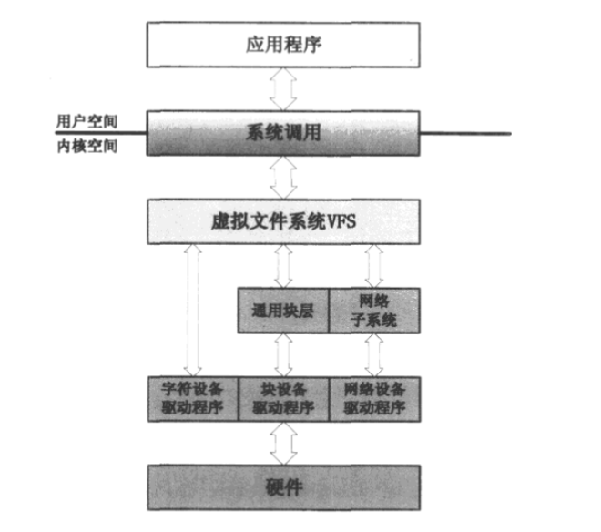

Liuⅸ系统从各异的设备中提取出了共性的特征，将其划分为三大类：字符设备、块设备和网络设备。

内核针对每一类设备都提供了对应的驱动模型框架，包括基本的内核设施和文件系统接口。这样设备驱动程序员在写某类设备驱动程序时，就有一套完整的驱动模型框架可以使用，从而可将大量的精力放在设备本身的操作上。



字符设备驱动程序是这三类设备驱动程序中最常见，也是相对比较容易理解的一种，现实中的大部分硬件都可由字符设备驱动程序来控制。

这类硬件的特征是，在 I/O 传输过程中以字符为单位，这种字符流的传输速率通常都比较缓慢（因而其内核设施中不提供缓存机制），常见的如键盘、鼠标及打印机等设备。

# 1. 应用程序与设备驱动程序互动实列

demo_chr_dev.c

```c
#include <linux/module.h>
#include <linux/kernel.h>
#include <linux/fs.h>
#include <linux/cdev.h>

static struct cdev chr_dev;	// 定义一个字符设备对象
static dev_t ndev;      	// 字符设备节点的设备号

static int chr_open(struct inode *nd, struct file *filp)
{
    int major = MAJOR(nd->i_rdev);
    int minor = MINOR(nd->i_rdev);
    printk("chr_open(); major = %d, minor = %d\n", major, minor);

    return 0;
}

static ssize_t chr_read(struct file *f, char __user *u, size_t sz, loff_t *off)
{
    printk("In the chr_read() function!\n");

    return 0;
}

static  struct file_operations chr_ops = {
    .owner = THIS_MODULE,
    .open = chr_open,
    .read = chr_read,
};

static int demo_init(void)
{
    int ret;
    cdev_init(&chr_dev, &chr_ops);                      // 初始化字符设备对象
    ret = alloc_chrdev_region(&ndev, 0, 1, "chr_dev");	// 分配设备号
    if(ret < 0) 
    	return ret;

	printk("demo_init(); majar = %d, minor = %d\n", MAJOR(ndev), MINOR(ndev));
    ret = cdev_add(&chr_dev, ndev, 1);                  // 将字符设备对象 chr_dev 注册进系统
    if(ret < 0)
        return ret;

    return 0;
}

static void demo_exit(void)
{
    printk("Removing chr_dev module...\n");
    cdev_del(&chr_dev);                                 // 将字符设备对象 chr_dev 从系统中注销掉
    unregister_chrdev_region(ndev, 1);                  // 释放分配的设备号
}

module_init(demo_init);
module_exit(demo_exit);

MODULE_LICENSE("GPL");
```

Makefile 

```
KDIR ?= /lib/modules/`uname -r`/build

obj-m += demo_chr_dev.o

module:
	make -C $(KDIR) M=$(PWD) modules

clean:
	make -C $(KDIR) M=$(PWD) clean
```

应用层 main.c

```c
#include <stdio.h>
#include <fcntl.h>
#include <unistd.h>

#define CHR_DEV_NAME "/dev/chr_dev"

int main()
{
    int ret;
    char buf[32];

    int fd = open(CHR_DEV_NAME, O_RDONLY | O_NDELAY);
    if(fd < 0)
    {
        printf("open file  %s failed\n", CHR_DEV_NAME);
        return -1;
    }

    read(fd, buf, 32);
    close(fd);

    return 0;
}
```

执行:

```sh
# insmod 后根据显示的设备号添加设备节点
mknod /dev/chr_dev c 236 0
```

# 2. struct file_operations

<include/linux/fs.h>
struct file_operations

其成员变量几乎全是函数指针。字符设备驱动程序的编写，其实基本上是围绕着如何实现 struct file_operations 中的那些指针成员展开的。

通过内核文件系统组件在其间的穿针引线，应用程序中对文件类函数的调用，比如 read() 等，将最终被转接到 struct file_operations 中对应的函数指针的具体实现上。

唯一非函数指针类成员 owner，表示当前 struct file_operations 对象所属的内核模块，几乎所有的设备驱动程序都会用 THIS_MODULE 宏给 owner 赋值，该宏的定义为：

<include/linux/module.h>
```
#define THIS_MODULE (&__this_module)
```

__this_module 是编译时工具为其产生的一个 struct module 对象，并被放到指定的 section 中:

demo_chr_dev.mod.c

```c
__visible struct module __this_module
__section(".gnu.linkonce.this_module") = {
	.name = KBUILD_MODNAME,
	.init = init_module,
#ifdef CONFIG_MODULE_UNLOAD
	.exit = cleanup_module,
#endif
	.arch = MODULE_ARCH_INIT,
};
```

owner 成员可以避免当 file_operations 中的函数正在被调用时，其所属的模块被从系统中卸载掉。

如果一个设备驱动程序不是以模块的形式存在，而是被编译进内核，那么THIS MODULE将被赋值为空指针，没有任何作用。

# 3. 字符设备的内核抽象

内核为字符设备抽象出了一个具体的数据结构 struct_cdev

<include/linux/cdev.h>
```c
struct cdev {
    struct kobject kobj;
    struct module *owner;
    const struct file_operations *ops;
    struct list_head list;
    dev_t dev;
    unsigned int count;
}
```
* struct kobject kobj 
  内嵌的内核对象

* struct module *owner
  字符设备驱动程序所在的内核模块对象指针
* const struct file_operations *ops
  文件操作，用于应用程序通过文件系统接口调用驱动程序的函数
* struct list_head list
  用来将系统中的字符设备形成链表
* dev_t dev
  字符设备的设备号，由主设备号和次设备号构成
* unsigned int count
  隶属于同一主设备号的次设备号的个数，用于表示由当前设备驱动程序控制的实际同类设备的数量

设备驱动程序中可以通过静态或动态的方式产生 stnuct cdev 对象

```c
// 静态定义
static stnuct cdev chr_dev；
// 动态申请
static struct cdev *p = kmalloc(sizeof(struct cdev), GFPKERNEL)
```

Linux 内核源码中提供了一个函数 cdev_alloc，专门用于动态分配 struct cdev 对象。cdev_alloc 不仅会为struct cdev 对象分配内存空间，还会对该对象进行必要的初始化：

<fs/char_dev.c>

```c
struct cdev *cdev_alloc(void)
{
    struct cdev *p = kzalloc(sizeof(struct cdev), GFP_KERNEL);
    if (p) {
        INIT_LIST_HEAD(&p->list);
        kobject_init(&p->kobj, &ktype_cdev_dynamic);
    }
    return p;
}
```

当然现实设备往往更复杂，这时 struct cdev 常作为一种内嵌的成员变量出现在实际设备的数据结构中，比如:

```c
struct real_char_dev {
    int a;              // 硬件相关成员变量
    struct cdev cdev;   // 内嵌的 struct cdev 数据结构
};
```

这时如果仅仅使用 cdev_alloc 来动态分配对象就不行了，只能使用以下方法:

```c
static struct real_char_dev *p = kzalloc(sizeof(struct real_char_dev), GFP_KERNEL);
```

不论是动态创建还是静态创建对象，都需要对对象进行初始化，为此内核函数提供 cdev_init

<fs/char_dev.c>

```c
void cdev_init(struct cdev *cdev, const struct file_operations *fops)
{
    memset(cdev, 0, sizeof *cdev);
    INIT_LIST_HEAD(&cdev->list);
    kobject_init(&cdev->kobj, &ktype_cdev_default);
    cdev->ops = fops;
}
```

初始化后就可以将对象加入到系统了，但着需要设备号的相关知识，在此之前需先了解设备号问题；

# 4. 设备号的构成与分配


## 4.1 设备号的构成

一个设备号由主设备号和次设备号构成，主设备号用来对应的设备驱动程序，而次设备号则由驱动程序使用，用来标识它所管理的若干同类设备。

设备号是一个 32 位的无符号整数:

<include/linux/types.h>
```c
typedef __u32 __kernel_dev_t;
typedef __kernel_dev_t dev_t;
```

目前来说主设备号和次设备号在32位数中的分配情况如下:

```c
dev_t: Major(12位) | Minor(20位)
```

在内核提供了如下几个宏用来操作设备号:

<include/linux/kdev_t.h>

```c
#define MAJOR(dev)      ((unsigned int) ((dev) >> MINORBITS))
#define MINOR(dev)      ((unsigned int) ((dev) & MINORMASK))
#define MKDEV(ma,mi)    (((ma) << MINORBITS) | (mi))
```

随着版本的推进，可能设备号的分配有变化，但只要坚持使用内核给定的宏操作设备号，则这部分代码无需修改就可以在新内核中运行。

## 4.2 设备号的分配与管理

在内核源码中，涉及到设备号的分配与管理的函数主要有以下两个：


<fs/char_dev.c>
```c
int register_chrdev_region(dev_t from, unsigned count, const char *name)
{
    struct char_device_struct *cd;
    dev_t to = from + count;
    dev_t n, next;

    for (n = from; n < to; n = next) {
        next = MKDEV(MAJOR(n)+1, 0);
        if (next > to)
            next = to;
        cd = __register_chrdev_region(MAJOR(n), MINOR(n),
                    next - n, name);
        if (IS_ERR(cd))
            goto fail;
    }
    return 0;
fail:
    to = n;
    for (n = from; n < to; n = next) {
        next = MKDEV(MAJOR(n)+1, 0);
        kfree(__unregister_chrdev_region(MAJOR(n), MINOR(n), next - n));
    }
    return PTR_ERR(cd);
}
```

在 `fs/char_dev.c` 中有一个全局性的指针数组:

```c
static struct char_device_struct {
    struct char_device_struct *next;
    unsigned int major;
    unsigned int baseminor;
    int minorct;
    char name[64];
    struct cdev *cdev;      /* will die */
} *chrdevs[CHRDEV_MAJOR_HASH_SIZE];
```

系统刚开始运行时，该数组是空的，而 register_chrdev_region 函数主要功能是将当前设备驱动程序要使用的设备号记录到 chardevs 数组中。

