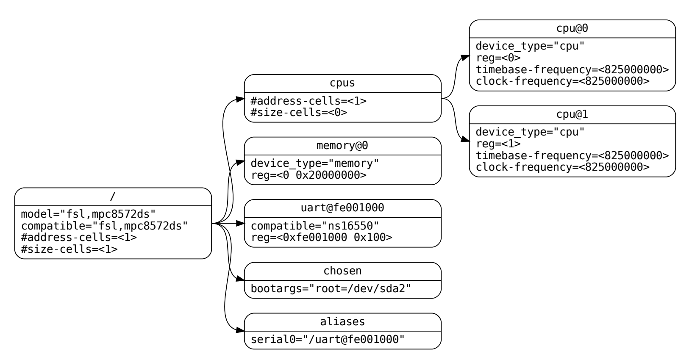
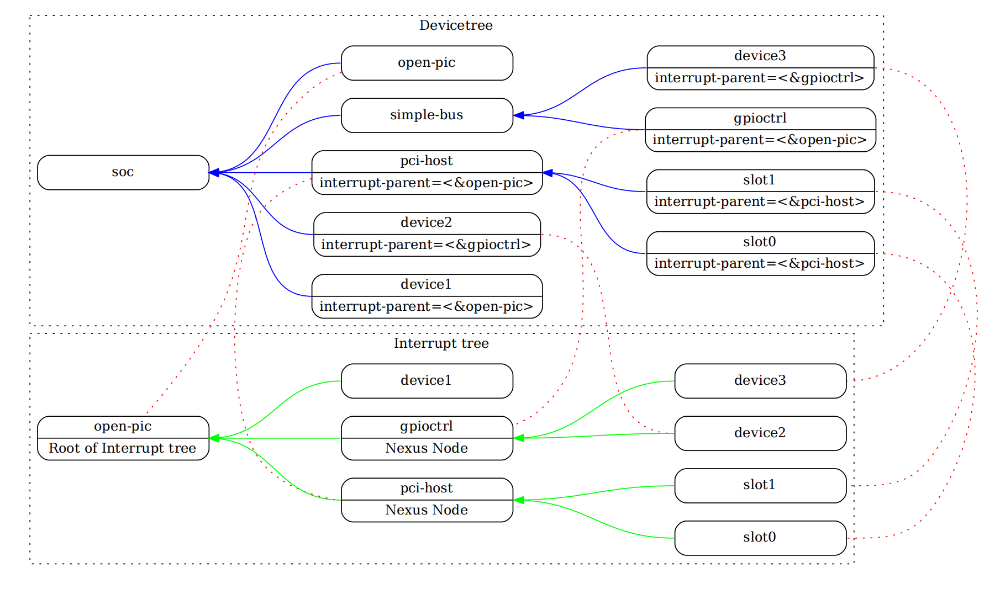

本文来自设备树规范文档:
https://www.devicetree.org/


最新在线文档:
https://devicetree-specification.readthedocs.io/en/latest/chapter1-introduction.html


# 设备树

设备树是一种树形数据结构，其节点描述系统中的设备。每个节点都有描述所表示设备的特征的属性/值对。每个节点只有一个父节点，但根节点除外，根节点没有父节点。

符合 DTSpec 的设备树描述了系统中不一定能被客户端程序动态检测到的设备信息。

例如，PCI 的体系结构使客户端能够探测和检测连接的设备，因此可能不需要描述 PCI 设备的设备树节点。但是，如果无法通过探测检测到，则需要一个设备节点来描述系统中的 PCI 主桥设备。

下图显示了一个简单设备树的示例，该设备树几乎足够完整，可以启动一个简单的操作系统，并描述了平台类型、CPU、内存和单个 UART。设备节点显示每个节点内的属性和值。



## Devicetree 结构和约定

设备树中的每个节点根据以下约定命名:

```sh
node-name@unit-address
```

`node-name` 指定节点的名称。它的长度应为 1 到 31 个字符，其字符集为 `0-9`、`a-z`、`A-Z`以及`,._+-`

节点名称应以小写或大写字符开头，并应描述设备的一般类别.

`unit-address` 部分特定于节点所在的总线类型。`unit-address` 必须与节点的 reg 属性中指定的第一个地址匹配。

如果节点没有 reg 属性，则必须省略 `@unit-address`，并且仅使用节点名称即可将该节点与树中同一级别的其他节点区分开来。

特定总线的绑定可能会为 reg 和 单元地址的格式指定附加的、更具体的要求。

对于没有 `@unit-address` 的节点名称，节点名称对于树中同一级别的任何属性名称来说应是唯一的

根节点没有节点名称或单元地址。它由正斜杠 (/) 标识。


> 图中
>
> 拥有相同节点名 cpu 的两个节点通过其单元地址 0 和 1 来区分
> 拥有相同节点名 ethernet 的两个节点通过其单元地址 fe002000 和 fe003000 来区分

## 通用名称推荐

节点的名称应该有点通用，用来反映设备的功能而不是其精确的编程模型。如果合适，名称应为以下选择之一：

```
adc             accelerometer       air-pollution-sensor        atm 
audio-codec     audio-controller    backlight                   bluetooth 
bus             cache-controller    camera                      can charger 
clock           clock-controller    co2-sensor                  compact-flash 
cpu             cpus                crypto                      disk 
display         dma-controller      dsi                         dsp 
eeprom          efuse               endpoint                    ethernet
ethernet-phy    fdc flash           gnss                        gpio 
gpu             gyrometer           hdmi                        hwlock 
i2c             i2c-mux             ide                         interrupt-controller 
iommu           isa                 keyboard                    key 
keys            lcd-controller      led                         leds 
led-controller  light-sensor        lora                        magnetometer 
mailbox         mdio                memory                      memory-controller 
mmc             mmc-slot            mouse                       nand-controller 
nvram           oscillator          parallel                    pc-card 
pci             pcie                phy                         pinctrl 
pmic            pmu                 port                        ports 
power-monitor   pwm                 regulator                   reset-controller 
rng             rtc                 sata                        scsi 
serial          sound               spi                         sram-controller 
ssi-controller  syscon              temperature-sensor          timer 
touchscreen     tpm                 usb                         usb-hub 
usb-phy         video-codec         vme                         watchdog 
wifi
```


## 路径名称

设备树中的节点可以通过指定从根节点经过所有后代节点到所需节点的完整路径来唯一标识。

指定设备路径的约定是：

```
/node-name-1/node-name-2/node-name-N
```

例如上图中 cpu1 的设备路径为 

```
/cpus/cpu@1
```

如果到节点的完整路径明确，则可以省略单元地址, 如果客户端程序遇到不明确的路径，则其行为是未定义的

## 属性

设备树中的每个节点都具有描述该节点特征的属性。

### 属性名称
属性由名称和值组成

非标准属性名称应指定唯一的字符串前缀，例如股票代码，标识定义该属性的公司或组织的名称。例子：

```
fsl,channel-fifo-len
ibm,ppc-interrupt-server#s
linux,network-index
```

### 属性值

属性值是零个或多个字节的数组，其中包含与属性关联的信息。

如果传达真假信息，属性可能具有空值。在这种情况下，属性的存在或不存在就足以描述性的。

| 价值                   | 描述                                                                                                       |
| ---------------------- | ---------------------------------------------------------------------------------------------------------- |
| \<empty\>              | 值为空。当属性本身的存在或不存在具有足够的描述性时，用于传达真假信息。                                     |
| \<u32\>                | 大端格式的 32 位整数                                                                                       |
| \<u64\>                | 表示大端格式的 64 位整数。由两个值组成 \<u32\>，其中第一个值包含整数的最高有效位，第二个值包含最低有效位。 |
|                        | 例如 64 位值 0x1122334455667788 将表示为两个单元格：<0x11223344 0x55667788>                                |
| \<string\>             | 字符串是可打印的并且以 `\0` 结尾                                                                           |
| \<prop-encoded-array\> | 自定义格式的属性。请参阅属性定义                                                                           |
| \<phandle\>            | 一个\<u32\>值。phandle值是引用设备树中另一个节点的一种方式。                                               |
|                        | 任何可以引用的节点都会定义具有唯一\<u32\>值的 phandle 属性。该数字用于具有 phandle 值类型的属性值。        |
| \<stringlist\>         | 连接在一起的 \<string\> 值列表 例如 `"hello","world"` |


## 标准属性

DTSpec 指定了设备节点的一组标准属性, 本节将详细描述了这些属性


##### compatible

属性名称：`compatible`

值类型：`<stringlist>`

`compatible` 属性值由一个或多个定义设备特定编程模型的字符串组成。客户端程序应使用此字符串列表来选择设备驱动程序。

属性值由以 '\0' 结尾的字符串的串联列表组成，从最具体到最一般。它们允许设备表达其与一系列类似设备的兼容性，从而可能允许单个设备驱动程序与多个设备进行匹配。

推荐的格式为 `"manufacturer,model"`，其中 manufacturer 是描述制造商名称的字符串（例如股票代码），并 `model` 指定型号。

`compatible` 字符串应仅包含小写字母、数字和破折号，并且应以字母开头。单个逗号通常仅在供应商前缀后使用。不应使用下划线。


例子:

```sh
compatible = "fsl,mpc8641", "ns16550";
```

> 在此示例中，操作系统将首先尝试查找支持 "fsl,mpc8641" 的设备驱动程序。如果未找到驱动程序，它将尝试查找支持更通用的 ns16550 设备类型的驱动程序


##### model

属性名称：`model`

值类型：`<string>`

`model` 属性值是 `<string>` 用于指定设备制造商的型号。

推荐的格式为：`"manufacturer,model"`，其中 manufacturer `是描述制造商名称的字符串（例如股票代码），model` 指定型号。

例子：

```sh
model = "fsl,MPC8349EMITX";
```


##### phandle

属性名称：`phandle`

值类型：`<u32>`

`phandle` 用于属性指定设备树中节点的唯一数字标识符。因此 phandle 属性值可用于一个节对另一个节点的引用。


例如:

```sh
pic@10000000 {
   phandle = <1>;
   interrupt-controller;
   reg = <0x10000000 0x100>;
};
```


该设备节点定义的 phandle 值为 1。另一个设备节点可以引用 phandle 值为 1 的 PIC 节点：

```sh
another-device-node {
  interrupt-parent = <1>;
};
```

> 可能会遇到旧版本的设备树，其中包含此属性的已弃用形式，称为linux,phandle。
> 
> 为了兼容性，客户端程序可能希望支持属性不存在的 linux,phandle 情况。phandle 这两个属性的含义和用途是相同的
>
> DTS 中的大多数设备树将不包含显式的 phandle 属性。当 DTS 编译为二进制 DTB 格式时，DTC 工具会自动插入 phandle 属性


##### status

属性名称：`status`

值类型：`<string>`


status 属性指示设备的运行状态。如果没有 `status` 属性，则应视为该属性的值为 `"okay"`, 下表列出了其所有可能值:

| 值           | 描述                                                                               |
| ------------ | ---------------------------------------------------------------------------------- |
| `"okay"`     | 表示设备运行正常                                                                   |
| `"disabled"` | 表示设备当前未运行，但将来可能会运行(例如，某些设备未插入或关闭)。                 |
|              | 有关禁用对给定设备意味着什么的详细信息，请参阅设备绑定 (device binding)。          |
| `"reserved"` | 表示设备运行正常，但不应使用。通常，这用于由另一个软件组件(如平台固件)控制的设备。 |
| `"fail"`     | 表示设备未运行。在设备中检测到严重错误，如果不进行修复，它不太可能开始运行。       |
| `"fail-sss"` | 表示设备未运行。在设备中检测到严重错误，如果不进行修复，它不太可能开始运行。       |
|              | 该值的SSS部分特定于该设备，并指示检测到的错误条件。                                |


#####  #address-cells and #size-cells

属性名称：`#address-cells, #size-cells`

值类型：`<u32>`

`#address-cells` 和 `#size-cells` 属性可用于在设备树分层结构中具有子节点的任何设备节点，并描述应如何对子设备节点寻址。

`#address-cells` 属性用于对子节点的 `reg` 属性中的地址字段进行编码的 `<u32>` 单元格的数量。

`#size-cells` 属性用于编码子节点的 `reg` 属性中的 `size` 字段的 `<u32>` 单元格的数量。

`#address-cells` 和 `#size-cells` 属性不是从设备树中的祖先继承的。应明确界定它们。

符合 DTSpec 的引导程序应当在所有有孩子的节点上都支持 `#address-cells` 和 `#size-cells`,  如果没有设置，客户端程序应该假定 `#address-cells` 的缺省值为2， `#size-cells` 的缺省值为1。

例子:

```lua
soc {
   #address-cells = <1>;
   #size-cells = <1>;

   serial@4600 {
      compatible = "ns16550";
      reg = <0x4600 0x100>;
      clock-frequency = <0>;
      interrupts = <0xA 0x8>;
      interrupt-parent = <&ipic>;
   };
};
```

在本例中，soc 节点的 `#address-cells` 和 `#size-cells` 属性均设置为 1。此设置指定需要一个单元格 (cell) 来表示地址，需要一个单元格来表示此节点的子节点的大小。

`serial` 设备的 `reg` 属性必须遵循父节点 (soc) 中设置的规范, 即地址由单个 cell (0x4600) 表示，大小由单个 cell (0x100) 表示。


##### reg

属性名称：`reg`

值类型：`<prop-encoded-array> ` 编码为任意数量的(地址、长度)对。

`reg` 属性描述了设备资源在由其父总线定义的地址空间内的地址。这通常意味着内存映射的IO寄存器块的偏移量和长度，但在某些总线类型上可能有不同的含义。根节点定义的地址空间中的地址是CPU实际地址。

该值是一个` <prop-encoded-array>`，由任意数量的地址和长度对 `<address length>` 组成。指定地址和长度所需的`<u32>`单元的数量是特定于总线的，并由设备节点父节点中的 `#address-cells` 和 `#size-cells` 属性指定。如果父节点为 `#size-cells` 指定值 0，则 `reg` 的值中的长度字段将被省略。

例子:

```lua
reg = <0x3000 0x20 0xFE00 0x100>;
```

假设片上系统中的一个器件有两个寄存器块，位于 soc 中偏移量 0x3000 处的 32 字节块和偏移量 0xFE00 处的 256 字节块。`reg` 属性将按如上例方式编码 (假设父级中 `#address-cells` 和 `#size-cells` 数值都为1)：


##### virtual-reg

属性名称：`virtual-reg`

值类型：`<u32> ` 

`virtual-reg` 属性指定映射到设备节点的 `reg` 属性中指定的第一个物理地址的有效地址。此属性使引导程序能够为客户端程序提供已设置的虚拟到物理映射。


##### ranges

属性名称：`ranges`

值类型：`<empty> or <prop-encoded-array> ` 编码为任意数量的(子总线地址、父总线地址、长度)三元组。

`ranges` 属性提供了一种在子总线地址空间和父总线地址空间之间定义映射或转换的方法。

`ranges` 属性值的格式是任意数量的三元组(子总线地址、父总线地址、长度)

* 子总线地址是子总线地址空间内的物理地址。表示地址的单元数依赖于总线，并且可以根据该节点(出现 `ranges` 属性的当前节点)的 `#address-cells` 来确定。
* 父总线地址是父总线地址空间内的物理地址。表示父地址的单元数依赖于总线，并且可以通过定义父地址空间的节点的 `#address-cells` 属性来确定。
* 长度指定子对象地址空间中范围的大小。表示大小的单元格的数量可以从该节点(显示 `range` 属性的当前节点)的 `#size-cells` 中确定。

如果使用`<empty>`值定义该属性，则它指定父地址空间和子地址空间相同，不需要地址转换。

如果该属性不存在于总线节点中，则假定该节点的子节点与父地址空间之间不存在映射。

例子:

```lua
soc {
   compatible = "simple-bus";
   #address-cells = <1>;
   #size-cells = <1>;
   ranges = <0x0 0xe0000000 0x00100000>;

   serial@4600 {
      device_type = "serial";
      compatible = "ns16550";
      reg = <0x4600 0x100>;
      clock-frequency = <0>;
      interrupts = <0xA 0x8>;
      interrupt-parent = <&ipic>;
   };
};
```

> soc 节点指定 `range` 属性为 `<0x0 0xe0000000 0x00100000>`
> 此属性值指定对于 1024 KB 范围的地址空间，在物理 0x0 处寻址的子节点映射到物理 0xe0000000 的父地址。
> 利用此映射，`serial`设备节点的寄存器将可通过 0xe0004600 地址访问得到，该地址是通过偏移量 0x4600 (以 `reg` 定义)加上指定的映射地址 0xe0000000 来得到。


##### dma-ranges

属性名称：`dma-ranges`

值类型：`<empty> or <prop-encoded-array>  ` 编码为任意数量的(子总线地址、父总线地址、长度)三元组。

和 `range ` 类似，但作用于 DMA，即当设置 DMA 访问某个设备节点的地址时，该地址将被映射到由 `dma-ranges` 指定的地址空间中。


##### dma-coherent

属性名称：` dma-coherent`

值类型：`<empty> ` 

默认情况下对于非一致性 (non-coherent) I/O 的体系机构，使用 `dma-coherent` 属性用来指示设备能够进行一致的DMA操作。某些架构默认情况下具有一致的DMA，此属性不适用。

也就说如果 dma 的设备树里有 dma-coherent，则系统会认为硬件会维护 cache 一致性，不会在 dma 运行过程中执行 cache 操作。


##### name (已弃用)

属性名称：`name`

值类型：`<string> ` 

`name` 属性是指定节点名称的字符串。此属性已弃用，不建议使用。但是，它可能用于较旧的不符合DTSpec的设备。操作系统应根据节点名 `node-name@unit-address` 的 `node-name` 部分确定节点名

##### device_type (已弃用)

属性名称：`device_type`

值类型：`<string>` 

`device_type` 属性在 IEEE 1275 中用于描述设备的 `FCode` 编程模型。由于 DTSpec 没有 `FCode` ，因此不建议使用该属性的新用法，为了与 IEEE 1275 派生的设备兼容，应仅在CPU和内存节点上包含该属性。


## 中断和中断映射

DTSpec 采用 *Open Firmware Recommended Practice: Interrupt Mapping, Version 0.9 [b7].* 中指定的中断树模型。在设备树内存在逻辑中断树，其表示平台硬件中的中断的分级和路由。虽然通常被称为中断树，但从技术上讲，它是一个有向无环图。

中断源到中断控制器的物理布线在设备树中用 `interrupt-parent` 属性表示。表示中断生成设备的节点包含一个 `interrupt-parent` 属性，该属性具有一个 `phandle` 值，该值指向将设备的中断路由到的设备，通常是中断控制器。如果中断生成设备没有 `interrupt-parent` 属性，则假定其`interrupt-parent` 为其设备树父级。

每个中断生成设备都包含一个 `interrupts` 属性，该属性具有描述该设备的一个或多个中断源的值。每个源都用称为中断说明符的信息表示。中断说明符的格式和含义是特定于中断域的，即，它取决于位于其中断域根处的节点的属性。中断域的根使用 `#interrupt-ells` 属性来定义对中断说明符进行编码所需的 `<u32>` 值的数量。

例如，对于开放式 PIC 中断控制器，中断特定器采用两个32位值，并由中断号和中断的电平/检测信息组成。

中断域是解释中断说明符的上下文。域的根是一个**中断控制器**或**中断关系**


1. 中断控制器是一个物理设备，需要一个驱动程序来处理通过它发送的中断。它也可以级联到另一个中断域。中断控制器由设备树中该节点上存在的中断控制器属性指定。
2. 中断关系定义了一个中断域和另一个中断域之间的转换。转换基于特定于域的信息和特定于总线的信息。域之间的转换是使用中断映射属性执行的。
   例如，一个PCI控制器设备节点可以是一个中断结点，它定义了从PCI中断命名空间(INTA、INTB等)的转换。发送到具有中断请求(IRQ)号的中断控制器。

当中断树的遍历到达没有中断属性并且因此没有显式中断父节点的中断控制器节点时，确定中断树的根。

下图显示了具有中断父关系的设备树的图形表示示例。它既显示了设备树的自然结构，也显示了每个节点在逻辑中断树中的位置。



在上图的示例中：
* 开放式中断控制器是中断树的根。
* 中断树根有三个子设备，它们将自己的中断直接发送到Open-PIC。
  * device1
  * PCI host controller
  * GPIO Controller
* 存在三个中断域；一个根在Open-PIC节点，一个根在PCI主桥节点，一个根在GPIO控制器节点。
* 有两个节点；一个位于PCI主桥，另一个位于GPIO控制器。

### 中断生成设备的属性

##### interrupts

属性：`interrupts`
值类型：`<prop-encoded-array>` 编码为任意数量的中断说明符。

设备节点的 `interrupts` 属性定义由设备生成的一个或多个中断。`interrupts` 属性的值由任意数量的中断说明符组成。中断说明符的格式由中断域根的绑定定义。中断被 `interrupts-extended` 属性覆盖，通常只应使用其中一个。

例子:

```lua
interrupts = <0xA 8>;
```

> 在开放的PIC兼容中断域中，中断说明符的常见定义由两个单元组成：中断号和电平/检测信息。
> 上例中定义了一个中断说明符，中断号为0xA，电平/检测编码为8。

##### interrupt-parent

属性：`interrupt-parent`
值类型：`<phandle>`

由于中断树中节点的层次结构可能与设备树不匹配，因此 `interrupt-parent` 属性可用于显式定义中断父节点。该值是指向中断父进程的 `phandle`。如果设备中缺少此属性，则假定其中断父级为其设备树父级。

##### interrupts-extended

属性：`interrupts-extended`
值类型：`<phandle>` `<prop-encoded-array>`

`interrupts-extended` 属性列出设备生成的中断。当一个设备连接到多个中断控制器时，应该使用 `interrupts-extended`，而不是 `interrupts`，因为它使用每个中断说明符编码一个父 `phandle` 

`interrupts` 和 `interrupts-extended` 属性是互斥的。设备节点应该使用其中一个，但不能同时使用两个。只有在需要与不理解 `interrupts-extended` 的软件兼容时，才允许同时使用两者。如果同时存在两者，则 `interrupts-extended` 优先级更高。

例子:

```lua
interrupts-extended = <&pic 0xA 8>, <&gic 0xda>;
```

此示例显示了具有两个连接到两个独立中断控制器的中断输出的设备如何使用 `interrupts-extended` 属性来描述连接。 

pic 是中断控制器，其 `#interrupt-cells` 说明符为 2，而 gic 是中断控制器，其 `#interrupts-cells` 说明符为 1

### 中断控制器的属性

##### #interrupt-cells

属性：`#interrupt-cells`
值类型：`<u32>`

`#interrupt-cells` 属性定义对中断域的中断说明符进行编码所需的单元数

##### interrupt-controller

属性：`interrupt-controller`
值类型：`<empty>`

中断控制器属性的存在将节点定义为中断控制器节点

##### interrupt-controller

属性：`interrupt-controller`
值类型：`<empty>`

中断控制器属性的存在将节点定义为中断控制器节点

### 中断连接器的属性

中断连接器节点应具有一个 `#interrupt-cells` 属性

##### interrupt-map

属性：`interrupt-map`
值类型：`<prop-encoded-array>` 编码为任意数量的中断映射条目

`interrupt-map` 是连接器节点上的一个属性，它将一个中断域与一组父中断域连接起来，并指定子域中的中断说明符如何映射到它们各自的父域。

`interrupt-map` 是一个表，其中每一行都是一个映射条目，由五个部分组成：子单元地址、子中断说明符、中断父单元地址、父单元地址、父中断说明符。

* **子单位地址** (child unit address)
  要映射的子节点的单元地址。指定这一点所需的32位单元数由子节点所在的总线节点的 `#address-cells` 属性描述。
* **子中断说明符** (child interrupt specifier)
  要映射的子节点的中断说明符。指定该组件所需的32位单元数由该节点的 `#interrupt-cell` 属性描述--包含 `interrupt-map` 属性的连接器节点。
* **中断父级** (interrupt-parent)
  指向子域要映射到的中断父节点的单个 `<phandle>` 值。
* **父级单位地址** (parent unit address)
  中断父域中的单元地址。指定此地址所需的32位单元数由`interrupt-parent` 字段指向的节点的 `#address-cells` 属性描述。
* **父中断说明符** (parent interrupt specifier)
  父域中的中断说明符。指定此组件所需的32位单元数由`interrupt-parent`字段指向的节点的 `#interrupt-cell` 属性描述

通过将单元地址/中断说明符对与中断映射表中的子组件进行匹配来在中断映射表上执行查找。

由于单元中断说明符中的某些字段可能不相关，因此在完成查找之前应用掩码。该掩码在 `interrupt-map-mask` 属性中定义

> 子节点和中断父节点都需要定义`#address-cells` 和 `#interrupt-cells` 属性。如果不需要单元地址组件，则应将 `#address-cells` 明确定义为零


##### interrupt-map-mask

属性：`interrupt-map-mask`
值类型：`<prop-encoded-array>` 编码为位掩码

为中断树中的连接器节点指定 `interrupt-map-mask` 属性。此属性指定一个掩码，该掩码与在 `interrupt-map` 属性中指定的表中查找的传入单元中断说明符进行 `AND` 运算。

##### #interrupt-cells

属性：`#interrupt-cells`
值类型：`<u32>` 

`#interrupt-cells` 属性定义对中断域的中断说明符进行编码所需的单元数。


### 中断映射举例:

下面显示了带有一个 PCI 总线控制器的设备树片段，以及用于描述两个PCI插槽的中断路由的示例中断映射(IDSEL 0x11，0x12)。插槽 1 和 2 的 INTA、INTB、INTC 和 INTD 引脚连接到 Open PIC 中断控制器。

```lua
soc {
   compatible = "simple-bus";
   #address-cells = <1>;
   #size-cells = <1>;

   open-pic {
      clock-frequency = <0>;
      interrupt-controller;
      #address-cells = <0>;
      #interrupt-cells = <2>;
   };

   pci {
      #interrupt-cells = <1>;
      #size-cells = <2>;
      #address-cells = <3>;
      interrupt-map-mask = <0xf800 0 0 7>;
      interrupt-map = <
         /* IDSEL 0x11 - PCI slot 1 */
         0x8800 0 0 1 &open-pic 2 1 /* INTA */
         0x8800 0 0 2 &open-pic 3 1 /* INTB */
         0x8800 0 0 3 &open-pic 4 1 /* INTC */
         0x8800 0 0 4 &open-pic 1 1 /* INTD */
         /* IDSEL 0x12 - PCI slot 2 */
         0x9000 0 0 1 &open-pic 3 1 /* INTA */
         0x9000 0 0 2 &open-pic 4 1 /* INTB */
         0x9000 0 0 3 &open-pic 1 1 /* INTC */
         0x9000 0 0 4 &open-pic 2 1 /* INTD */
      >;
   };
};
```

一个开放式PIC中断控制器被表示并被标识为具有 `interrupt-controller` 属性的中断控制器。

`interrupt-map` 表中的每一行由五个部分组成：子单元地址和中断说明符，它们被映射到具有指定的父单元地址和中断说明符的 `interrupt-parent` 节点。

例如，`interrupt-map` 表的第一行指定插槽 1 的 INTA 的映射, 该行的组件如下所示:

    child unit address: 0x8800 0 0
    child interrupt specifier: 1
    interrupt parent: &open-pic
    parent unit address: (empty because #address-cells = <0> in the open-pic node)
    parent interrupt specifier: 2 1

* 